# 学前先看

## 1. 认识uHandPi视觉手掌

### 1.1 产品简介

uHandPi是一款基于树莓派5平台开发的智能视觉机械手掌，全机身有6个自由度。手指关节5个自由度，采用微型防堵转舵机，寿命长，灵活性高，云台采用高精度数字舵机，可水平转动180度。 

uHandPi机身搭载高清晰度摄像头，配合跨平台计算机视觉库OpenCV，可以轻松实现智能AI识别、画面回传、石头剪刀布等功能。

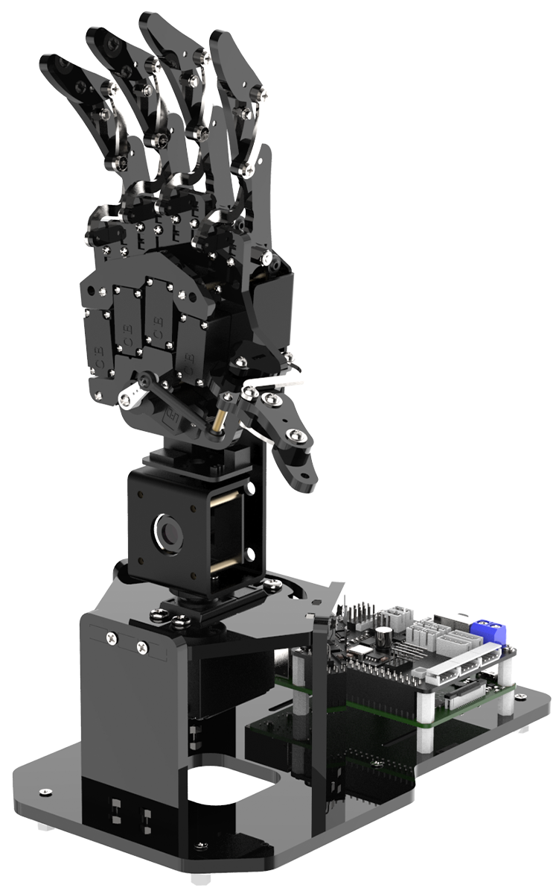

### 1.2 产品清单 

<table class="docutils-nobg" border="1" style="text-align:center">
    <colgroup>  
        <col style="width: 25%">
        <col style="width: 25%">
        <col style="width: 25%">
        <col style="width: 25%">
    </colgroup> 
    <thead>
        <tr><th colspan="4">树莓派5主板套餐</th></tr>
    </thead>
    <tbody>
    	<tr>
            <td></td>
            <td>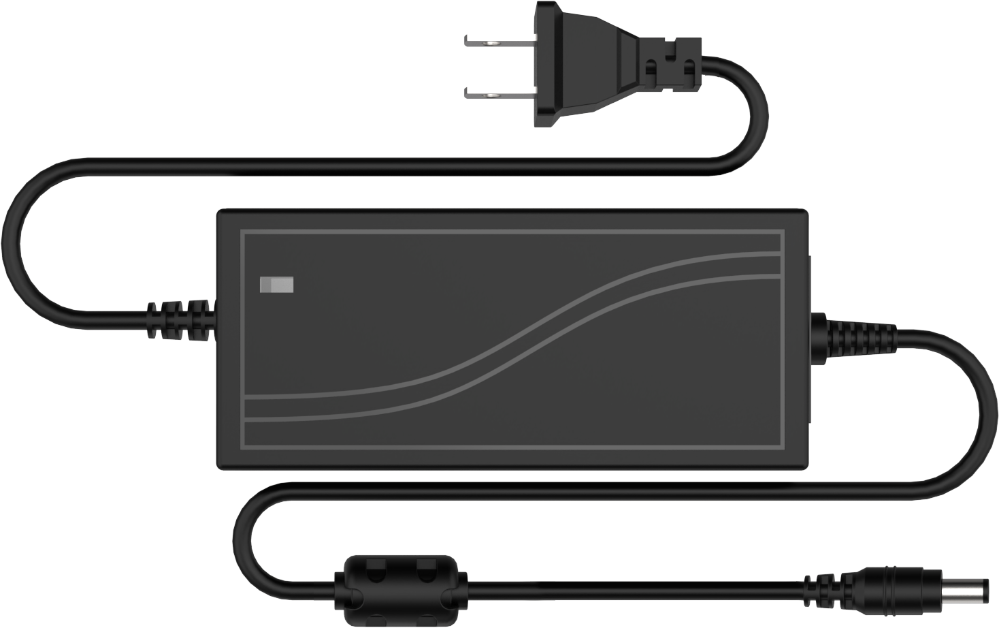</td>
            <td></td>
            <td>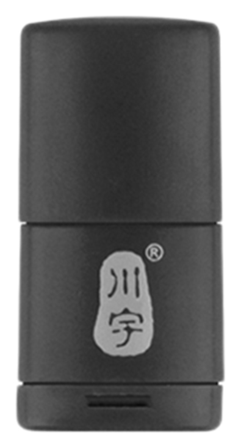</td>
        </tr>
        <tr><td>uHandPi机械手掌</td><td>7.5V 6A电源适配器</td><td>红/蓝小球各1个</td><td>读卡器</td></tr>
        <tr><td>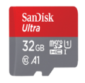</td></tr>
        <tr><td>32G 内存卡</td></tr>
    </tbody>
</table>

<table class="docutils-nobg" border="1" style="text-align:center">
    <colgroup>  
        <col style="width: 25%">
        <col style="width: 25%">
        <col style="width: 25%">
        <col style="width: 25%">
    </colgroup>  
<thead>
        <tr><th colspan="4">无主板套餐</th></tr>
</thead>
<tbody>
<tr>
<td >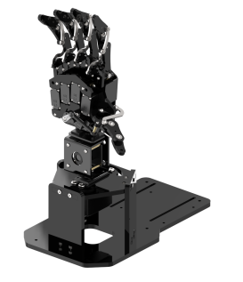</td>
<td ></td>
<td >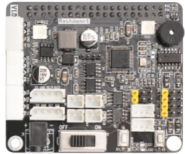</td>
<td > </td>
</tr>
<tr>
<td >uHandPi机械手掌（无主板）</td>
<td >7.5V 6A电源适配器</td>
<td >树莓派5扩展板</td>
<td >红/蓝小球各1个</td>
</tr>
<tr>
<td ></td>
<td ></td>
<td >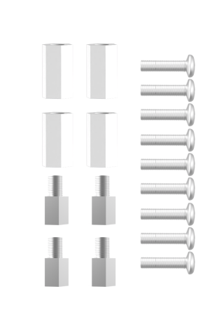</td>
<td ></td>
</tr>
<tr>
<td >读卡器</td>
<td >32G 内存卡</td>
<td >螺丝配件</td>
<td ></td>
</tr>
</tbody>
</table>

## 2. 首次开机

### 2.1 舵机接线

将贴着标签ID1-ID5的舵机线分别对应连接至树莓派扩展板的1、2、3、4、5、6号接口上（注意：黄线/白线接S，红线接+，灰线/黑线接-）。

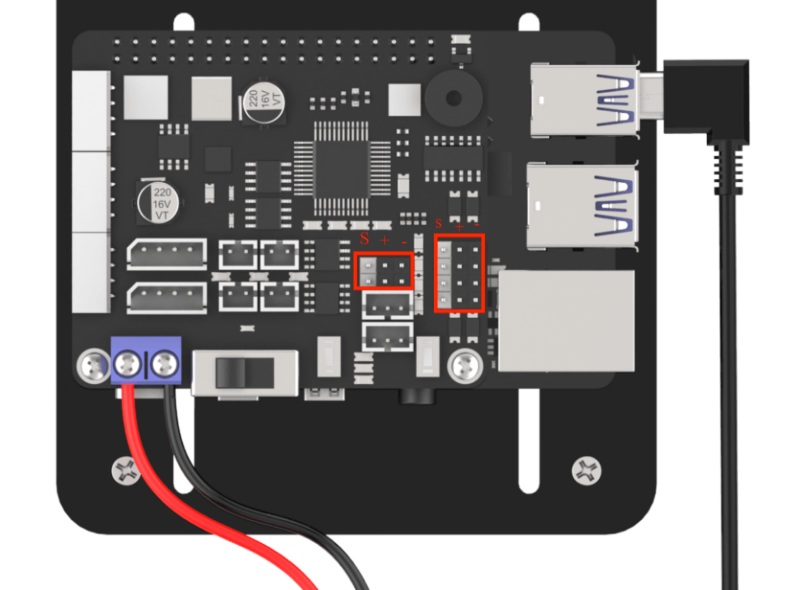

### 2.2 连接电源及开机

:::{Note}
本小节教程为操作步骤规范。机器人出厂前，DC电源对接线的（红黑）已经连接至树莓派扩展板。
:::

1)  将DC电源对接线的红色和黑色分别连接至树莓派扩展板的正（+）负极（-）。

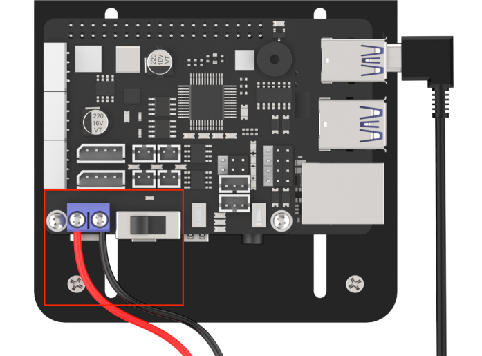

2)  将电源适配器的公头接口与DC电源对接线的母头接口连接，然后将电源适配器接入插排。

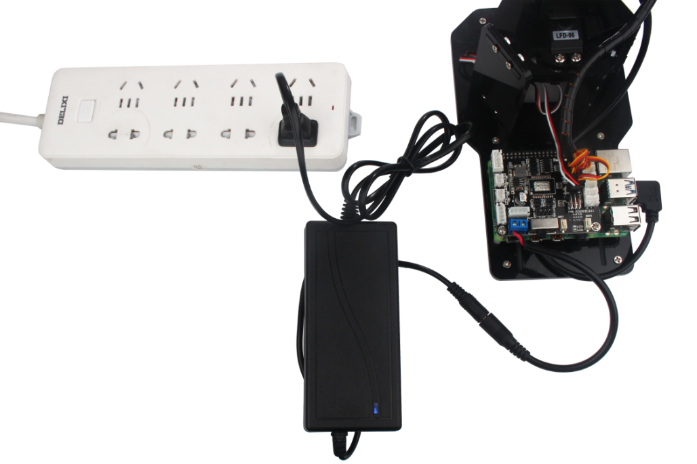

3)  将树莓派扩展板的开关由“**OFF**”推动到“**ON**”，此时树莓派的LED1、LED2常亮，稍等片刻后LED1由常亮变为每隔2秒闪亮一次，同时手掌会做出抓取姿态，即设备成功开机。**树莓派本身也是电脑，开机启动需要一小段时间，开机时间约30秒左右，请耐心等待。**

设备开机成功后，默认为AP直连模式，并产生一个以HW开头的热点。

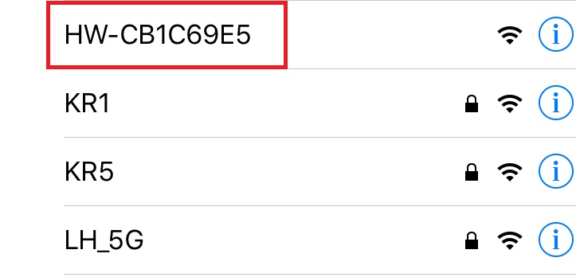

接下来您可前往“**[上手试玩/2. 手机APP安装与连接](https://docs.hiwonder.com/projects/uHandPi/en/latest/docs/2.quick_user_experience.html#app)**”继续学习后续内容。
