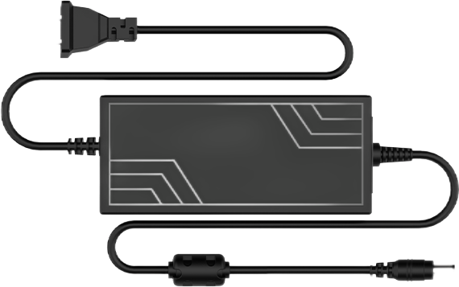
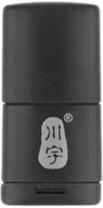
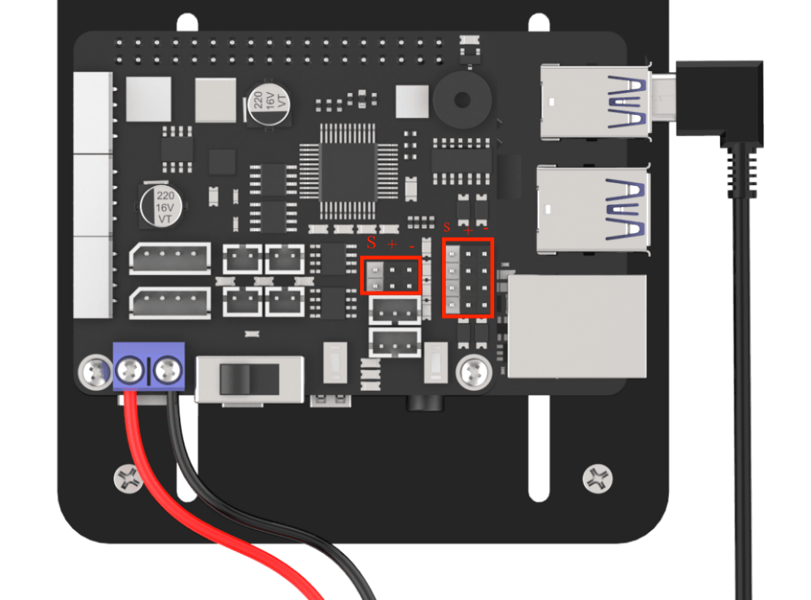
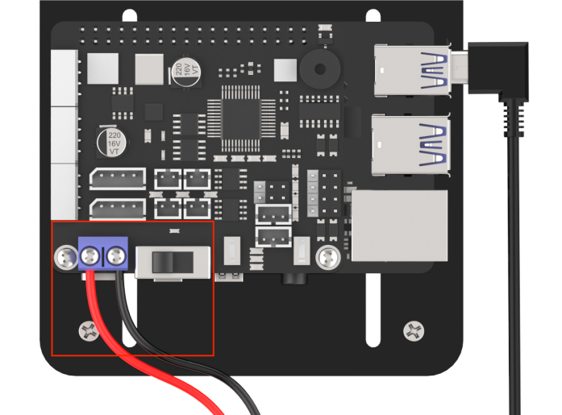
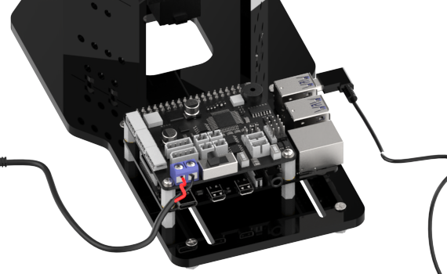
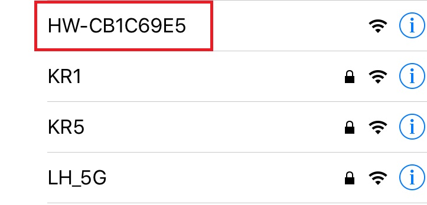

# 1. Getting Ready

## 1. uHandPi Introduction

### 1.1 Introduction 

Powered by Raspberry Pi 5, uHandPi is an intelligent vision mechanical hand of 6 DOF. Adopting micro anti-blocking servo, its knuckles have 5 DOF, long service life, great flexibility. Pan-tilt adopts high accuracy digital servo and it can rotate 180 degree horizontally.

Loaded with HD camera, uHandPi can work with OpenCV to realize AI image recognition, image transmission, finger-guessing, etc.

### 1.2 Packing list

### 1.3 Usage Precautions

Please pay attention to the following points when using and storing this product:

(1) This product contains conductive components. Avoid contact with metal objects when powered on.

(2) After the robot is powered on, do not forcibly move the servo, as this may cause damage.

(3) If the robot runs for an extended period, the servos may become hot. Allow the robot to "rest" and wait for the servos to cool before resuming operation.

(4) Keep your face, glasses, and other body parts away from the robot while it is operating. Do not place fingers within the joint movement range to prevent injury. Also, be cautious of falls from high edges.

(5) The robot's servos are precision components and consumable parts. They may need replacement after long-term or intensive use.

(6) If the product will not be used for an extended period, fully charge the battery, remove it, and store it in a cool, dry place.

### 1.4 Copyright Notice

This manual is the property of Shenzhen Hiwonder Technology Co., Ltd. No organization or individual is permitted to reproduce, copy, translate, or distribute any content from this manual without authorization.
Any unauthorized use or infringement of this manual's copyright will be subject to legal action by our company.

### 1.5 Disclaimer

The product described in this manual (including hardware, software, etc.) is provided "as is." Every effort has been made to ensure the accuracy of this manual, but we cannot guarantee it is completely free from errors or omissions. This document is regularly reviewed, and we welcome feedback for improvements.
Product features and specifications may change with version upgrades. For the latest product information, please contact customer service when placing your order.
Furthermore, unless explicitly stated by Hiwonder, we are not responsible for any losses resulting from product malfunctions or damage under extreme conditions outside of typical use cases.

## 2. Start uHandPi

### 2.1 Servo Wiring

Connect the servo wires labeled ID1-ID5 respectively to the Raspberry Pi expansion board's 1, 2, 3, 4, 5, 6 interfaces. Note: connect the yellow/white wire to S, the red wire to +, and the gray/black wire to -.

### 2.2 Pulg in and Boot up

:::{Note}
This section is for standardizing operational procedures. DC power cable has been connected to Raspberry Pi expansion board already before delivery.
:::

(1) Connect red part of the DC power cable to + pole on Raspberry Pi expansion board, and black part to - pole.

(2) Connect the male interface of the power adaptor to the female interface of the DC power cable. After that, plug in the power adaptor.

(3) Push the switch on Raspberry Pi expansion board to "ON". At this time, LED1 and LED2 on Raspberry Pi will light up continuously. After a while, LED1 will flash every 2s, and the mechanical hand will in the posture shown below, which means that it boots up successfully. The Raspberry Pi is also a computer, and it takes a short while to boot up, approximately 30 seconds. Please be patient.

(4) After booting up the device successfully, the default mode is AP directly connection mode. And create a hotspot starting with HW.

(4) Next, you can go to "[Quick User Experience\1. APP Installation and Connection](https://docs.hiwonder.com/projects/uHandPi/en/latest/docs/2.quick_user_experience.html#app-installation-and-connection)" to learn the subsequent contents.
