# 2. Quick User Experience

## 2.1 APP Installation and Connection 

The following instructions use TurboPi as an example and apply to other Hiwonder Raspberry Pi series products as well.
In this section, you will learn how to use APP "**WonderPi**" to control TurboPi. The installation method is as follows.

:::{Note}

① Make sure all APP permissions are turned on in settings, otherwise APP functions will be limited!

② Turn on Location and WiFi before operation.

:::

### 2.1.1 Installation

**[APP Installation Pack (Android)](https://play.google.com/store/apps/details?id=com.Wonder.Pi)**

**[APP Installation Pack (iOS)](https://apps.apple.com/cn/app/wonderpi/id1477946178)**

:::{Note}
- Please turn TurboPi on before connecting. 

- Make sure all APP permissions are turned on in settings, otherwise APP functions will be limited!

- Turn on Location and WiFi before operation.

:::

### 2.1.2 APP Connection

(1) Start robot. (The switch is on Raspberry Pi expansion board). For detailed instruction, please refer to the file in "[Getting Ready\1.3 Start uhandPi]()".

(2) After TurboPi boots up successfully, it enters AP direct connection mode, and generates a WiFi starting with **"HW"**. Join this WiFi, and then you can experience robot games

* **Introduction to Connection Mode**

There are two connection modes, namely direct connection mode and LAN mode. APP functions are the same under these two modes.

(1) AP direct connection mode: RaspberryPi generates a WiFi which can be connected by phones. But this WiFi has no internet access. 

(2) STA LAN mode: Raspberry Pi actively connects to specific WiFi. In this mode, you can access internet.

* **Direct Connection Mode (MUST-READ)** 

:::{Note}
After TurboPi boots up successfully, it enters AP direct connection mode, and generates a WiFi starting with **"HW"**.
:::

(1) Open"**WonderPi**". Select **"Standard ->TurboPi"** in sequence.

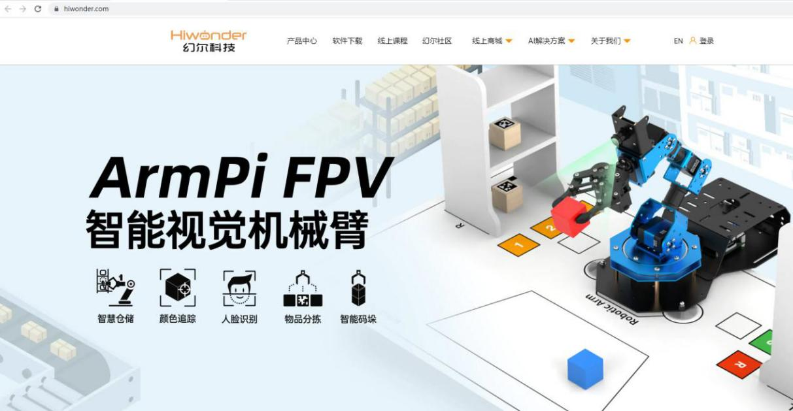

(2) Tap **"+"** in bottom right corner, and then select **Direct Connection Mode**.

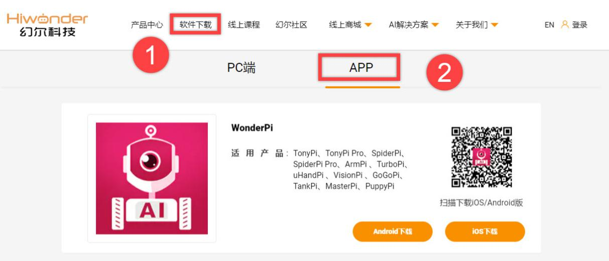

(3) Tap **"Go to connect device hotspot"**. Join WiFi starting with "**HW**". The password is **"hiwonder"**.

(4) Return back to APP after connection.

:::{Note}
 for iOS user, please don't return to APP until WiFi icon appears on status bar, otherwise robot cannot be searched. If robot cannot be searched by APP, tap  to refresh.
:::

(5) APP automatically connects to robot. When robot icon below occurs, connection completes. 

:::{Note}
if you are informed of "No Internet. Whether to keep connection", just select "**keep connected**".
:::

(6) Tap robot icon to enter mode selection interface.

For detailed introduction to robot games, please refer to the file in "**[2.2 APP Control](#anchor_2)**".

**1.2.3  LAN Connection Mode**

(1) Disconnect the WiFi generated by TurboPi. Connect your phone to a WiFi. Take **"Hiwonder"** as example.

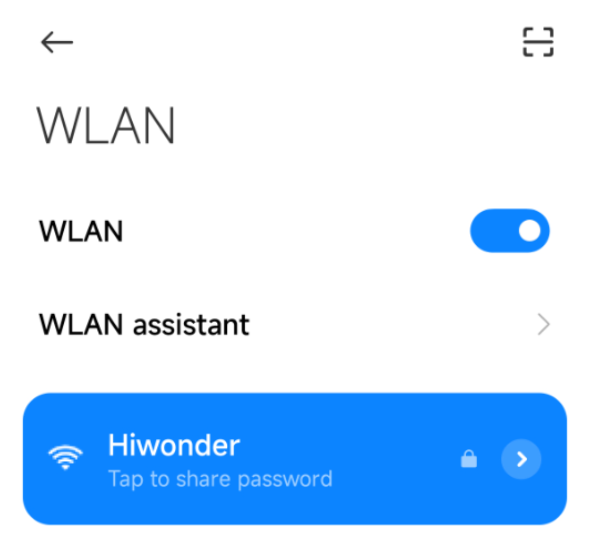

(2) After connection, open **"WonderPi"**. Select **"Standard ->TurboPi"** in sequence.

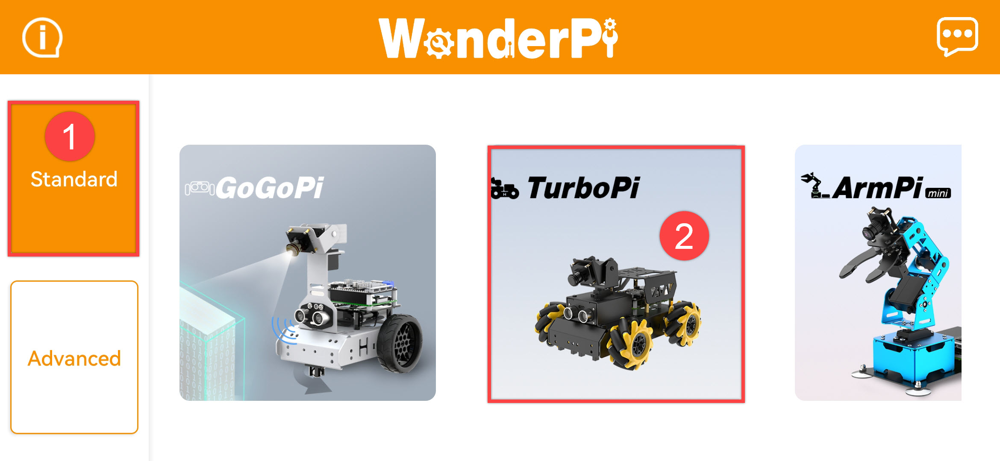

(3) Tap **"+"** in bottom right corner, and then select LAN Mode.

(4) Input the password of the WiFi your phone joins. Ensure the password you input is correct, otherwise APP fails to connect to robot. Tap **"OK"**.

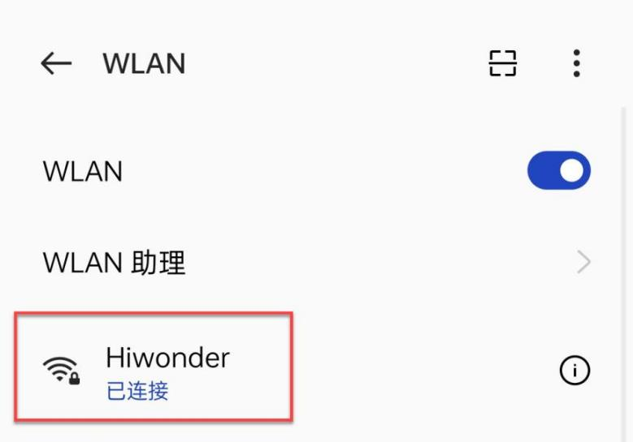

(5) Tap **"Go to connect device hotspot"**.

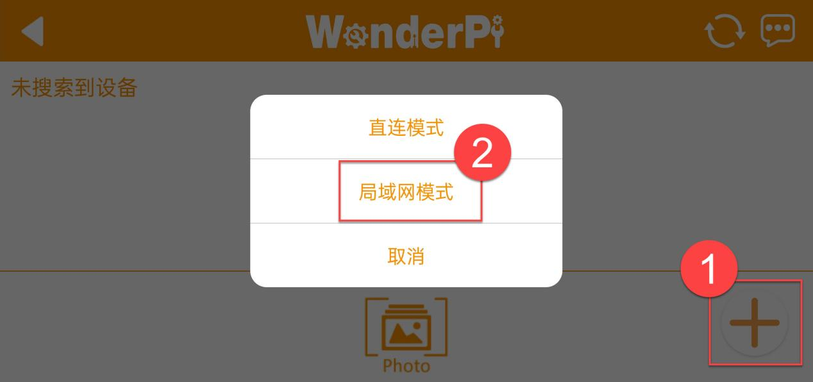

(6) Join the WiFi starting with **"HW".** The password is **"hiwonder"**. After connection, return back to APP.

(7) APP automatically configures network.

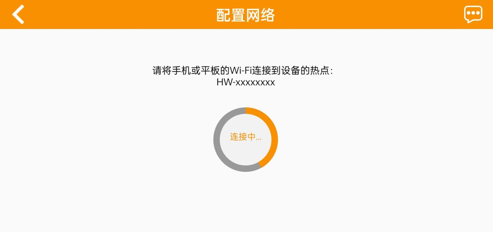

(8) After a while, robot icon below occurs, and LED on expansion board keeps on.

(9) Long press robot icon to check TurboPi's IP and ID.

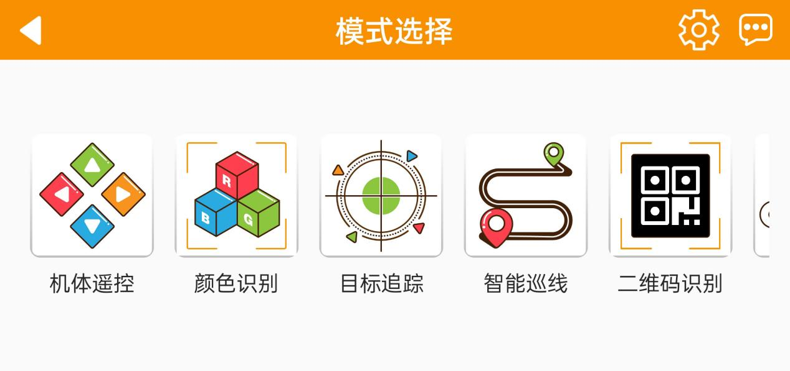

(10) Tap robot icon to enter mode selection interface.

For detailed introduction to robot games, please refer to the file in"**[2.2 APP Control](#anchor_2)**".

## 2.2 App Control

### 2.2.1 Preparation

After connection successfully, click uHandPi icon to go to the mode selection interface.

### 2.2.2 Start uHandPi

(1) After connection successfully, click uHandPi icon to go to the mode selection interface.

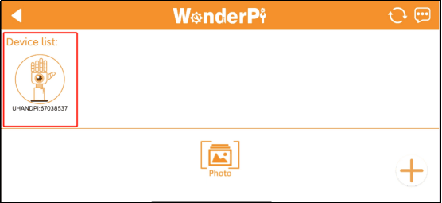

(2) Click corresponding icon in the interface to go to the corresponding game interface.

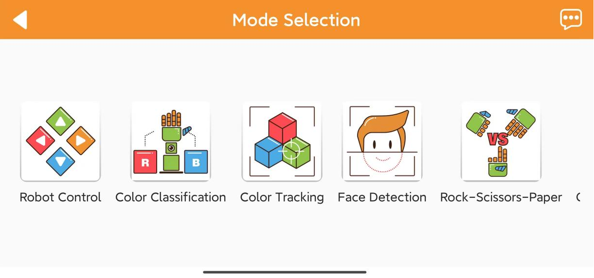

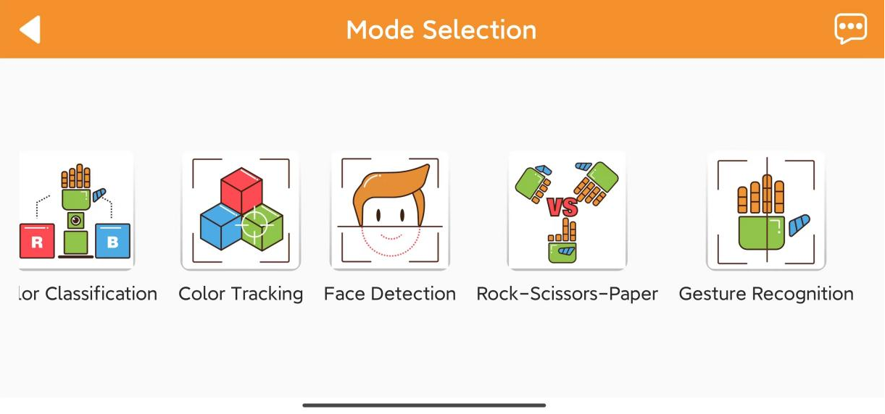

**2.2.1 Remote Control**

(1) This game allows real-time control of the hand pan-tilt and action groups. The interface is divided into five parts, each with its description and functional icon as follows:

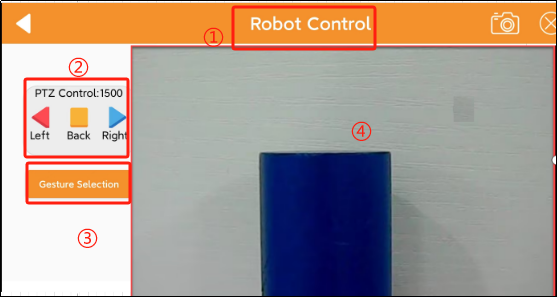

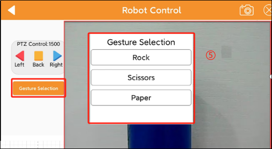

① Status bar: control the exit of game, screenshot of the feedback screen and the hiding of the status bar.

② Control bar: control the pan-tilt motion.

③ Gesture control: can open action group list.

④ Feedback Screen: displaying the camera's feedback image.

⑤ Action group list: can provide executable action group.

<table class="docutils-nobg" border="1">
    <thead>
    	<tr><th>Interface</th><th>Icon</th><th>Function</th></tr>
    </thead>
    <tbody>
    	<tr>
        	<td rowspan="3">Status</td><td></td><td>Return key, return to the previous level of game selection menu</td>
        </tr>
        <tr>
        	<td></td><td>Capture a screenshot of the feedback screen and save it to the gallery of the connection interface.</td>
        </tr>
        <tr>
        	<td></td><td>Hide menu bar.</td>
        </tr>
        <tr>
        	<td rowspan="3">Control</td><td></td><td>Click this icon then the hand will rotate to the left (from the perspective of the robot)</td>
        </tr>
        <tr>
        	<td>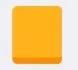</td><td>Click this icon then the hand will return to the neutral position</td>
        </tr>
        <tr>
        	<td></td><td>Click this icon the the hand will rotate to the right (from the perspective of the robot)</td>
        </tr>
        <tr>
        	<td>Feedback screen</td><td>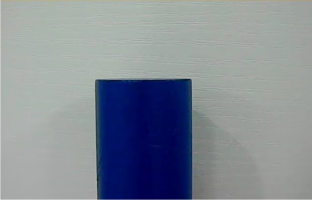</td><td>Display the feedback screen of the hand camera</td>
        </tr>
        <tr>
        	<td>Gesture </td><td>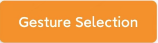</td><td>Click gesture selection, you can open the action</td>
        </tr>
        <tr>
        	<td>Action group list</td><td>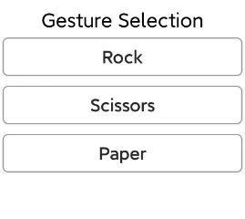</td><td>Click "Rock" will make the hand assume a fist posture; click "Scissor" will make the hand assume a scissor hand posture: click "Paper" will make the hand open</td>
        </tr>
    </tbody>
</table>

If you want to return the game selection interface, you can click a blank area to bring up the status bar. Then click the icon  on the left.

* **Color Classification**

:::{Note}
- Please perform this game in a well-lit indoor environment, but try to avoid strong direct sunlight. 
- During recognition, please ensure that there are no objects with similar or identical colors to the target within the camera's field of view to avoid interference with recognition.
- If the recognition effect is unsatisfactory, you can go to the directory "[Quick User Experience\2.3 Adjust Color Threshold]()" to learn how to adjust the color threshold.
:::

(1) Click **"Color Classification"** icon to proceed to the game interface. This interface is divided into three parts:

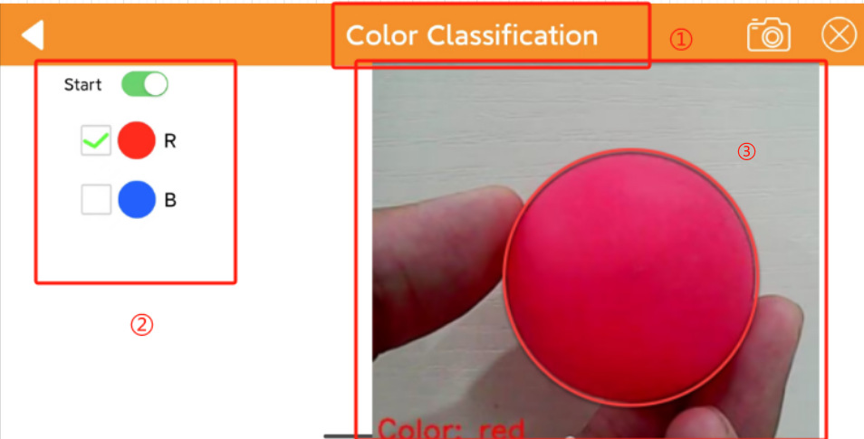

① The area at the top of the interface is the status bar.

② On the left side of the interface is the area for activating, deactivating, and selecting colors for the game.

③ On the right side of the interface is the area for the camera feedback screen.

(2) Click **"Start Classification"**, check the classify colors, and place the corresponding colored balls individually in front of the camera. Take red as an example, when red is detected, the identified red will be highlighted in the feedback image. The RGB lights on the expansion board will illuminate the corresponding color, place the ball in the center of the hand, the hand will grasp the ball, and then place the ball in the corresponding position.

| Identified Color | Identified Result                                            |
| ---------------- | ------------------------------------------------------------ |
| Red              | RGB light is red, place the red ball to the left side of the hand |
| Blue             | RGB light is blue, place the red ball to the right side of the hand |

If you want to return the game selection interface, you can click a blank area to bring up the status bar. Then click the icon  on the left.

* **Color tracking**

:::{Note}
- Please perform this game in a well-lit indoor environment, but try to avoid strong direct sunlight. 
- During recognition, please ensure that there are no objects with similar or identical colors to the target within the camera's field of view to avoid interference with recognition.
- If the recognition effect is unsatisfactory, you can go to the directory "[Quick User Experirnce \2.3 Adjust color threshold]()" to learn how to adjust the color threshold.
:::

(1) Click **"Color Tracking"** to go to the game interface. This interface is divided into three parts:

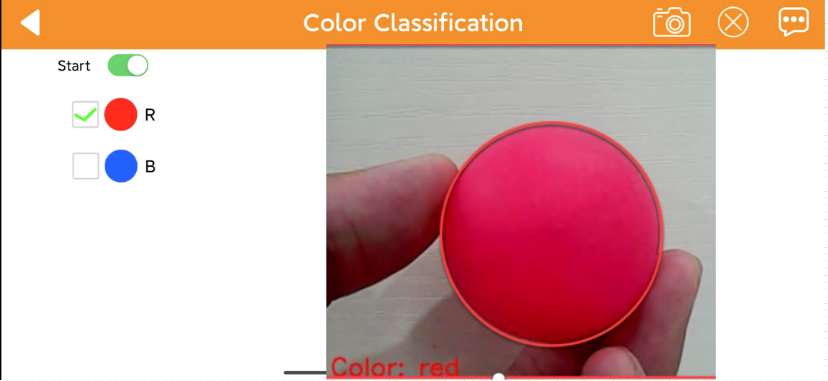

① The area at the top of the interface is the status bar.

② On the left side of the interface is the area for tracking.

③ On the right side of the interface is the area for the camera feedback screen.

(2) Click **"Start"** button, then select the target color to activate the tracking game. At this point, the uHandPi will follow the motion of the selected color target.

|                                            Icon                                         | Function |
|:-----------------------------------------------------------------------------------------------:|:--:|
|  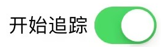  | Start/close color tracking |
| 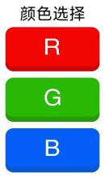 | Select the tracking target color |
|  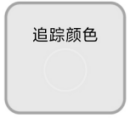   | Display target color information |

If you want to return the game selection interface, you can click a blank area to bring up the status bar. Then click the icon  on the left.

* **Face detection**

Click **"Face Detection"** to go to the interface. After this game is started, the hand will move left and right to search for a face back and forth. Once a face is detected, it will perform a "waving" gesture.

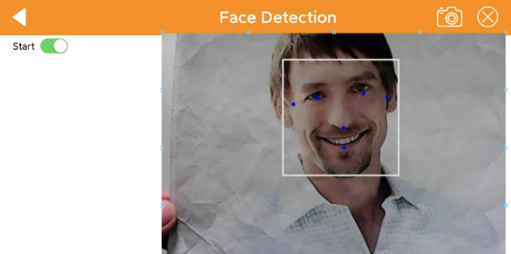

|                                           Icon                                        | Function |
|:---------------------------------------------------------------------------------------------:|:--:|
| 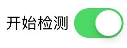 | Start/Close game |

If you want to return the game selection interface, you can click a blank area to bring up the status bar. Then click the iconon the left.

**2.2.5 Scissor-Rock-Paper**

Click **"Scissor-Rock-Paper"** to go to the interface. Once this game is activated, uHandPi can recognize the gestures of "scissors, rock, paper" and execute the corresponding gesture.

:::{Note}
During recognition, only one hand will appear in the screen.
:::

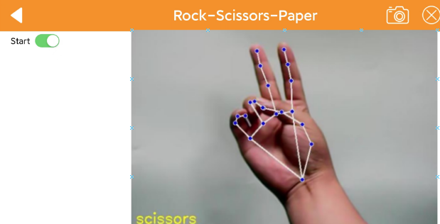

① The area at the top of the interface is the status bar.

② On the left side of the interface is the area for switching.

③ On the right side of the interface is the area for the camera feedback screen.

(1) Click **"Start Scissor-Rock-Paper"** and make scissor-Rock-Paper gesture in front of the uHandPi camera. Then the uHandPi will execute the corresponding suppression gesture after recognizing each different gesture.

| Detected gesture | **Suppression Gesture** |
|:--:|:--:|
| 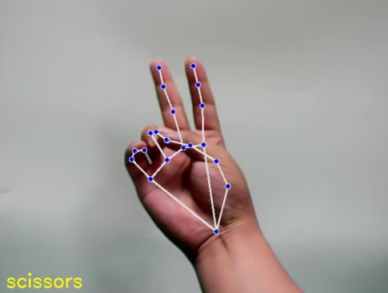 | 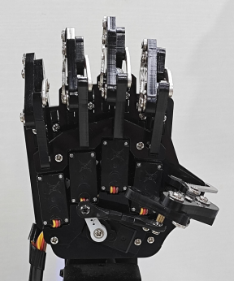 |
| 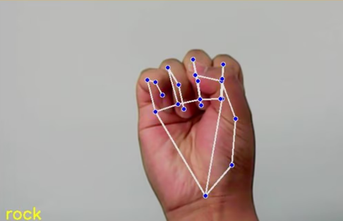 | 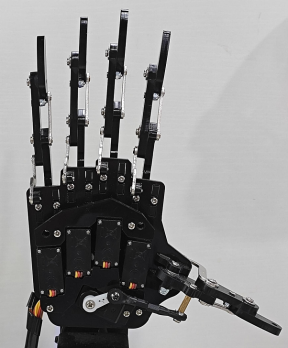 |
| 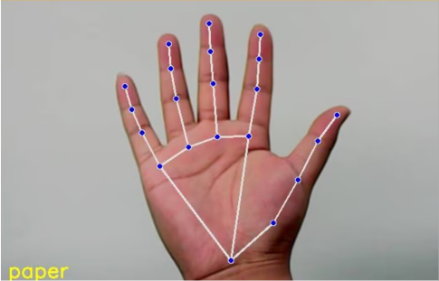 | 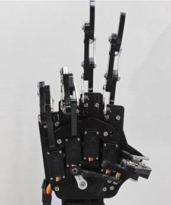 |

If you want to return the game selection interface, you can click a blank area to bring up the status bar. Then click the icon  on the left.

**2.2.6 Gesture recognition**

Click **"Gesture Recognition"** to go to the interface. After this game is activated, the car can use ultrasonic waves to detect obstacles in front and avoid them.

:::{Note}
During recognition, only one hand will appear in the screen.
:::

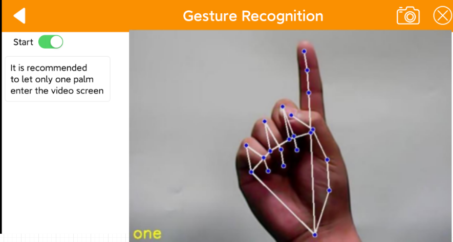

① The area at the top of the interface is the status bar.

② On the left side of the interface is the area for switching.

③ On the right side of the interface is the area for the camera feedback screen

(1) Click "Gesture Recognition", uHandPi will detect the corresponding gesture and perform corresponding action.

| Gesture name | Detected Gesture |
|:--:|:--:|
| One | 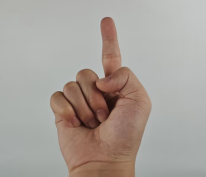 |
| Two |  |
| Three | 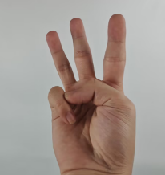 |
| Four | 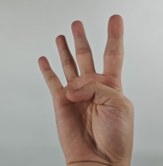 |
| Five | 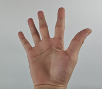 |
| Six |  |
| Fist |  |
| OK |  |
| Gun |  |
| Rock |  |
| hand_heart |  |

If you want to return the game selection interface, you can click a blank area to bring up the title bar. Then click the icon.

## 2.3 Adjust Color Threshold

Different light source will have different influence on the colors, which will result in recognition discrepancy. To tackle this problem, you can adjust color threshold via "**WonderPi**" APP.

### 2.3.1 Preparation

Start TurboPi. Open "WonderPi" APP, and connect it to TurboPi. For how to connect robot to APP, operate referring to "**[2.1 APP Installation and Connection ](#anchor_1)**".

### 2.3.2 Interface Layout

Tap  in upper right corner to enter color threshold adjustment interface.

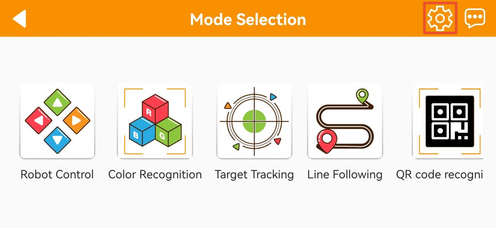

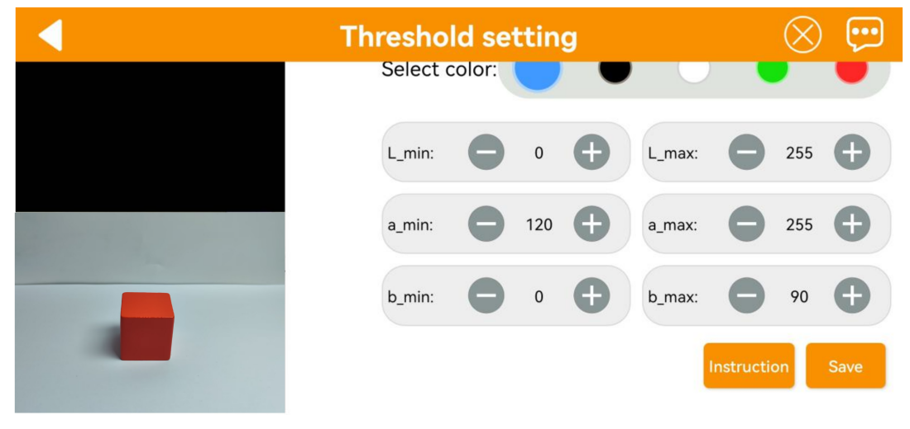

The table below list function of specific icon.

<table class="docutils-nobg" border="1">
<colgroup>
<col  />
<col  />
</colgroup>
<tbody>
<tr>
<td ><strong>Icon</strong></td>
<td ><strong>Function</strong></td>
</tr>
<tr>
<td ></td>
<td >
Processed camera returned image.

Target object is white, and other area is black.
</td>
</tr>
<tr>
<td ></td>
<td >Raw camera returned image.</td>
</tr>
<tr>
<td ></td>
<td >Select the color to be adjusted.</td>
</tr>
<tr>
<td ></td>
<td >
Adjust L component of camera returned image. "L_min" is lower limit and "L_max" is upper limit.

</tr>
<tr>
<td >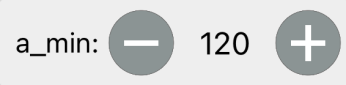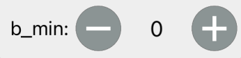</td>
<td >
Adjust A component of camera returned image. "a_min" is lower limit and "a_max" is upper limit.

</tr>
<tr>
<td ></td>
<td >
Adjust B component of camera returned image. "b_min" is lower limit and "b_max" is upper limit.

</tr>
<tr>
<td ></td>
<td >Get instruction to check how to adjust color threshold.</td>
</tr>
<tr>
<td ></td>
<td >Save the adjusted color threshold.</td>
</tr>
<tr>
<td ></td>
<td >Return back to mode selection interface.</td>
</tr>
<tr>
<td ></td>
<td >Hide navigation bar.</td>
</tr>
<tr>
<td >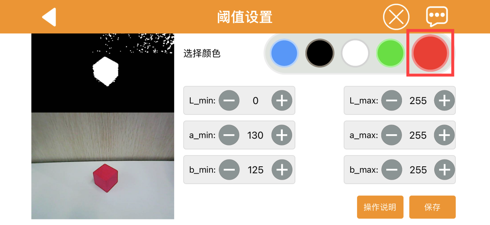</td>
<td >Display Hiwonder info.</td>
</tr>
</tbody>
</table>

### 2.3.3 Adjust Color Threshold

(1) Select color to be adjusted. Take red as example.

(2) Put red object within camera recognition zone. Set L_min, a_min and b_min to 0, and L_max, a_max and b_max to 255.

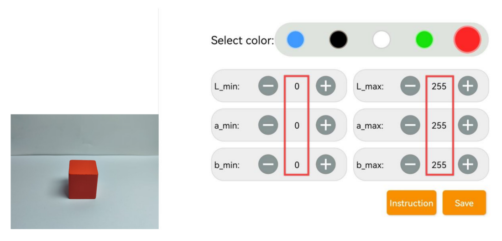

(3) Tap "**Instruction**" icon to check how to adjust color threshold.

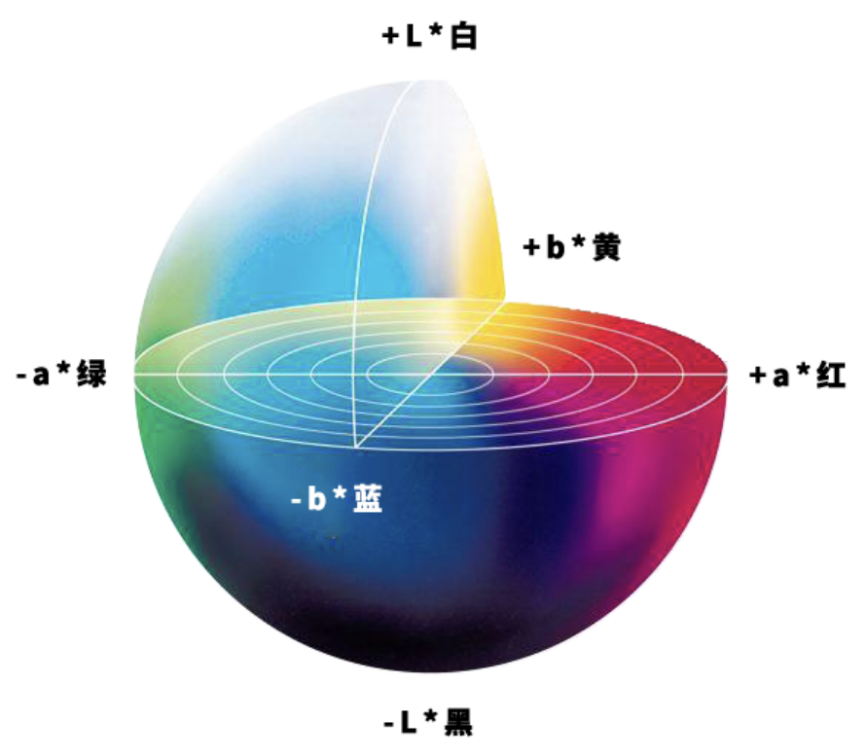

:::{Note}
if you need to close Instruction window, select "**OK**".
:::

(4) Red approaches "**+a**" zone, so you need to adjust A component.

(5) Keep "**a_max**" value the same, and then increase "**a_min**" value till red object turns white and other area is black.

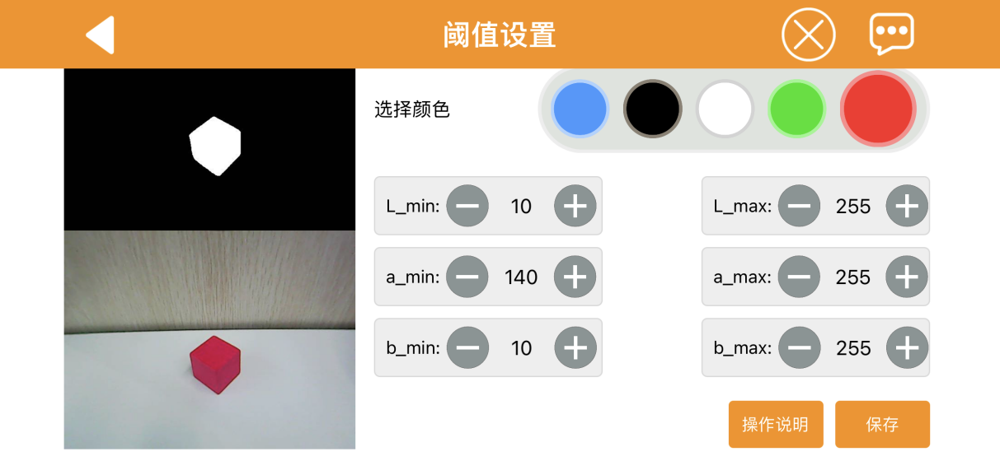

(6) Adjust "**L**" and "**B**" values. If it belongs to light red, increase L_min. Otherwise, decrease L_max. If it belongs to warm tone, increase B_min. Otherwise, decrease B_max.

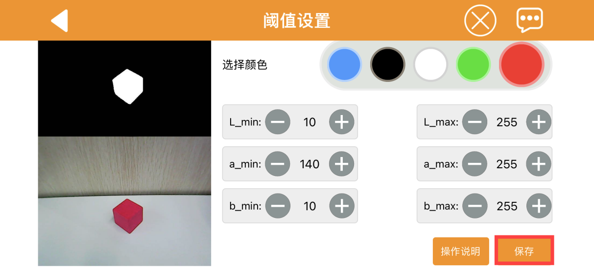

(7) Remember to save the value after adjustment.

