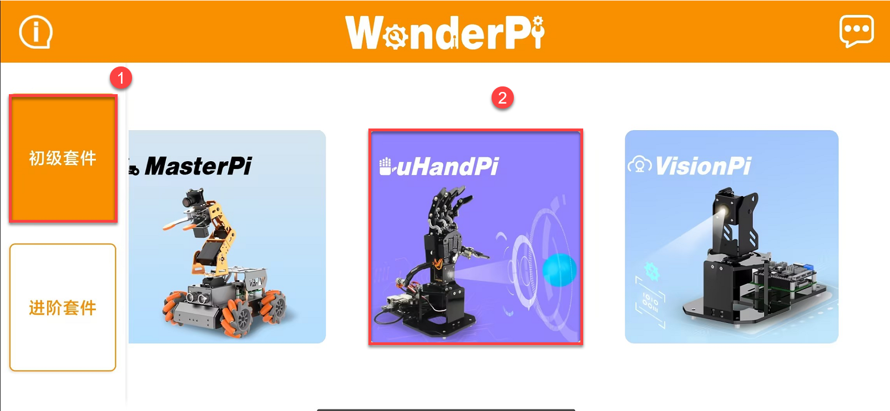
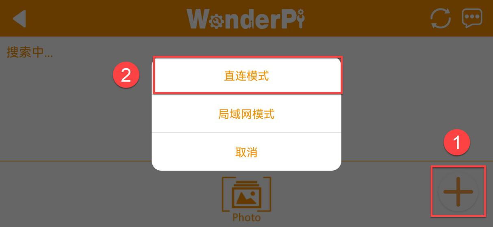
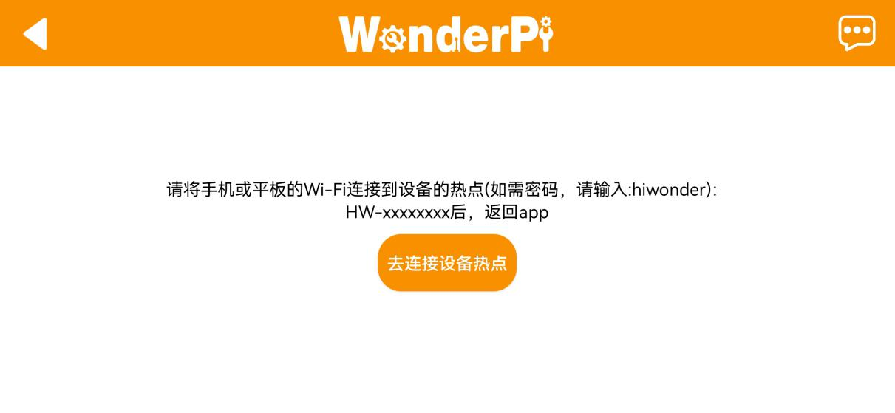
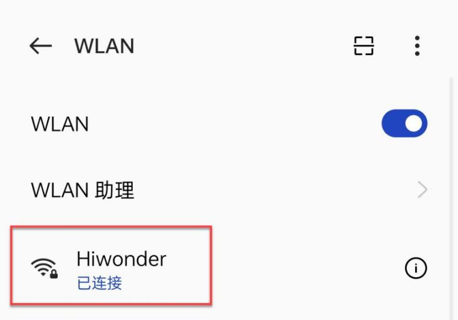
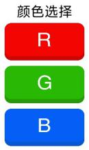

# 上手试玩

## 1.手机APP的安装与连接

### 1.1 APP安装

用户可以使用手机APP"**WonderPi**"来控制uHandPi。本节课会说明安装方法。

:::{Note}
1.  安装时请对APP开放所有权限，以免影响APP的正常使用。
2.  打开APP前，需开启手机的位置信息和Wi-Fi功能。
:::

**[安卓系统](https://play.google.com/store/apps/details?id=com.Wonder.Pi)**

**[iOS系统](https://apps.apple.com/cn/app/wonderpi/id1477946178)**

- #### 设备开机

按照前面所学，在连接适配器后推动树莓派扩展板的开关。稍等片刻后扩展板上的LED1由常亮变为每隔2秒闪烁一次，同时手掌上的所有舵机呈现抓取姿态，即为成功开机标志。

### 1.2 设备连接

uHandPi开机成功后，会进入AP直连模式，并生成一个以"**HW**"开头的热点，使用手机APP连接该热点后，即可启动其对应玩法。

设备的连接方法有两种分别是直连模式与局域网模式，用户无论是选择AP直连模式还是STA局域网模式，都能一致实现uHandPi手机APP的玩法功能。

- #### 1.2.1 连接模式简介

以下为uHandPi的两种网络模式：

1.  AP 直连模式：开发板能够开启热点被手机连接上。(但不能联通外部网络)

2.  STA局域网模式：开发板能够主动去连接指定的热点/Wi-Fi。(可联通外部网络)

- #### 1.2.2 直连模式连接方法（必看）

:::{Note}
uHandPi启动成功后会进入AP直连模式并生成一个****以"HW"为开头的热点。**
:::

1)  打开手机APP"**WonderPi**"，依次点击"**初级套件**"、"**uHandPi**"。

2)  点击界面右下角的"**+**"按钮，选择"**直连模式**"。

3)  点击"**去连接设备热点**"按键，前往设置界面，连接uHandPi生成的热点，连接时需输入密码"**hiwonder**"。

4)  连接成功后返回手机APP。

:::{Note}
iOS系统下，需等待手机状态栏显示Wi-Fi图标后再返回APP，否则可能会搜索不到设备。若出现搜索不到设备的情况，可点击APP界面右上方的刷新图标**。
:::

5)  此时APP将自动连接设备，稍等片刻，当搜索到下图所示图标时，即为连接成功。

:::{Note}
若出现"网络不可用，是否继续连接"的提示弹窗，单击"保持连接"按键即可。
:::

6)  点击上图的uHandPi图标即可进入玩法模式选择界面，如下所示：

如需了解各个玩法的具体使用方法，可查看目录"**[2. 手机APP试玩](#anchor_2)**"下的文档。

- #### 1.2.3 局域网模式连接方法

1)  断开之前uHandPi直连模式下的热点，将手机连接至一个Wi-Fi，这里以连接名称为："**Hiwomder**"的Wi-Fi为例。

2)  连接完成之后，打开"**WonderPi**"，依次点击"**初级套件**"、"**uHandPi**"。

3)  然后单击右下角"**+**"按钮，选择"**局域网模式**"。

4)  此时APP会提示输入你所连接Wi-Fi的密码（请确认密码是否输入正确，如果输入错误会导致连接失败），输入完成后点击"**好的**"。

5)  再点击"**去连接设备热点**"。

6)  此时手机会自动跳转到Wi-Fi连接页面，找到"**HW**"开头的热点，输入密码 "**hiwonder**"连接它。连接完成之后点击"**返回**"按钮。

7)  连接完成后，可以看到APP已经开始自动配置网络了。

8)  稍等片刻，主界面会显示uHandPi的图标，同时扩展板上的LED灯也会常亮。

9)  长按APP中的uHandPi图标，可以查看分配给uHandPi的IP地址和ID。

10) 点击uHandPi的图标，就可以进入到玩法页面了。

如需了解各个玩法的具体使用方法，可查看下文"**2. 手机APP试玩**"下的文档。

## 2. 手机APP试玩

### 2.1 准备工作

将uHandPi开机，先参照"**[上手试玩\1. 手机APP安装与连接]()**"教程，安装手机APP，并连接uHandPi机器人。

### 2.2 开始试玩

连接完成后，点击uHandpi图标，进入模式选择界面。

在模式选择界面中点击玩法对应的图标即可进入玩法界面。

- #### 2.2.1 机体遥控

1)  该玩法可以实时控制手掌云台和动作组；界面分为五个部分，各部分的描述以及功能图标如下所示：

1.  状态栏：可以控制玩法的退出、回传画面的截图以及状态栏的隐藏；

2.  控制栏：可以控制云台运动；

3.  手势选择：可以打开动作组列表；

4.  回传画面：显示摄像头的回传画面；

5.  动作组列表：提供可以执行的动作组。

<table class="docutils-nobg" border="1">
    <thead>
    	<tr><th>界面分布</th><th>图标</th><th>对应功能</th></tr>
    </thead>
    <tbody>
    	<tr>
        	<td rowspan="3">状态栏</td><td></td><td>返回按键，返回上一级的玩法选择菜单</td>
        </tr>
        <tr>
        	<td></td><td>对回传画面进行截图，并且保存到连接界面的图库中</td>
        </tr>
        <tr>
        	<td></td><td>隐藏菜单栏</td>
        </tr>
        <tr>
        	<td rowspan="3">控制栏</td><td></td><td>点击按钮手掌云台向左转动（以机器人为第一视角）</td>
        </tr>
        <tr>
        	<td></td><td>点击按钮手掌云台会回中</td>
        </tr>
        <tr>
        	<td></td><td>点击按钮手掌云台向右转动（以机器人为第一视角）</td>
        </tr>
        <tr>
        	<td>回传画面</td><td></td><td>显示手掌摄像头的回传画面</td>
        </tr>
        <tr>
        	<td>手势选择</td><td></td><td>点击"手势选择"，可以打开动作组列表</td>
        </tr>
        <tr>
        	<td>动作组列表</td><td></td><td>点击"**石头**"手掌会呈现握拳姿态；点击"**剪刀**"手掌会呈现剪刀手姿态；点击"**布**"手掌会张开</td>
        </tr>
    </tbody>
</table>

如需返回到玩法选择界面，点击空白区域调出状态栏，再点击左侧的图标即可。

- #### 2.2.2 颜色分类

该玩法可以识别红、蓝两种颜色。识别到红色后，将小球放置到手掌中心，手掌会抓取小球，将小球放置到云台左边；识别到蓝色后，将小球放置到手掌中心，手掌会抓取小球，将小球放置到云台右边；

:::{Note}
- 请在光线充足的室内环境下进行，但尽量避免在强光直射下进行。
- 识别时，摄像头画面内请勿应无同目标颜色相同或相近的杂物，避免干扰识别。
- 如识别效果不佳，可前往目录"**[上手试玩\3. 颜色阈值调节]()**"查看文档，学习颜色阈值的调节方式。
:::

1)  点击"**颜色分类**"，进入玩法界面。该界面分为三个部分：

:::{Note}
- 界面上方的是状态栏。
- 界面左侧是玩法的开启、关闭与颜色选择区域；
- 界面右侧是摄像头回传画面区域。
:::

2)  点击"**开始分类**"按钮，勾选分类颜色，将对应颜色小球体单独放置于摄像头前。以红色为例，当识别到红色时，会在回传画面中将识别到的红色框出来，扩展板上的RGB灯亮起相应颜色，将小球放置到手掌中心，手掌会抓取小球，将小球放置到对应位置。

| **识别颜色** |             **识别结果**              |
|:------------:|:-------------------------------------:|
|      红      | RGB灯为红色，将红色小球放置到手掌左边 |
|      蓝      | RGB灯为蓝色，将红色小球放置到手掌右边 |

3)  如需返回到玩法选择界面，点击当前界面的空白区域，调出标题栏，随后点击按键即可。

- #### 2.2.3 颜色追踪

点击"**颜色追踪**"，进入玩法界面。该玩法开启后可以实现手掌云台随着目标颜色的移动而移动的功能。

:::{Note}
- 请在光线充足的室内环境下进行，但尽量避免在强光直射下进行。
- 识别时，摄像头画面内请勿应无同目标颜色相同或相近的杂物，避免干扰识别。
- 如识别效果不佳，可前往目录"**[上手试玩\3. 颜色阈值调节]()**"查看文档，学习颜色阈值的调节方式。
:::

1)  点击"**颜色追踪**"，进入玩法界面。该界面分为三个部分：

:::{Note}
- 界面上方的是状态栏
- 界面左侧是追踪开关区域；
- 界面右侧是摄像头回传画面区域。
:::

2. 点击"开始**追踪**"按钮，再选择目标颜色即可启动追踪玩法，此时uHandPi的云台将跟随选定的颜色目标运动。

|                                            **按钮图标**                                             | **功能说明** |
|:-----------------------------------------------------------------------------------------------:|:--:|
|    | 开启/关闭颜色追踪玩法。 |
|  | 选择追踪的目标颜色。 |
|     | 显示目标颜色信息。 |

3. 如需返回到玩法选择界面，点击当前界面的空白区域，调出标题栏，随后点击按键即可。

- #### 2.2.4 人脸检测

点击"**人脸检测**"，进入玩法界面。启动该玩法后，可以让手掌云台会左右来回寻找人脸，检测到人脸之后会执行"**招手**"动作。

:::{Note}
- 界面上方的是状态栏；
- 界面左侧是人脸检测开关区域；
- 界面右侧是摄像头回传画面区域。
:::

1.  点击"**开始巡线**"按钮，并选择巡线颜色，手掌云台会进行左右来回移动。

|                                           **按钮图标**                                            | **功能说明** |
|:---------------------------------------------------------------------------------------------:|:--:|
|  | 开启/关闭玩法。 |

2.  如需返回到玩法选择界面，点击当前界面的空白区域，调出标题栏，随后点击按键即可。

- #### 2.2.5 剪刀石头布

点击"**剪刀石头布**"识别，进入玩法界面。该玩法启动后可以让uhandPi识别到"**剪刀石头布**"的手势并执行压制手势。

:::{Note}
在识别时在画面中只出现一只手。
:::

:::{Note}
- 界面上方的是状态栏；
- 界面左侧是开关区域；
- 界面右侧是摄像头回传画面区域。
:::

1.  点击"**开始剪刀石头布**"按钮，在uHandPi摄像头前摆出剪刀石头布的手势，uHandPi将在识别到不同的手势后执行压制手势。

| **检测手势** | **压制手势** |
|:--:|:--:|
|  |  |
|  |  |
|  |  |

2.  如需返回到玩法选择界面，点击当前界面的空白区域，调出标题栏，随后点击按键即可。

- #### 手势识别

点击"**手势识别**"，进入玩法界面。该玩法启动后可让小车通过超声波识别前方是否有障碍物并避开。

:::{Note}
在识别时在画面中只出现一只手。
:::

:::{Note}
- 界面上方的是状态栏；
- 界面左侧是手势识别开关区域；
- 界面右侧是摄像头回传画面区域。
:::

1.  点击"**手势识别**"按钮，uHandPi会检测出对应的手势并执行对应的动作。

| **手势名称** | **检测手势** |
|:--:|:--:|
| One |  |
| Two |  |
| Three |  |
| Four |  |
| Five |  |
| Six |  |
| Fist |  |
| OK |  |
| Gun |  |
| Rock |  |
| hand_heart |  |

2.  如需返回到玩法选择界面，点击当前界面的空白区域，调出标题栏，随后点击按键即可。
