# 远程工具安装及连接

## 1. 远程工具安装与连接

本章节的学习需要准备一台笔记本电脑，如使用台式电脑请自备无线网卡。

### 1.1 准备工作

- #### VNC远程工具的安装

如果你希望通过电脑端来执行玩法，并尝试后期查看玩法代码并修改程序，那么需要先完成本章的学习，安装好VNC软件。

VNC是一款图形化远程控制软件。我们可以通过连接树莓派的Wi-Fi热点，直接在自己电脑上控制树莓派。接下来将会分步讲解如何使用VNC。

1)  双击本文件夹中的"**VNC-Viewer-6.17.731-Windows**"文件，在弹出的对话框中选择安装语言为"**English**"，单击"**OK**"按钮。

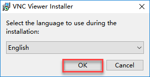

2)  在弹出的界面单击"**Next**"按钮。

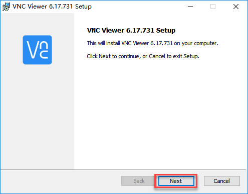

3)  在新的提示框中勾选同意协议，然后单击"**Nex**t"，接着弹出安装位置设置，保持默认设置，继续单击"**Next**"。

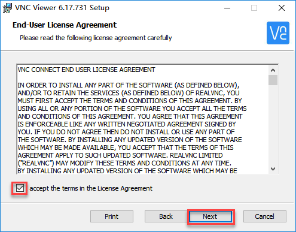

4)  在新弹出的页面中单击"**Install**"。

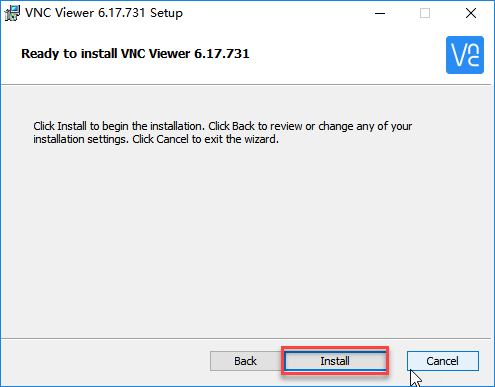

5)  等待安装，片刻之后出现安装完成提示页面，单击"**Finish**"按钮即可完成安装，安装后打开VNC。

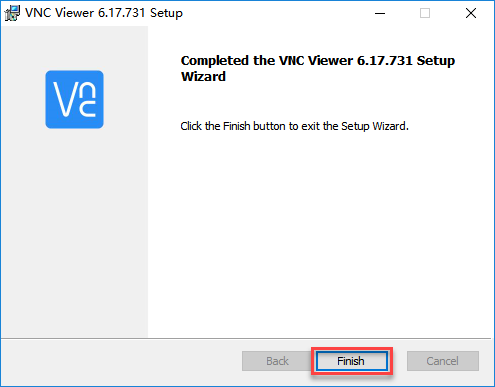

6)  VNC完成连接，直接打开图标即可。

- #### 设备开机

按照前面所学，在连接适配器后推动树莓派扩展板的开关。稍等片刻后树莓派扩展板上的LED1由常亮变为每隔2秒闪烁一次，同时手掌上的所有舵机呈现抓取姿态，即为成功开机标志。

### 1.2 设备连接

1)  机器人在开机后，会产生一个HW开头的热点，我们可以打开电脑Wi-Fi搜索到以HW开头的热点，如下图所示：


2)  在打开的VNC Viewer中输入树莓派默认的IP地址：192.168.149.1，然后按回车，如果提示不是安全连接的话单击"**Continue**"。

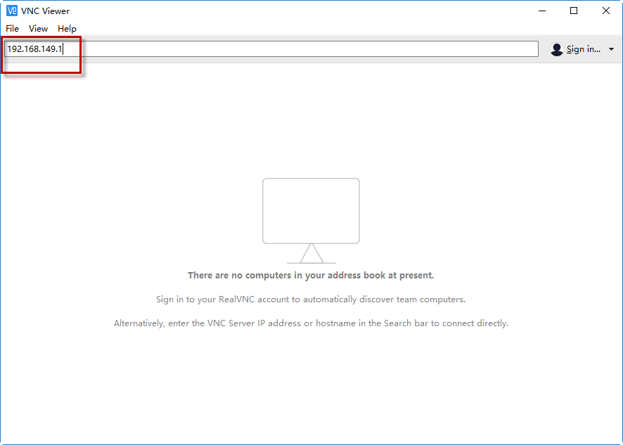

3. 此时弹出一个提示框，要求输入账号（Username）和密码（Password），账号输入：pi，密码输入：raspberrypi，勾选上记住密码框，然后单击"OK"，此时即可看到远程打开的树莓派的桌面了。

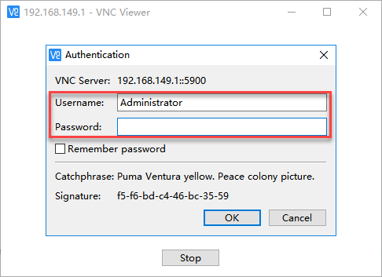

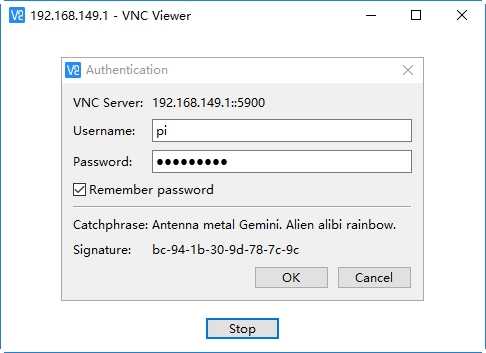

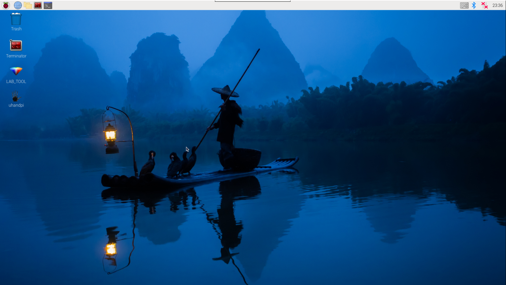

4.  在桌面上有一个警告对话框（树莓派本身特性），单击"**确定**"关闭即可。（如果是黑屏，只有一个鼠标，则可尝试重新启动树莓派。）

:::{Note}
各实验玩法详细启动步骤请参考后续的每章节的课程学习。
:::

## 2. 系统目录简要说明

### 2.1 桌面分布

通过VNC远程连接后，系统桌面如下图所示：


1)  其中我们主要看这个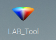图标。双击后，点击"**执行**"。

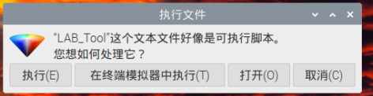

这个工具用来对颜色阈值参数进行调节，以及调试云台的舵机。

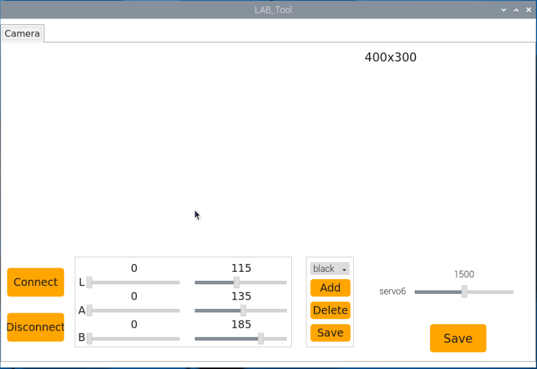

2)  点击"**Connect**"，可以显示当前摄像头回传的实时画面。点击"**Disconnect**"则可关闭摄像头。

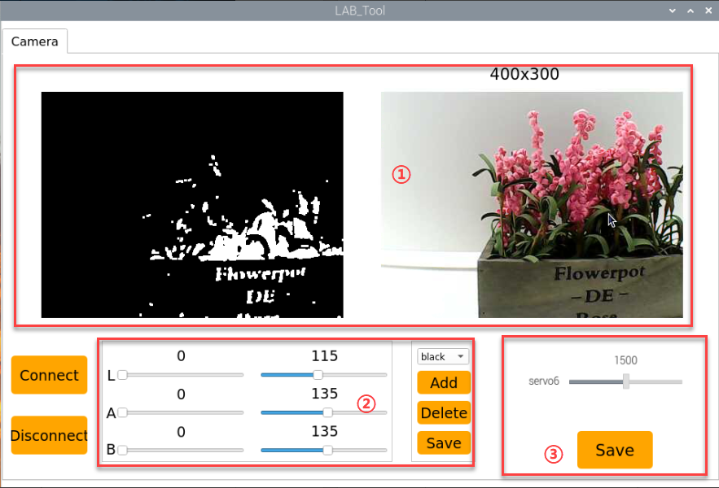

3)  工具界面可以分为以下三个部分，如下表所示：

| 序号 | 名称 | 功能 |
|:--:|:--:|:--:|
| ① | 摄像头回传区 | 用于显示回传画面，左侧为处理后的画面，右侧为原始画面。 |
| ② | 颜色阈值参数调节按钮 | 用于调节颜色阈值，选择需要调节的识别颜色及增删颜色种类及保存效果。 |
| ③ | 舵机控制区 | 用于调节云台6号舵机的初始位置，以及保存修改后的数值。 |

关于工具的具体使用，颜色阈值参数学习可参考 **"[上手试玩\3. 颜色阈值调节]()"** 。

### 2.2 程序结构说明

1)  按下"**Ctrl+Alt+T**"打开命令行终端，输入"**ls**"指令，列出当前所有文件。我们主要看以下几个目录即可。

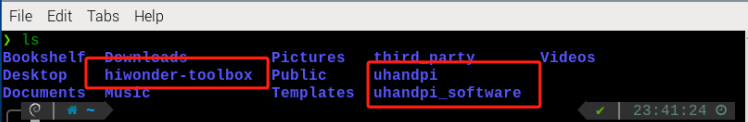

|      目录名      |              作用              |
|:----------------:|:------------------------------:|
| hiwonder-toolbox |         Wi-Fi管理工具          |
|     uhandpi      | 存放所有玩法及涉及到的程序源码 |
| uhandpi_software |  颜色阈值调试工具及手掌上位机  |

2)  接下来进入玩法及程序源码目录，输入"**cd uhandpi/**"指令。

```commandline
cd uhandpi/
```

3)  然后输入"**tree -L 1**"指令，以树状图的形式列出该目录下的所有文件夹及文件，我们主要了解下图红框所示的几个目录即可。

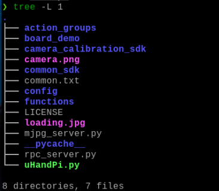

|      目录/文件名       |            说明            |
|:----------------------:|:--------------------------:|
|     action_groups      |     动作组文件存放路径     |
|     action_groups      |       扩展板相关例程       |
| camera_calibration_sdk |   相机底层文件及标定文件   |
|       common_sdk       |         底层驱动库         |
|       common.txt       |       测试及玩法指令       |
|         config         | 颜色阈值及舵机偏差配置文件 |
|     mjpg_server.py     |         视频流程序         |
|     rpc_server.py      |      rpc通讯服务程序       |
|       uHandPi.py       |    手机APP服务启动文件     |

4)  输入命令"**tree -l 1 functions**"，通过树状图直接打开AI视觉玩法程序所在目录。

```commandline
tree -l 1 functions
```

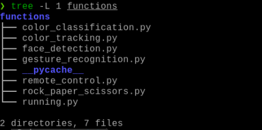

|       目录/文件名       |        说明         |
|:-----------------------:|:-------------------:|
| color_classification.py |    颜色分类玩法     |
|    color_tracking.py    |    颜色追踪玩法     |
|    face_detection.py    |    人脸检测玩法     |
| gesture_recognition.py  |    手势识别玩法     |
|    remote_control.py    | 手机APP遥控图传程序 |
| rock_paper_scissors.py  |   石头剪刀布玩法    |
|       running.py        |   手机APP调用程序   |
