# 3. Remote Desktop Installation and Connection

## 3.1 VNC Installation and Connection

**3.1.1 Preparation**

* **Hardware**

Prepare a computer. If you are using desktop computer, wireless network card is required.The network card should support 5G band.

*  **Install VNC**

VNC is a graphical remote desktop control software. Through connecting your computer to the WiFi generated by Raspberry Pi, you can control Raspberry Pi. Installation of VNC is as below.

(1) Double-click the installation program "**VNC-Viewer-6.17.731-Windows**" in the same directory as this section. Select the installation language as "**English**" and lick "**OK**".

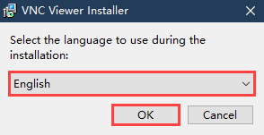

(2) Click "**Next**".


(3) Tick **"I accept the terms in the License Agreement"**. Then click **"Next"**.


(4) Remain default location where the software is installed. Click **"Next"** to proceed next interface. Then directly click **"Install"**.

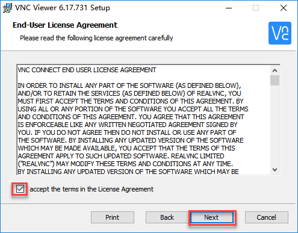

(5) When the installation completes, click **"Finish"**.


(6) Click  to open VNC.

* **Start Robot**

Start Robot When LED1 on expansion board starts flickering and buzzer emits one beep, robot boots up successfully.

**3.1.2 Connect to Robot**

(1) After turning Robot on successfully, the default mode is AP direct connection mode. Robot generates a WiFi starting with HW. Connect your computer to this WiFi.


(2) Input password. The password is **"hiwonder"**.

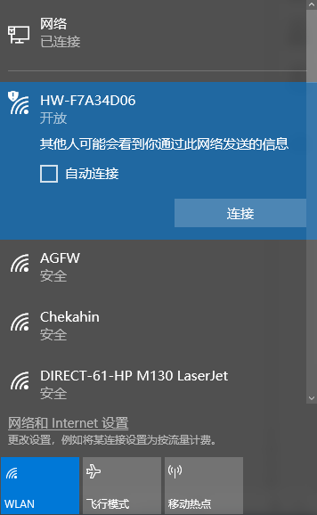

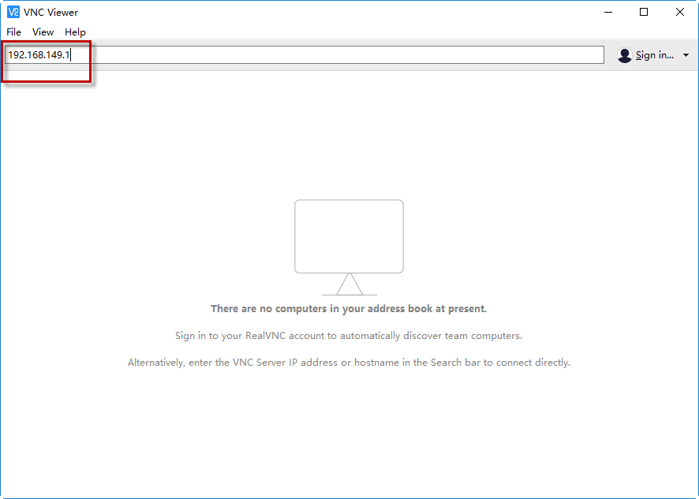

(3) After connection, open VNC Viewer. Input the default IP address of Raspberry Pi, **192.168.149.1**, and then press Enter. If you receive security warning, select **"Continue"**.

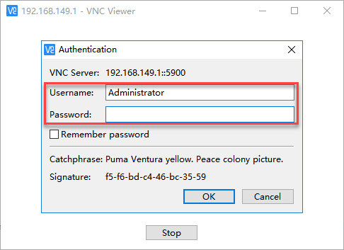

(4) Input username and password. **(Username: pi  Password: raspberrypi)**. Click **"OK"** to enter Raspberry Pi desktop.


(5) The desktop is as pictured. If black screen occurs or only cursor leaves on the screen, restart Raspberry Pi.


**3.1.3 Introduction to Desktop**

The desktop is as pictured after connecting Robot through VNC successfully.

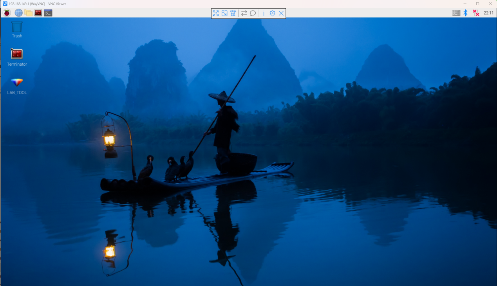

The following table demonstrates common functions:

<table  class="docutils-nobg" border="1">
<colgroup>
<col  />
<col  />
</colgroup>
<tbody>
<tr>
<td >Icon</td>
<td >Function</td>
</tr>
<tr>
<td ></td>
<td ><p>Application menu. Click to select different applications.</p>
<p></p></td>
</tr>
<tr>
<td ></td>
<td >Browser.</td>
</tr>
<tr>
<td >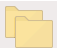</td>
<td >File manager.</td>
</tr>
<tr>
<td ></td>
<td >LX terminal. Click to input command line in the opened interface.</td>
</tr>
<tr>
<td ></td>
<td >Trash. You can find the files deleted here.</td>
</tr>
<tr>
<td >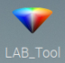</td>
<td >PC software. You can adjust pan tilt and adjust color threshold on it.</td>
</tr>
<tr>
<td ></td>
<td >Full screen or exit full screen.。</td>
</tr>
<tr>
<td >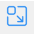</td>
<td >Exit full screen.</td>
</tr>
<tr>
<td ></td>
<td ><p>Shut down, reboot and logout</p>
<p>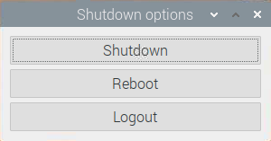</p></td>
</tr>
</tbody>
</table>

## 3.2 System Content

### 3.2.1 Desktop Layout

After connecting to VNC, the system desktop is as pictured:

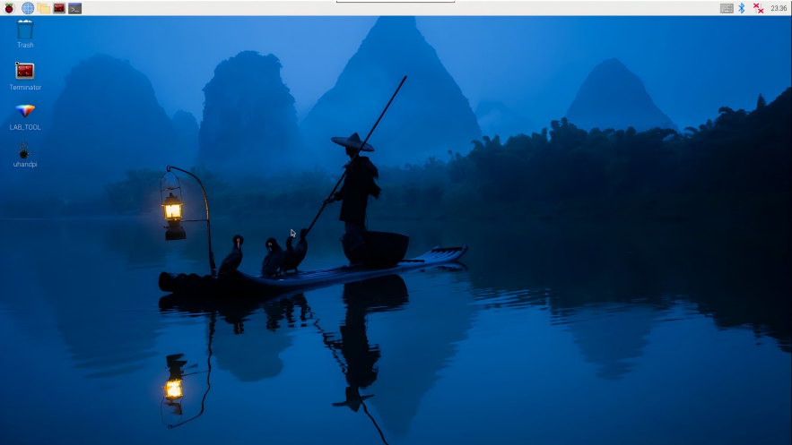

(1) Double-click this icon 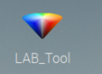 and click Execution.

This tool is used to adjust color threshold parameters and debug the pan-tilt servo.

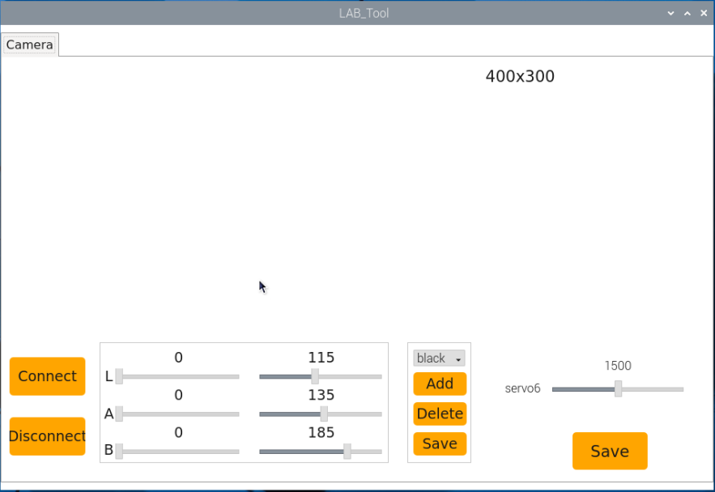

(2) Click **"Connect"** to display the real-time image transmitted by the current camera. Then you can click "Disconnect" to close the camera.

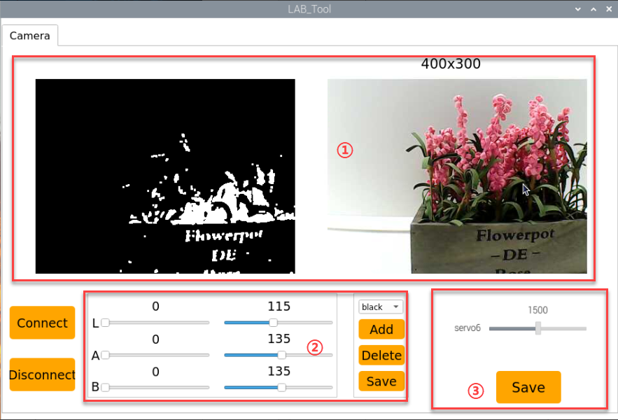

(3) The tool interface can be divided into three parts as follows:

| **No.** | **Name**                                 | **Function**                                                 |
| ------- | ---------------------------------------- | ------------------------------------------------------------ |
| ①       | Camera feedback area                     | Used to display the transmitted image, with the processed image on the left and the original image on the right. |
| ②       | Adjust color threshold parameters button | Used for adjusting color thresholds, selecting the colors to be adjusted for recognition, adding or removing color categories, and saving the effects. |
| ③       | Servo control area                       | Used to adjust the initial position of the sixth servo of the pan-tilt and save the modified values. |

You can go to "[Quick User Experience\2.3 Adjust Color Threshold]()" to learn the specific usage method of tool and the color threshold parameter.

### 3.2.2 Program Structure Instruction

(1) Press **"Ctrl+Alt+T"** to open the command line terminal. And input **"ls"** command to list all the current files. Take following contents as example.

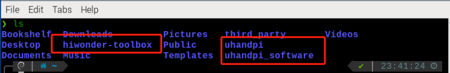

| Content          | Function                                                     |
| ---------------- | ------------------------------------------------------------ |
| hiwonder-toolbox | WiFi management tool                                         |
| uhandpi          | Program source code for all game modes and associated functions. |
| uhandpi_software | Color threshold debugging tool and palm-sized PC.            |

(2) Next, enter the game and program source content. Then input the following command.

```commandline
cd uhandpi/
```

(3) After that, input **"tree-L1"** command. List all folders and files in the directory in the form of a tree diagram. We mainly need to understand several directories indicated by the red box in the diagram.

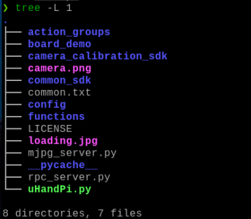

| **Content/File**       | **Instruction**                                        |
| ---------------------- | ------------------------------------------------------ |
| action_groups          | Action group files storage path                        |
| action_groups          | Expansion board related routine                        |
| camera_calibration_sdk | Camera underlying file and calibration files           |
| common_sdk             | Underlying driver library                              |
| common.txt             | Detect and game command                                |
| config                 | Color threshold and servo deviation configuration file |
| mjpg_server.py         | Video stream program                                   |
| rpc_server.py          | Rpc communication service program                      |
| uHandPi.py             | APP service starting file                              |

(4) Input the command below, and open the directory containing the AI vision game program directly through the tree diagram.

```shell
tree -l 1 functions
```

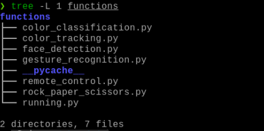

| **Content/File**        | **Instruction**                               |
| ----------------------- | --------------------------------------------- |
| color_classification.py | Color sorting program                         |
| color_tracking.py       | Color tracking program                        |
| face_detection.py       | Face detection program                        |
| gesture_recognition.py  | Gesture recognition program                   |
| remote_control.py       | APP remote control image transmission program |
| rock_paper_scissors.py  | Rock-scissors-paper program                   |
| running.py              | APP calling program                           |
