# 4. AI Vision Projects

## 4.1 Single Color Recognition

In this section, the camera detects colors. When a red ball is recognized, the buzzer will emit a beep, and the red ball will be highlighted in the transmitted image with "**Color: red**" displayed.

### 4.1.1 Program Description

The implementation of color recognition consists of two parts: color detection and execution feedback after recognition.

First, for the color detection part, Gaussian filtering is applied to the image to reduce noise. The Lab color space is then used to convert the color of the object (you can learn more about the Lab color space in the "[**OpenCV Vision Basic Course**]()" section of the tutorial materials). 

Next, the object's color within the circle is recognized using color thresholding, followed by masking (masking involves using selected images, shapes, or objects to globally or locally obscure the image being processed). 

After performing morphological operations such as opening and closing on the object image, the object with the largest contour is circled. 

**Opening:** The image undergoes erosion followed by dilation. This operation removes small objects, smooths shape boundaries, and preserves the area. It can eliminate small noise particles and separate connected objects.  

**Closing:** The image undergoes dilation followed by erosion. This operation fills small holes within objects, connects nearby objects, closes broken contour lines, and smooths boundaries while preserving the area.

After recognition, the servo and buzzer are set up to provide feedback based on the detected color. For example, when red is detected, the buzzer will emit a sound.

For detailed feedback behavior, please refer to section 3. Function Implementation of this document.

### 4.1.2 Start and Close the Game

:::{Note}
The input command is case-sensitive, and keywords can be auto-completed using the Tab key.
:::

(1) Power on the robot and use VNC Viewer to connect to the remote desktop.


(2) Click the icon  in the top left corner of the system desktop or press the shortcut **"Ctrl+Alt+T"** to open the LX terminal.

(3) Execute the command to navigate to the directory where the program is located, then press Enter: 

```shell
cd uhandPi/function_demo/
```

(4) Enter the command and press Enter to start the program:

```shell
python3 individual_colors.py
```

(5) To close the program, simply press **"Ctrl+C"** in the LX terminal. If it does not close, press it multiple times.

<p id="anchor_1_3"></p>

### 4.1.3 Program Outcome

After starting the game, the camera will be used to detect colors. When a red ball is recognized, the buzzer will emit a beep sound, and the ball will be circled in the transmitted image, with "**Color: red**" printed.

:::{Note}
- During the recognition process, ensure the environment is well-lit to avoid inaccurate recognition due to poor lighting conditions.

- Ensure that no objects with similar or matching colors to the target are present in the background within the camera's visual range, as this may cause misrecognition.
:::

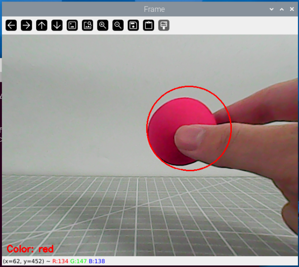


### 4.1.4 Program Analysis

The source code of this program is saved in:  [/home/pi/uhandpi/function_demo/individual_colors.py](https://store.hiwonder.com.cn/docs/uHandPi/5/source_code/individual_colors.zip)

* **Import Function Library**

{lineno-start=1}

```python
#!/usr/bin/python3
# coding=utf8
import sys
import cv2
import time
import math
import signal
import threading
import numpy as np
from common import yaml_handle
from common.pid import PID
from common import misc
from calibration.camera import Camera 
```

(1) Import Libraries for OpenCV, Time, Math, and Threading
To use functions from a library, we can call them with the syntax:

```python
library_name.function_name(parameter1, parameter2, ...) 
```

{lineno-start=107}

```python
time.sleep(0.01)
```

For example, to call the `sleep` function from the `time` library, we use: 

In Python, several libraries like `time`, `cv2`, and `math` are built-in and can be directly imported and used. You can also create your own libraries, like the `yaml_handle` file-reading library mentioned above.

(2) Instantiate a Library

Some library names can be long and hard to remember. To simplify function calls, we often instantiate libraries. For example: 

{lineno-start=9}

```python
import numpy as np
```

* **Main Function Analysis**

In a Python program,  `__name__ == '__main__'`  indicates the main function of the program, where the program starts by reading an image.

{lineno-start=88}

```python
if __name__ == '__main__':
    from common.ros_robot_controller_sdk import Board
    from common.action_group_controller import ActionGroupController
    board = Board()
    agc = ActionGroupController(board)
```

(1)  Image Processing

① Function `run()` for Image Processing

{lineno-start=49}

```python
def run(img):
    global buzzer_triggered 
    detect_color = 'None'  
    draw_color = range_rgb["black"]
    
    img_copy = img.copy()
    img_h, img_w = img.shape[:2]

    frame_resize = cv2.resize(img_copy, size, interpolation=cv2.INTER_NEAREST)
    frame_gb = cv2.GaussianBlur(frame_resize, (3, 3), 3)
    frame_lab = cv2.cvtColor(frame_gb, cv2.COLOR_BGR2LAB)
```

② Resizing the Image. The image size is resized to facilitate processing.

{lineno-start=57}

```python
    frame_resize = cv2.resize(img_copy, size, interpolation=cv2.INTER_NEAREST)
```

The first parameter `img_copy` is the input image.

The second parameter `size` specifies the output image size, which can be customized.

The third parameter `interpolation=cv2.INTER_NEAREST` defines the interpolation method.  

`INTER_NEAREST`: Nearest-neighbor interpolation.  

`INTER_LINEAR`: Bilinear interpolation (default if not specified).  

`INTER_CUBIC`: Bicubic interpolation over a 4x4 pixel neighborhood.  

`INTER_LANCZOS4`: Lanczos interpolation over an 8x8 pixel neighborhood.

(2) Gaussian Filtering

To remove noise from the image, Gaussian filtering is applied. This filter smooths the image to improve feature visibility.

{lineno-start=58}

```python
 frame_gb = cv2.GaussianBlur(frame_resize, (3, 3), 3)  
```

The first argument `frame_resize` is the input image.

The second argument `(3, 3)` specifies the size of the Gaussian kernel.

The third argument `3` is the standard deviation of the Gaussian kernel in the X direction.

{lineno-start=59}

```python
    frame_lab = cv2.cvtColor(frame_gb, cv2.COLOR_BGR2LAB)
```

The first parameter `"frame_gb"` is the image to be converted.

The second parameter `cv2.COLOR_BGR2LAB` converts the image from BGR format to LAB format. To convert to RGB, use `cv2.COLOR_BGR2RGB`.

(3) Convert the Image to a Binary Image

The image is simplified by converting it to a binary image, containing only 0s and 1s, which reduces the data size and makes it easier to process. The `cv2.inRange()` function is used for thresholding.

{lineno-start=61}

```python
    frame_mask = cv2.inRange(frame_lab,
                             (lab_data['red']['min'][0], lab_data['red']['min'][1], lab_data['red']['min'][2]),
                             (lab_data['red']['max'][0], lab_data['red']['max'][1], lab_data['red']['max'][2]))
```

The first parameter `"frame_lab"` is the input image.

The second parameter `(lab_data['red']['min'][0], lab_data['red']['min'][1], lab_data['red']['min'][2])` specifies the lower color threshold.

The third parameter `(lab_data['red']['max'][0], lab_data['red']['max'][1], lab_data['red']['max'][2])` specifies the upper color threshold.

(4) Dilation and erosion

To reduce interference and create smoother images, erosion and dilation processes are applied.

{lineno-start=64}

```python
    eroded = cv2.erode(frame_mask, cv2.getStructuringElement(cv2.MORPH_RECT, (3, 3)))
    dilated = cv2.dilate(eroded, cv2.getStructuringElement(cv2.MORPH_RECT, (3, 3)))
```

erode() function is applied to erode image. Here uses an example of the code `eroded = cv2.erode(frame_mask, cv2.getStructuringElement(cv2.MORPH_RECT, (3, 3)))`. The meaning of parameters in parentheses are as follow:

The first parameter `frame_mask` is the input image.

The second parameter `cv2.getStructuringElement(cv2.MORPH_RECT, (3, 3))` is the structural elements and kernel that determines the nature of operation. The first parameter in parentheses is the shape of kernel and the second parameter is the size of kernel.
dilate() function is applied to dilate image. The meaning of parameters in parentheses is the same as the parameters of erode() function.

(5) Obtain the contour of the maximum area

After processing the above image, obtain the contour of the recognition target.  The findContours() function in cv2 library is involved in this process.

{lineno-start=66}

```python
    contours = cv2.findContours(dilated, cv2.RETR_EXTERNAL, cv2.CHAIN_APPROX_NONE)[-2]
```

The erode() function is applied to erode. Take code `contours = cv2.findContours(dilated, cv2.RETR_EXTERNAL, cv2.CHAIN_APPROX_NONE)[-2]` as example.

The first parameter `dilated` is the input image.

The second parameter `cv2.RETR_EXTERNAL` is the contour retrieval mode.

The third parameter `cv2.CHAIN_APPROX_NONE)[-2]` is the approximate method of contour.
Find the maximum contour from the obtained contours. To avoid interference, set a minimum value. Only when the area is greater than this 
minimum value, the target contour will take effect. The minimum value here is "**100**".

(6) Find the Largest Contour

{lineno-start=69}

```python
    if areaMaxContour is not None and area_max > 200:
        if not buzzer_triggered:
            board.set_buzzer(1900, 0.1, 0.2, 1)  # Trigger the buzzer
            buzzer_triggered = True  # 更新状态为已触发
```

* **Display the Transmitted Image**

{lineno-start=101}

```python
            result_image = cv2.resize(Frame, (320, 240))  # Resize image to 320x240
            cv2.imshow('color_tracking', result_image)
            key = cv2.waitKey(1)
            if key == 27:  # Exit on ESC key
                break
```

The function `cv2.imshow()` is used to display an image in a window. The first parameter `"frame"` is the name of the window, and the second parameter `"Frame"` is the content to be displayed. 
It is important to include `cv2.waitKey()` after `cv2.imshow()`, as the image will not be displayed without it. 
The function `cv2.waitKey()` waits for a key press, and the parameter `1` specifies the delay time in milliseconds.

<p id="anchor_1_4"></p>

### 4.1.5 Function Extension

<p id="1_change_default_recognized_color"></p>

* **Change Default Recognition Color**

The color recognition program is pre-configured to recognize three colors: red, green, and blue. By default, when red is detected, the buzzer emits a "**beep-beep**" sound, a circle is drawn around the detected color in the video feed, and "**Color: red**" is printed.
This guide explains how to change the recognized color to green, with detailed steps as follows:

(1) Enter the following command in the terminal and press Enter:

```shell
cd uhandpi/function_demo
```

(2) Enter the following command to open the file for editing and press Enter:

```shell
sudo vim individual_colors.py
```

(3) Press the i key on the keyboard to switch to edit mode.

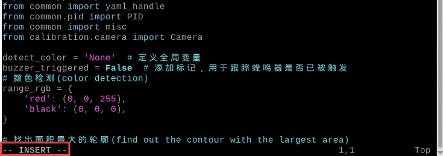

(4) Find the section of code highlighted in the red box in the image below.

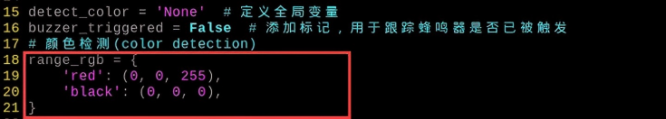

(5) Replace the corresponding line with the following code:

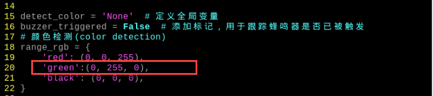

(6) Locate the code snippet shown in the image and replace red with green.

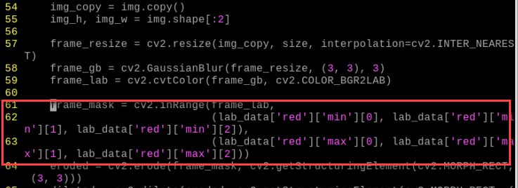

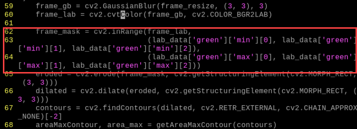

(7) Modify the code so that the circle and text displayed in the video feed are green.

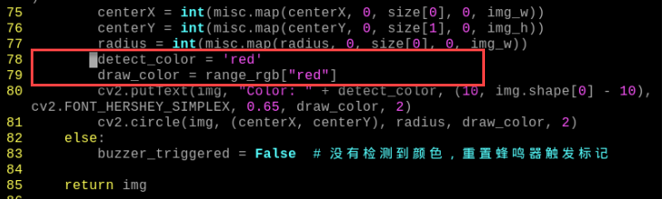

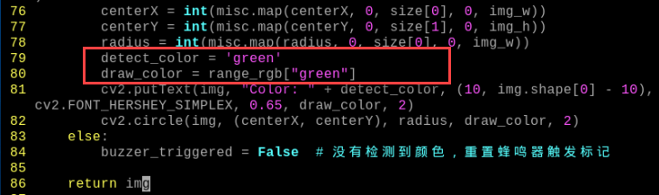

(8) Press the Esc key. Type the following command (note the colon : before wq) and press Enter to save changes and exit:

(9) Run the program using the following command and press Enter:

```shell
python3 individual_colors.py
```

* **Add New Recognition Color**

In addition to the three built-in colors, you can add custom colors for recognition. Below are the steps to add purple as an additional recognizable color:

(1) Double-click the LAB icon on the system desktop. In the pop-up prompt, simply select **"Execute"**.


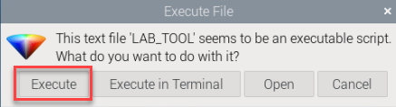

(2) Once the interface pops up, click the **"Connect"** button.

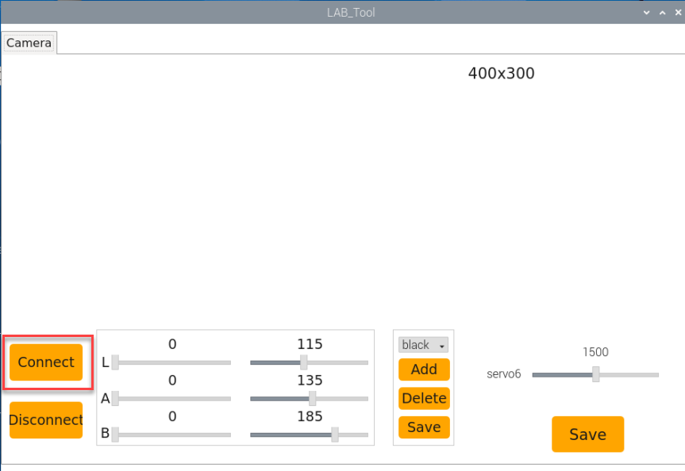

(3) Click the **"Add"** button, then name the new color (e.g., "**purple**") and click **"OK"**.

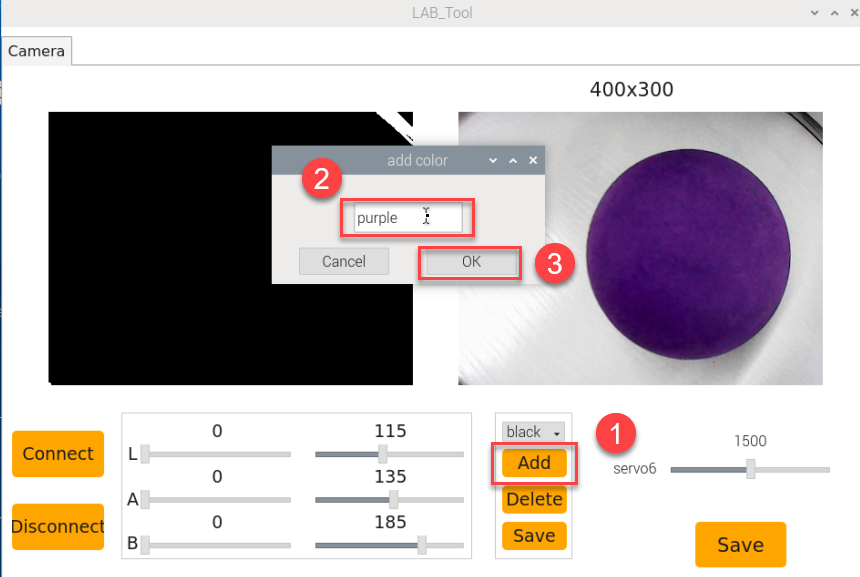

(4) Click the drop-down button in the color selection box and choose **"purple"**.

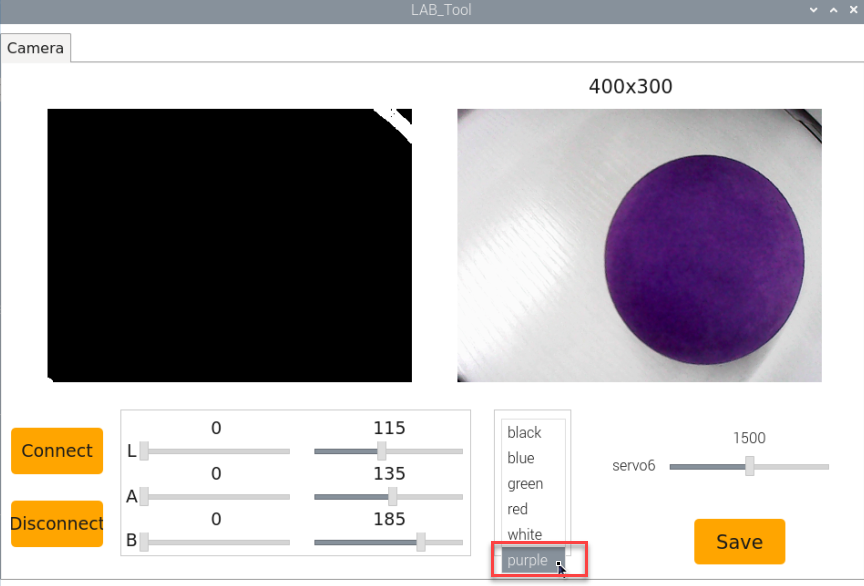

(5) Point the camera at a purple object and adjust the L, A, and B sliders. Move them until the purple area in the left-side display becomes white, and other areas turn black.

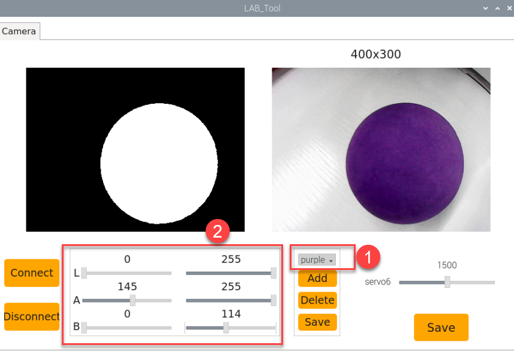

(6) Once the threshold adjustment is complete, click **"Save"** to store the color settings.

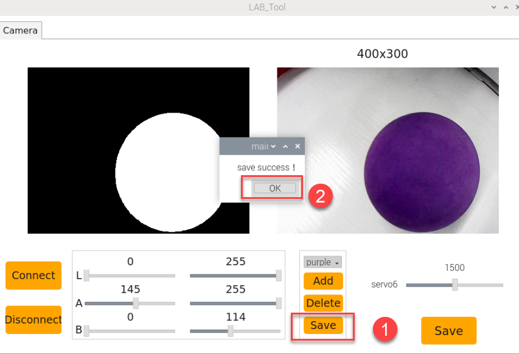

(7) After saving, check if the modified color values have been successfully written. Navigate to the program code directory:

```shell
cd uhandpi/config
```

(8) Enter the following command to open the program file, then press Enter:

```shell
sudo vim lab_config.yaml
```

(9) In the file, you can verify the purple color threshold parameters.

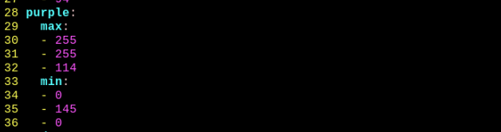

(10) To set purple as the default recognized color, follow the steps in [**4.1.5 Function Extension -> Change Default Recognition Color**](#1_change_default_recognized_color)  to replace the default color with purple. If you need to add other colors, you can follow the same steps as described above.

## 4.2 Color Sorting

### 4.2.1 Program Description

Human eyes can easily distinguish different colors in the world. How can robots recognize object colors? We can add a camera vision module to uHandPi. Through visual recognition, uHandPi can identify different colors.

First, in the color recognition section, we utilize the Lab color space to convert the colors of objects. For detailed learning about the Lab color space, you can refer to "[**OpenCV Basic Courses**]()".

Next, we use color threshold to identify the colors of objects in the circle, followed by masking the image. Masking involves covering parts of the processed image globally or locally using selected images, graphics, or objects.

Afterward, the image of the object undergoes opening and closing operation. Finally, the largest contour of the object is encircled with a circle.

**Opening operation:** It involves first corrosion followed by dilation of the image. Its purpose is to eliminate small objects, smooth the shape boundaries, and maintain the area unchanged. It can remove small particle noise and break connections between objects.
**Closing operation:**  It involves first dilation followed by corrosion of the image. Its purpose is to fill small holes inside objects, connect nearby objects, reconnect broken contour lines, and smooth their boundaries while maintaining the area unchanged.

After recognition, settings are applied to the pan-tilt and RGB lights to provide corresponding feedback based on different colors. For instance, if red is recognized, the RGB lights illuminate red. Then, if a ball is placed in the center of the hand, the hand grasps the ball, and the hand turns to the left before opening the hand.

### 4.2.2 Start and Close the Game

:::{Note}
Instructions must be entered with strict attention to case sensitivity and spacing.
:::

(1) Turn on robotic hand, and connect it to Raspberry Pi desktop through VNC.

(2) Click the icon in the upper left corner of the desktop, or press **"Ctrl+Alt+T"** to open LX terminal.

(3) Input the following command to navigate to the directory where the game program is located, then press Enter.

```shell
cd uhandpi/functions
```

(4) Input the command of activating the program and press Enter.

```shell
python3 color_classification.py
```

(5)  To close this game, simply wait for the game program to finish loading, then press **"Ctrl+C"**. If the closing fails, you can try pressing **"Ctrl+C"** multiple times.

### 4.2.3 Program Outcome

:::{Note}
You can take out the small balls from the accessory pack and use them in combination with the setup.
:::

When the camera recognizes a red ball, the transmitted image will outline it within the feedback area. When the ball is placed in front of the hand of uHandPi, uHandPi will grab the ball. Then, the hand will rotate, followed by opening the palm. If the recognized ball is red, the hand will rotate to the right. If the recognized ball is blue, the hand will rotate to the left.

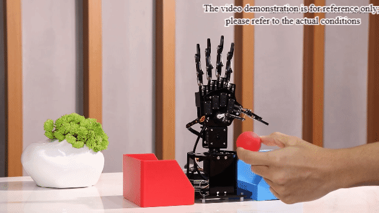

### 4.2.5 Function Extension

* **Adjust color threshold**

During the game experience, if the color recognition effect is not satisfactory, adjustments to the color thresholds are required. In this section, adjusting red color is taken as an example, and other color settings can be adjusted following the same method. The operational steps are as follows:

(1) Double-click the icon  on the desktop, and click **"Execute"** in the prompt interface.

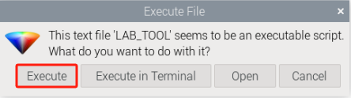

(2) Then click **"Connect"** to connect it to the camera.

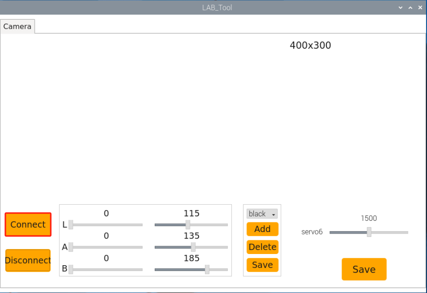

(3) After connection successfully, select **"red"** in the bottom right corner of the selection bar.


(4) If the transmitted image does not appear in the popped-up interface, it indicates that the camera is not successfully connected. Please check the camera connection cable to ensure it is properly connected.

(5) In the interface below, the right side displays the real-time transmitted image, while the left side shows the color to be captured. Align the camera with the red ball, then drag the six sliders below to make the area of the red ball on the left side of the screen completely white, while the other areas become black. Then, click the **"Save"** button to save the data.


* **Change default recognized color**

There are three built-in colors in the program: red, green and blue. By default, it recognizes red and blue colors, performing corresponding actions by the robot when detected.

Here, we'll use changing the recognized color to green as an example. The specific modification steps are as follows:

(1) Input the following command and press Enter to switch to the source code program path.

```shell
cd uhandpi/functions
```

(2) Then input command and press Enter to open the program file.

```shell
sudo vim color_classification.py
```

(3) Locate the code outlined in the image in the opened program.

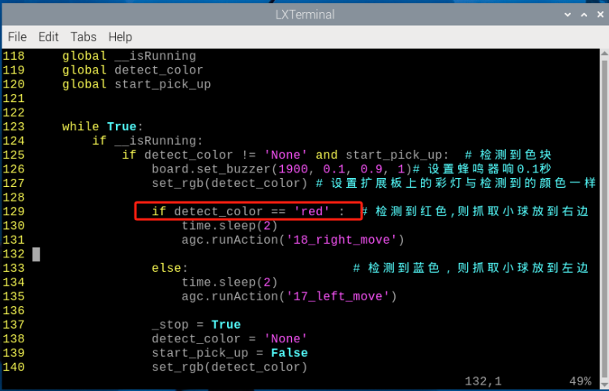

(4) Press **"i"** on the keyboard to enter the editing mode.

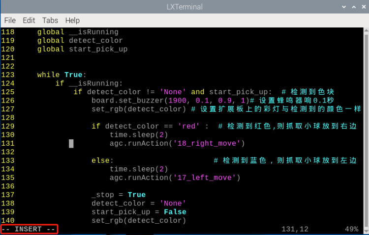

(5) Replace **"red"** with **"green"** in `detect_color == 'red'`as pictured:

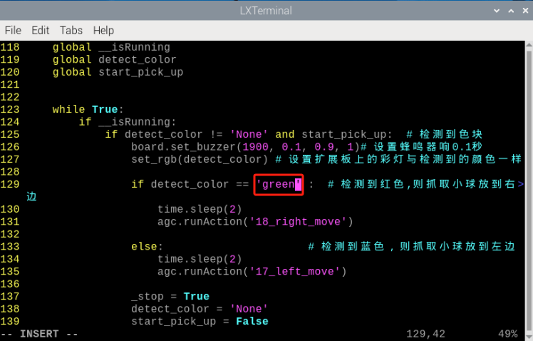

(6) Next, save the modified contents. Press **"Esc"** key and input **":wq"** in turn (make sure there is a colon before "**wq**"). Then press Enter to save and exit. 

(7) Input command again and press Enter to start recognizing green. And the hand will rotate to the right.

```shell
python3 color_classification.py
```

### 4.2.4 Program Analysis

The source code of this program is located in: [/home/pi/uhandpi/functions/color_classification.py ](https://store.hiwonder.com.cn/docs/uHandPi/5/source_code/color_classification.zip)

:::{Note}
Before modifying the program, it's crucial to create a backup of the original factory program. Avoid modifying parameters in the wrong way, which may cause the robot to malfunction and become irreparable.
:::

<p id="2_import_parameter_module"></p>

* **Import parameter module**

| **Import module**                                            | **Function**                                                 |
| ------------------------------------------------------------ | ------------------------------------------------------------ |
| import sys                                                   | The Python "**sys**" module has been imported for accessing system-related functions and variables. |
| import cv2                                                   | The OpenCV library has been imported for image processing and computer vision-related functionalities. |
| import time                                                  | The Python "**time**" module has been imported for time-related functionalities, such as delay operations. |
| import threading                                             | Provides an environment for running multiple threads concurrently. |
| import yaml_handle                                           | Contains functionalities or tools related to processing YAML format files. |
| from common.action_group_controller import ActionGroupController | Import action group execution library                        |
| from common.ros_robot_controller_sdk import Board            | Import board library to control sensor                       |

* **Function Logic**

Capture image information through the camera, then process the image, specifically by performing binarization. At the same time, to reduce interference and make the image smoother, perform corrosion and dilation operations on the image. Next, obtain the largest area contour to determine the color of the color block and provide corresponding feedback.

* **Program Analysis**

**(1) Initialization**

① Import function library

In this initialization step, the first task is to import the required libraries for subsequent program calls. For details on the imports, refer to "[**4.2.4 Program Analysis -> Import Parameter Module**](#2_import_parameter_module)".

{lineno-start=1}

```python
#!/usr/bin/python3
# coding=utf8
#2.AI视觉玩法/第1课 颜色分类(2.AI Vision Game/Lesson 1 Color Sorting)
import sys
import cv2
import time
import math
import signal
import threading
import numpy as np
from common import yaml_handle
from calibration.camera import Camera 
```

② Set initial state

Set initial state, including the initial position of servo, PID, color threshold value, etc.

{lineno-start=29}

```python
# 初始位置(initial position)
def init_move():
    agc.runAction('15_5_12345')
    set_rgb('None') 

range_rgb = {
    'red': (0, 0, 255),
    'blue': (255, 0, 0),
    'black': (0, 0, 0),
}
```

* **Image processing**

**(1) Image pre-processing**

Resizing and Gaussian blur processing of the image.

{lineno-start=171}

```python
    frame_resize = cv2.resize(img_copy, size, interpolation=cv2.INTER_NEAREST)
    frame_gb = cv2.GaussianBlur(frame_resize, (3, 3), 3)
```

`cv2.resize(img_copy, size, interpolation=cv2.INTER_NEAREST)` is an operation to resize the image.

The first parameter `img_copy` is the image to be resized.

The second parameter `size` is the target size.

The third parameter `interpolation` is the interpolation method, which is used to determine the pixel interpolation algorithm used for resizing.

`cv2.GaussianBlur(frame_resize, (3, 3), 3)` applies Gaussian blur to the image.

The first parameter `frame_resize` is the image to be blurred.

The second parameter `(3, 3)` is the size of the Gaussian kernel, indicating that the width and height of the kernel are both 3.

The third parameter `3` is the standard deviation of the Gaussian kernel, used to control the degree of blur.

**(2) Color space conversion**

Convert the BGR image to LAB image.

{lineno-start=168}

```python
    frame_lab = cv2.cvtColor(frame_gb, cv2.COLOR_BGR2LAB)  # 将图像转换到LAB空间(convert the image to LAB space)
```

**(3) Binarization processing**

Use `inRange()` function in cv2 library to process binarization.

{lineno-start=180}

```python
            if i in lab_data:
                frame_mask = cv2.inRange(frame_lab,
                                             (lab_data[i]['min'][0],
                                              lab_data[i]['min'][1],
                                              lab_data[i]['min'][2]),
                                             (lab_data[i]['max'][0],
                                              lab_data[i]['max'][1],
                                              lab_data[i]['max'][2]))  #对原图像和掩模进行位运算(perform bitwise operation to original image and mask)
```

The first parameter `frame_lab` is inputting image.

The second parameter `lab_data[i]['min'][0]` is the lower limit of the threshold.

The third parameter `lab_data[i]['max'][0]` is the upper limit of the threshold.

**(4) Opening and closing operation**

{lineno-start=188}

```python
                opened = cv2.morphologyEx(frame_mask, cv2.MORPH_OPEN, np.ones((3, 3), np.uint8))  # 开运算(opening operation)
                closed = cv2.morphologyEx(opened, cv2.MORPH_CLOSE, np.ones((3, 3), np.uint8))  # 闭运算(closing operation)
```

This line of code performs an opening operation on a binary image using `cv2.morphologyEx(frame_mask, cv2.MORPH_OPEN, np.ones((3, 3), np.uint8))`.

The first parameter `frame_mask` is the binary image on which morphological operations are to be performed.

The second parameter, `cv2.MORPH_OPEN`, specifies the opening operation to be performed.

The third parameter, `np.ones((3, 3), np.uint8)`, is the structuring element used in morphological operations, defining the shape and size of the operation. Here, a 3x3 matrix filled with ones is used as the structuring element.

The same applies to the closing operation function.

**(5) Get the contour with the largest area**

After completing the above image processing, it is necessary to obtain the contours of the recognized targets. This involves using the `findContours()` function from the cv2 library.

{lineno-start=190}

```python
                contours = cv2.findContours(closed, cv2.RETR_EXTERNAL, cv2.CHAIN_APPROX_NONE)[-2]  # 找出轮廓(find out contour)
```

Take code `contours = cv2.findContours(closed, cv2.RETR_EXTERNAL, cv2.CHAIN_APPROX_NONE)[-2]` as example:

The first parameter `dilated` is inputting image.

The second parameter `cv2.RETR_EXTERNAL` is the contour retrieval mode.

The third parameter `cv2.CHAIN_APPROX_NONE)[-2]` is the contour approximation method.

Find the contour with the largest area in the obtained contour. In order to avoid interference, you need to set a minimum value. The target contour is considered valid only if its area is greater than this value.

{lineno-start=191}

```python
                areaMaxContour, area_max = get_area_maxContour(contours)  # 找出最大轮廓(find out the largest contour)
                if areaMaxContour is not None:
                    if area_max > max_area:  # 找最大面积(find the largest area)
                        max_area = area_max
                        color_area_max = i
                        areaMaxContour_max = areaMaxContour
```

**(6)  Determine the largest color block**

{lineno-start=202}

```python
            if not start_pick_up:
                if color_area_max == 'red':  # 红色最大(red is the largest area)
                    color = 1
                elif color_area_max == 'blue':  # 蓝色最大(blue is the largest area)
                    color = 2
                else:
                    color = 0
                color_list.append(color)
```

**(7) Multiple judgments**

Take the average by multiple judgments, and determine the recognized color.

{lineno-start=211}

```python
                if len(color_list) == 50:  # 多次判断(determine for multiple times)
                    # 取平均值(take average value)
                    color = np.mean(np.array(color_list))
                    color_list = []
                    start_pick_up = True
                    if color == 1:
                        detect_color = 'red'
                        draw_color = range_rgb["red"]
                    elif color == 2:
                        detect_color = 'blue'
                        draw_color = range_rgb["blue"]
                    else:
                        start_pick_up = False
                        detect_color = 'None'
                        draw_color = range_rgb["black"]
```

* **Color recognition**

**(1) Open RGB light and buzzer**

{lineno-start=131}

```python
        if __isRunning:
            if detect_color != 'None' and start_pick_up:  # 检测到色块(a color block is detected)
                board.set_buzzer(1900, 0.1, 0.9, 1)# 设置蜂鸣器响0.1秒(set the buzzer to emit for 0.1 seconds)
                set_rgb(detect_color) # 设置扩展板上的彩灯与检测到的颜色一样(set the color light on the expansion board to match the detected color)
```

Call the function  `set_rgb()` to set the color light on the expansion board to match the detected color. Set the RGB lights on the expansion board based on the input color parameters.

Call the function  `set_buzzer()` to set the buzzer to emit for 0.1 seconds continuously. It is used to control the buzzer sound effect and duration.
You can control the RGB lights on the expansion board based on the detected color and provide feedback through the buzzer's sound.

* **Execute action group**

{lineno-start=136}

```python
                if detect_color == 'red' :  # 检测到红色,则抓取小球放到右边(red is detected, grasp the ball and place it to the right)
                    time.sleep(2)   
                    agc.runAction('18_right_move')
                                       
                else:                      # 检测到蓝色，则抓取小球放到左边(blue is detected, grasp the ball and place it to the left)
                    time.sleep(2)   
                    agc.runAction('17_left_move')
```

Use `agc.runAction` function to call the action group based on the recognized result.

## 4.3 Target Position Recognition

### 4.3.1 Brief Analysis of the Task

The implementation of target tracking can be divided into two parts: color recognition and position marking.
First, for the color recognition part, Gaussian filtering is applied to the image for noise reduction. The Lab color space is then used to convert the color of the objects (for more details on the Lab color space, please refer to the "[**OpenCV Vision Basic Course**]()").

Next, color thresholding is used to identify the color of objects within the circle. The image is then masked (masking involves using a selected image, shape, or object to globally or locally occlude the processed image).

After performing morphological operations (open and close operations) on the object's image, the largest contour is outlined with a circle.

**Opening operation:** The image is eroded first and then dilated. This operation is used to remove small objects, smooth shape boundaries, and preserve the overall area. It helps remove small noise particles and separate objects that are connected.

**Closing operation:** The image is dilated first and then eroded. This operation is used to fill small holes within the objects, connect adjacent objects, and reconnect broken contour lines while smoothing the boundaries without changing the area.

Position marking requires specific detection algorithms. The basic principle is to search for areas in the image that match predefined features or patterns, then return the position and bounding box of these areas.

### 4.3.2 Start and Close the Game

:::{Note}
The input of commands must strictly distinguish between uppercase and lowercase letters, as well as spaces. Additionally, you can use the "**Tab**" key on the keyboard to auto-complete keywords.
:::

(1) Power on the robot and use VNC Viewer to connect to the remote desktop.

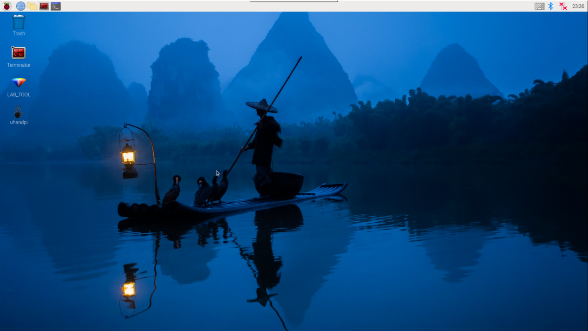

(2) Click the icon in the top left corner of the system desktop or press the shortcut "**Ctrl+Alt+T**" to open the LX terminal.

(3) In the terminal, enter the command to navigate to the directory where the program is located, then press Enter:

```shell
cd uhandpi/function_demo
```

(4) Enter the command and press Enter to start the program:

```shell
python3 Target_location_identification.py
```

(5) To close the program, simply press "**Ctrl+C**" in the LX terminal. If it does not close, press it multiple times.

### 4.3.3 Program Outcome

The program defaults to recognizing red, green, and blue balls. After recognition, it will highlight the objects in the transmitted image and display their XY coordinates.

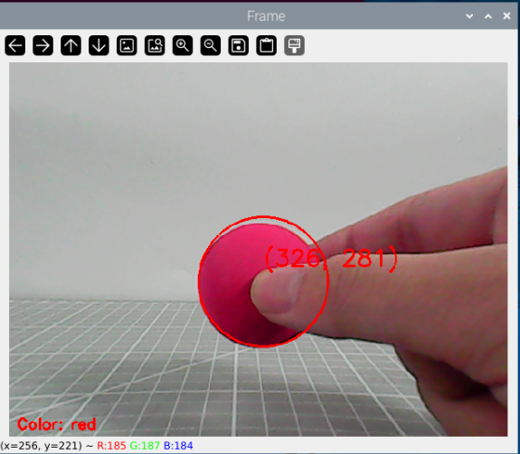

### 4.3.4 Program Description

The source code for this program is located at: [/home/pi/uhandpi/function_demo/Target_location_identification.py](https://store.hiwonder.com.cn/docs/uHandPi/5/source_code/Target_location_identification.zip)

* **Importing Libraries**

{lineno-start=1}

```python
#!/usr/bin/python3
# coding=utf8
import os
import sys
import cv2
import time
import signal
import math
import threading
import datetime
import numpy as np
from common import misc
from common import yaml_handle
from common.pid import PID
from calibration.camera import Camera 
```

Import the necessary libraries, including OpenCV, time, math, threading, and inverse kinematics. To call a function from a library, use the format `LibraryName.FunctionName(Parameters)`. For example:

{lineno-start=148}

```python
            time.sleep(0.01)
```

This calls the `sleep` function from the `time` library, which is used for adding delays.
Python comes with several built-in libraries like `time`, `cv2`, `math`, which can be imported directly. You can also create your own libraries, such as the "**yaml_handle**" file reading library.

* **Instantiating Libraries**  

Sometimes, library names are long and hard to remember. To make function calls more convenient, we often instantiate libraries using shorter names. For example:

{lineno-start=131}

```python
if __name__ == '__main__':
    from common.ros_robot_controller_sdk import Board
    from common.action_group_controller import ActionGroupController
    board = Board()
```

After instantiation, functions from the `Board` library can be called as:
Board.FunctionName(Parameters)
This makes calling functions much easier.

{lineno-start=60}

```python
            board.set_buzzer(1900, 0.1, 0.9, 1)  # 以1900Hz的频率，持续响0.1秒，关闭0.9秒，重复1次(at a frequency of 1900Hz for 0.1 seconds, followed by silence for 0.9 seconds, and repeat this sequence once)
```

* **Main Function Analysis**

The main function in the Python program is defined by the statement \_\_name\__ == '\_\_main\__ '. The function init() is called first to initialize the configuration. In this program, initialization includes resetting the robotic arm to its initial position and reading the color threshold file. Generally, other configurations like ports, peripherals, and timer interrupts are also set up during initialization.

{lineno-start=131}

```python
if __name__ == '__main__':
    from common.ros_robot_controller_sdk import Board
    from common.action_group_controller import ActionGroupController
    board = Board()
    camera = Camera()
    camera.camera_open(correction=True)
```

(1) Reading Camera Image

{lineno-start=135}

```python
    camera = Camera()
    camera.camera_open(correction=True)  # 开启畸变矫正, 默认不开启
```

(2) Image Processing

When the image is successfully read, the value of img will no longer be empty.

{lineno-start=137}

```python
    while True:
        img = camera.frame
        if img is not None:
            frame = img.copy()
            Frame = run(frame)  # Make sure run() is defined and imported appropriately
            result_image = cv2.resize(Frame, (320, 240))  # Resize image to 320x240
            cv2.imshow('face_demo.py', result_image)
            key = cv2.waitKey(1)
            if key == 27:  # Exit on ESC key
                break
```

The function `img.copy()` copies the contents of img to frame.

The function `run()` processes the image. Detailed image processing steps are provided in Section Image Processing.

(3) Displaying Image in Window

{lineno-start=142}

```python
            result_image = cv2.resize(Frame, (320, 240))  # Resize image to 320x240
            cv2.imshow('face_demo.py', result_image)
            key = cv2.waitKey(1)
            if key == 27:  # Exit on ESC key
                break
```

The function `cv2.resize()` resizes the processed image to an appropriate size.

The function `cv2.imshow()` displays the image in a window. `frame` is the window name, and frame_resize is the content to be displayed. It is important to include cv2.waitKey(), otherwise, the image will not display.

The function `cv2.waitKey()` waits for a key input. The parameter 1 specifies the delay time (in milliseconds).

* **Image Processing**

{lineno-start=72}

```python
def run(img):
    global draw_color
    global color_list
    global detect_color
        
    img_copy = img.copy()
    img_h, img_w = img.shape[:2]

    frame_resize = cv2.resize(img_copy, size, interpolation=cv2.INTER_NEAREST)
    frame_gb = cv2.GaussianBlur(frame_resize, (3, 3), 3)      
    frame_lab = cv2.cvtColor(frame_gb, cv2.COLOR_BGR2LAB)  # 将图像转换到LAB空间(convert image to the LAB space)
```

(1) Image Resizing

The image is resized for easier processing.

{lineno-start=80}

```python
    frame_resize = cv2.resize(img_copy, size, interpolation=cv2.INTER_NEAREST)
```

The first parameter `img_copy` is the input image.

The second parameter size specifies the output image size.

(2) Gaussian Filtering

Images often contain noise, which can degrade the quality and make features less distinguishable. Depending on the type of noise, different filtering methods should be chosen. Common methods include Gaussian filtering, median filtering, and mean filtering.

{lineno-start=81}

```python
    frame_gb = cv2.GaussianBlur(frame_resize, (3, 3), 3)  
```

The first parameter `frame_resize` is the input image.

The second parameter `(3, 3)` is the size of the Gaussian kernel.

The third parameter `3` is the standard deviation of the Gaussian kernel in the X direction.

(3) Color Space Conversion

The image is converted to the LAB color space using the cv2.cvtColor() function.

{lineno-start=82}

```python
    frame_lab = cv2.cvtColor(frame_gb, cv2.COLOR_BGR2LAB)  # 将图像转换到LAB空间(convert image to the LAB space)
```

The first parameter `frame_gb` is the input image.

The second parameter `cv2.COLOR_BGR2LAB` specifies the conversion format. `cv2.COLOR_BGR2LAB` converts BGR to LAB format. If you need to convert to RGB, use cv2.COLOR_BGR2RGB.

(4) The image is converted to a binary image with only two values: 0 and 1. This simplifies the image and reduces data size, making it easier to process. The inRange() function from cv2 is used for binarization.

{lineno-start=88}

```python
    for i in lab_data:
        if i != 'black' and i != 'white':
            frame_mask = cv2.inRange(frame_lab,
                                     (lab_data[i]['min'][0],
                                      lab_data[i]['min'][1],
                                      lab_data[i]['min'][2]),
                                     (lab_data[i]['max'][0],
                                      lab_data[i]['max'][1],
                                      lab_data[i]['max'][2]))  #对原图像和掩模进行位运算(operate bitwise operation to original image and mask)
```

The first parameter  `frame_lab` is the input image.

The second parameter `(lab_data[i]['min'][0], lab_data[i]['min'][1], lab_data[i]['min'][2])` is the lower threshold for the color.

The third parameter `(lab_data[i]['max'][0], lab_data[i]['max'][1], lab_data[i]['max'][2])` is the upper threshold for the color.

(5) Morphological Operations (Opening and Closing)

To reduce noise and smooth the image, opening and closing operations are applied. Opening is erosion followed by dilation, while closing is dilation followed by erosion. The `cv2.morphologyEx()` function is used for these morphological operations.

{lineno-start=97}

```python
            eroded = cv2.erode(frame_mask, cv2.getStructuringElement(cv2.MORPH_RECT, (3, 3)))  #腐蚀(corrosion)
            dilated = cv2.dilate(eroded, cv2.getStructuringElement(cv2.MORPH_RECT, (3, 3))) #膨胀(dilation)
```

For erosion, the first parameter` frame_mask` is the input binary image.

For dilation, the first parameter eroded is the result of the erosion operation.

The second parameter `cv2.getStructuringElement(cv2.MORPH_RECT, (3, 3))` defines the structuring element used for the morphological transformation. This specifies the shape and size of the neighborhood used during the transformation. Here, `cv2.MORPH_RECT` specifies a rectangular shape, and (3, 3) defines a 3x3 rectangular structuring element.

(6) Contour Detection

After the image processing steps, the contours of the identified target need to be extracted using cv2.findContours().

{lineno-start=100}

```python
            areaMaxContour, area_max = getAreaMaxContour(contours)  #找出最大轮廓(find out the contour with the maximal area)
```

The first parameter dilated is the input image, which is the result of the dilation operation.

The second parameter `cv2.RETR_EXTERNAL` specifies the contour retrieval mode, meaning only the outermost contours are retrieved, ignoring any nested contours.

The third parameter `cv2.CHAIN_APPROX_NONE)[-2]` specifies the contour approximation method, which stores each point of the contour for an accurate representation.

The largest contour is then identified by area, and a minimum threshold area is set. Only contours with an area greater than the threshold are considered valid.

{lineno-start=100}

```python
            areaMaxContour, area_max = getAreaMaxContour(contours)  #找出最大轮廓(find out the contour with the maximal area)
            if areaMaxContour is not None:
                if area_max > max_area:#找最大面积(find out the maximal area)
                    max_area = area_max
                    color_area_max = i
                    areaMaxContour_max = areaMaxContour
    
    if max_area > 200:  # 有找到最大面积(the largest area is found)
```

**(7) Obtaining Position Information**

The `cv2.minEnclosingCircle()` function is used to find the minimum enclosing circle of the target contour and obtain its center coordinates and radius.

Since the image was previously resized, the Misc.map() function is used to map the center coordinates and radius to their actual size.

{lineno-start=107}

```python
    if max_area > 200:  # 有找到最大面积(the largest area is found)
        ((centerX, centerY), radius) = cv2.minEnclosingCircle(areaMaxContour_max)  # 获取最小外接圆(get the minimum circumcircle)
        centerX = int(misc.map(centerX, 0, size[0], 0, img_w))
        centerY = int(misc.map(centerY, 0, size[1], 0, img_h))
        radius = int(misc.map(radius, 0, size[0], 0, img_w))            
        cv2.circle(img, (centerX, centerY), radius, range_rgb[color_area_max], 2)#画圆(draw circle)
```

Finally, the center coordinates are displayed in both the terminal and the image.

{lineno-start=127}

```python
    cv2.putText(img, "Color: " + detect_color, (10, img.shape[0] - 10), cv2.FONT_HERSHEY_SIMPLEX, 0.65, draw_color, 2)
    cv2.putText(img, f"({centerX}, {centerY})", (centerX, centerY - 20), cv2.FONT_HERSHEY_SIMPLEX, 1.0, range_rgb[color_area_max], 2)  
    return img
```

## 4.4 Color Tracking

### 4.4.1 Program Logic

In the previous lessons, we learned how to implement simple color recognition using uHandPi. In this lesson, we will further explore a related game called "**color tracking**".

The principle of this experiment is similar to the previous one, still using the Lab color space to convert the color of objects. For detailed learning about the Lab color space, you can refer to "[**OpenCV Basic Courses**]()".

Second, identify the object color in the circle using color threshold value, then apply a mask to that part of the image. Masking is the process of using selected images, graphics, or objects to globally or locally obscure parts of the processed image.

After processing the opening operation and closing operation of the object image, the largest object contour is circled.

Opening operation: It involves first corrosion followed by dilation of the image. Its purpose is to eliminate small objects, smooth the shape boundaries, and maintain the area unchanged. It can remove small particle noise and break connections between object.

Closing operation: It involves first dilation followed by corrosion of the image. Its purpose is to fill small holes inside objects, connect nearby objects, reconnect broken contour lines, and smooth their boundaries while maintaining the area unchanged.

Finally, by comparing the center coordinates of the frame with the position of the tracked target using the PID algorithm, the pan-tilt servos are controlled to rotate and achieve tracking.
The PID algorithm is the most widely used type of automatic controller. In process control, it operates based on the error's proportion (P), integral (I), and derivative (D). It has the advantages of being simple in principle, easy to implement, versatile in application, with control parameters being independent of each other, and relatively simple parameter selection.

### 4.4.2 Operation Steps

:::{Note}
Instructions must be entered with strict attention to case sensitivity and spacing.
:::

(1) Power on the robot and use VNC Viewer to connect to the remote desktop.

(2) Click the icon  in the upper left corner of the desktop, or press "**Ctrl+Alt+T**" to open LX terminal.

(3) Input the following command to navigate to the directory where the game program is located, then press Enter.

```shell
cd uhandpi/functions
```

(4) Input the below command of activating the program and press Enter.

```shell
python3 color_tracking.py
```

(5) To close this game, simply wait for the game program to finish loading, then press "**Ctrl+C**". If the closing fails, you can try pressing "**Ctrl+C**" multiple times.

### 4.4.3 Program Outcome

:::{Note}
The program defaults to recognizing the color red. To switch to other color, refer to "[**4.4.5 Function Extension -> Change default recognized color**](#4_change_default_recognized_color)".
:::

When the camera detects an object of the specified color, the feedback on the screen will outline it, and the uHandPi pan-tilt platform will rotate accordingly.

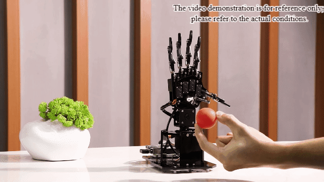

### 4.4.5 Function Extension

* **Adjust Color Threshold**

During the game, if the color recognition effect is not satisfactory, adjustments to the color thresholds are required. In this section, adjusting red color is taken as an example, and other color settings can be adjusted following the same method. The operational steps are as follows:

(1) Double-click the iconon the desktop, and click **"Execute"** in the prompt interface.


(2) Then click **"Connect"** to connect it to the camera.


(3) After connection successfully, select **"red"** in the bottom right corner of the selection bar.

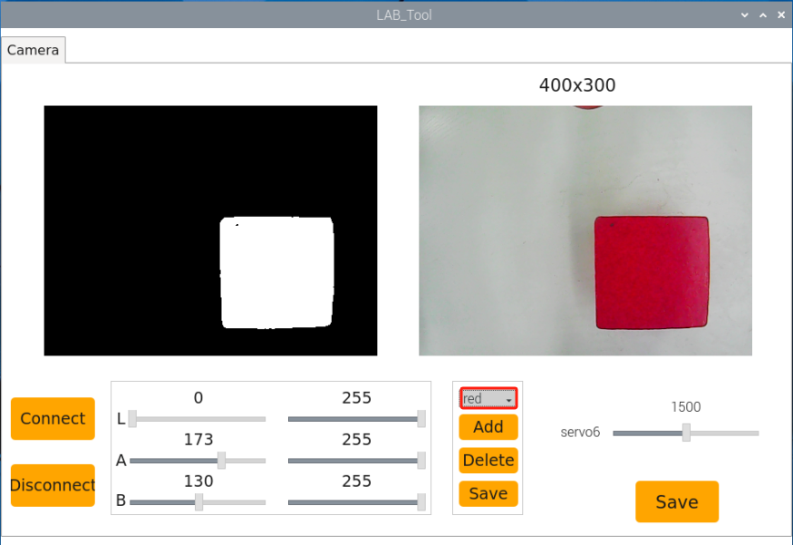

(4) If the transmitted image does not appear in the popped-up interface, it indicates that the camera is not successfully connected. Please check the camera connection cable to ensure it is properly connected.

(5) In the interface below, the right side displays the real-time transmitted image, while the left side shows the color to be captured. Align the camera with the red ball, then drag the six sliders below to make the area of the red ball on the left side of the screen completely white, while the other areas become black. Then, click the **"Save"** button to save the data.

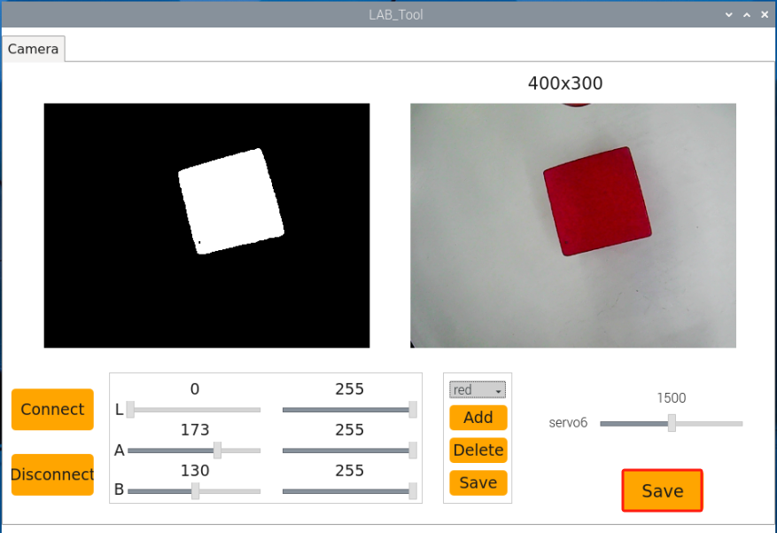

<p id="4_change_default_recognized_color"></p>

* **Change default recognized color**

The color recognition program is built with three predefined colors: red, green, and blue. By default, it recognizes red. When red is detected, the feedback on the screen will outline it, and the uHandPi pan-tilt platform will rotate accordingly.

Here, we'll use changing the recognized color to green as an example. The specific modification steps are as follows:

(1) Input the following command and press Enter to switch to the source code program path.

```shell
cd uhandpi/functions
```

(2) Then input the command below and press Enter to open the program file.

```shell
sudo vim color_tracking.py
```

(3) Locate the code outlined in the image in the opened program.

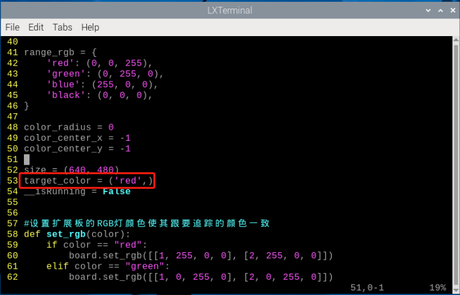

(4) Press **"i"** on the keyboard to enter the editing mode.

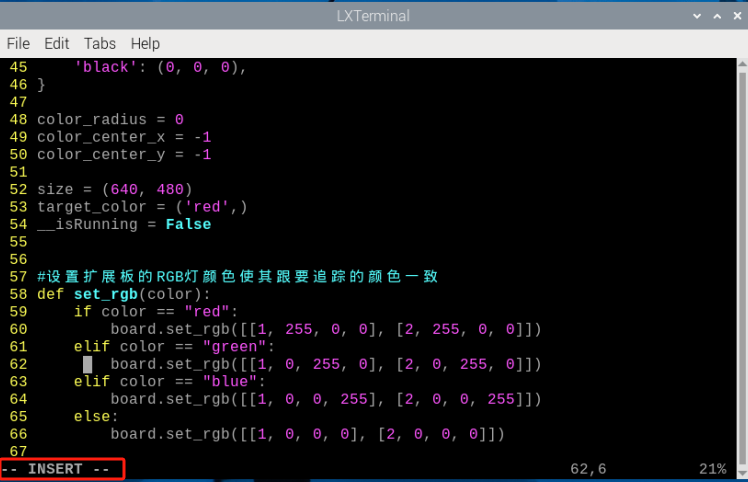

(5) Replace **"red"** with **"green"** in `detect_color == 'red'`as pictured:

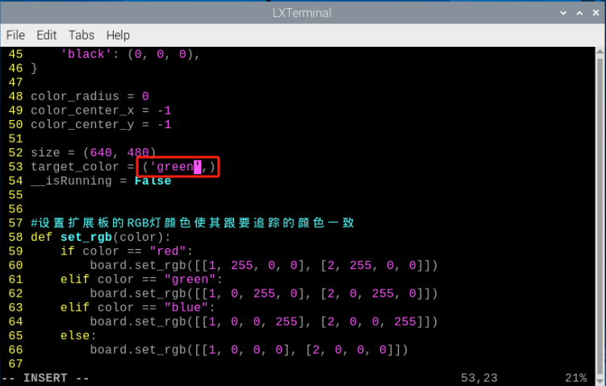

(6) Next, save the modified contents. Press **"Esc"** key and input **":wq"** in turn (make sure there is a colon before "**wq**"). Then press Enter to save and exit.

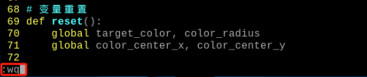

(7) Input command again and press Enter to open the game.

```shell
python3 color_tracking.py
```

### 4.4.6 Programming Analysis

The source code of this program is locate in: [/home/pi/uhandpi/functions/color_tracking.py](https://store.hiwonder.com.cn/docs/uHandPi/5/source_code/color_tracking.zip)

Color tracking program mainly uses the `resize()` and `GaussiamBlur()` function in the cv2 library. 

The `resize()` function is used to resize images. The first parameter within the parentheses is the input image, the second parameter is the output image size, and the third parameter is the interpolation method.

The `GaussianBlur()` function is used to apply Gaussian filtering to an image. Take the code "**frame_GaussianBlur = cv2.GaussianBlur(frame_resize, (3, 3), 0)**" as example, the parameters inside the parentheses are interpreted as follows:

The first parameter `frame_resize` is the input image.

The second parameter `(3, 3)` is the size of the Gaussian kernel.

The third parameter `0` specifies the variance allowed near the mean in Gaussian filtering. A larger value allows for a larger variance around the mean, while a smaller value allows for a smaller variance around the mean.

:::{Note}
Before modifying the program, it's crucial to create a backup of the original factory program. Avoid modifying parameters in the wrong way, which may cause the robot to malfunction and become irreparable!!! 
:::

<p id="4_import_parameter_module"></p>

* **Import parameter module**

| **Import module**                                            | **Function**                                                 |
| ------------------------------------------------------------ | ------------------------------------------------------------ |
| import sys                                                   | The Python "**sys**" module has been imported for accessing system-related functions and variables. |
| import cv2                                                   | The OpenCV library has been imported for image processing and computer vision-related functionalities. |
| import time                                                  | The Python "**time**" module has been imported for time-related functionalities, such as delay operations. |
| from common import misc                                      | The Misc module has been imported for processing obtained rectangle data. |
| from common.pid import PID                                   | Import PID control library                                   |
| import threading                                             | Provides an environment for running multiple threads concurrently |
| import yaml_handle                                           | Contains functionalities or tools related to processing YAML format files. |
| from common.action_group_controller import ActionGroupController | Import action group execution library                        |
| from common.ros_robot_controller_sdk import Board            | Import board library to control sensor                       |

* **Function Logic**

Capture image information through the camera, then process the image, specifically by performing binarization. At the same time, to reduce interference and make the image smoother, perform erosion and dilation operations on the image.
Next, obtain the largest area contour and minimum enclosing circle of the target. Get the color block tracking area and rotate the robot hand to the color block position based on PID algorithm.

* **Program logic and related code analysis**

**(1) Initialization**

**①  Import function library**

In this initialization step, the first task is to import the required libraries for subsequent program calls. For details on the imports, refer to "[**4.4.6 Programming Analysis -> Import parameter module**](#4_import_parameter_module)".

{lineno-start=4}

```python
import sys
import cv2
import time
import math
import signal
import threading
import numpy as np
from common import yaml_handle
from common.pid import PID
from common import misc
from calibration.camera import Camera 
```

**② Set initial state**

Set initial state, including the target color, the initial position of servo, motor state, etc.

{lineno-start=33}

```python
# 初始位置(initial position)
def init_move():
    agc.runAction('15_5_12345')
    
range_rgb = {
    'red': (0, 0, 255),
    'green': (0, 255, 0),
    'blue': (255, 0, 0),
    'black': (0, 0, 0),
}
```

**(2) Image pre-processing**

**①  Image pre-processing**

Resizing and Gaussian blur processing of the image.

{lineno-start=167}

```python
    frame_resize = cv2.resize(img_copy, size, interpolation=cv2.INTER_NEAREST)
    frame_gb = cv2.GaussianBlur(frame_resize, (3, 3), 3)  
```

`cv2.resize(img_copy, size, interpolation=cv2.INTER_NEAREST)` is an operation to resize the image.

The first parameter `img_copy` is the image to be resized.

The second parameter `size` is the target size.

The third parameter `interpolation` is the interpolation method, which is used to determine the pixel interpolation algorithm used for resizing.

`cv2.GaussianBlur(frame_resize, (3, 3), 3)` applies Gaussian blur to the image.

The first parameter `frame_resize` is the image to be blurred.

The second parameter`(3, 3)` is the size of the Gaussian kernel, indicating that the width and height of the kernel are both 3.

The third parameter `3` is the standard deviation of the Gaussian kernel, used to control the degree of blur.

**②  Color space conversion**

Convert the BGR image to LAB image

{lineno-start=169}

```python
    frame_lab = cv2.cvtColor(frame_gb, cv2.COLOR_BGR2LAB)  # 将图像转换到LAB空间(convert the image to LAB space)
```

**③ Binarization processing**

Use "**inRange()**" function in cv2 library to process binarization.

{lineno-start=164}

```python
            frame_mask = cv2.inRange(frame_lab,
                                         (lab_data[i]['min'][0],
                                          lab_data[i]['min'][1],
                                          lab_data[i]['min'][2]),
                                         (lab_data[i]['max'][0],
                                          lab_data[i]['max'][1],
                                          lab_data[i]['max'][2]))  #对原图像和掩模进行位运算(perform bitwise operation to original image and mask)
```

The first parameter `frame_lab` is inputting image.

The second parameter `lab_data[i]['min'][0]` is the lower limit of the threshold.

The third parameter `lab_data[i]['max'][0]` is the upper limit of the threshold.

**④ Opening and closing operation**

{lineno-start=181}

```python
            opened = cv2.morphologyEx(frame_mask, cv2.MORPH_OPEN, np.ones((3, 3), np.uint8))  # 开运算(opening operation)
            closed = cv2.morphologyEx(opened, cv2.MORPH_CLOSE, np.ones((3, 3), np.uint8))  # 闭运算(closing operation)
```

This line of code performs an opening operation on a binary image using `cv2.morphologyEx(frame_mask, cv2.MORPH_OPEN, np.ones((3, 3), np.uint8))`.

The first parameter `frame_mask` is the binary image on which morphological operations are to be performed.

The second parameter, `cv2.MORPH_OPEN`, specifies the opening operation to be performed.

The third parameter, `np.ones((3, 3), np.uint8)`, is the structuring element used in morphological operations, defining the shape and size of the operation. Here, a 3x3 matrix filled with ones is used as the structuring element.

The same applies to the closing operation function.

**⑤ Get position information**

After completing the above image processing, it is necessary to obtain the contours of the recognized targets. This involves using the "**findContours()**" function from the cv2 library.

{lineno-start=183}

```python
            contours = cv2.findContours(closed, cv2.RETR_EXTERNAL, cv2.CHAIN_APPROX_NONE)[-2]  # 找出轮廓(find out contour)
```

Take code `contours = cv2.findContours(closed, cv2.RETR_EXTERNAL, cv2.CHAIN_APPROX_NONE)[-2]` as example:

The first parameter `dilated` is inputting image.

The second parameter `cv2.RETR_EXTERNAL` is the contour retrieval mode.

The third parameter `cv2.CHAIN_APPROX_NONE)[-2]` is the contour approximation method.

Find the contour with the largest area in the obtained contour. In order to avoid interference, you need to set a minimum value. The target contour is considered valid only if its area is greater than this value. Then, get the minimum bounding circumcircle through `minEnclosingCircle()` function.

{lineno-start=186}

```python
    if area_max > 1000:  # 有找到最大面积(the largest area is found)
        (center_x, center_y), radius = cv2.minEnclosingCircle(areaMaxContour)  # 获取最小外接圆(get the minimum bounding circumcircle)
        color_radius = int(misc.map(radius, 0, size[0], 0, img_w))
        color_center_x = int(misc.map(center_x, 0, size[0], 0, img_w))
        color_center_y = int(misc.map(center_y, 0, size[1], 0, img_h))
        if color_radius > 300:
            color_radius = 0
            color_center_x = -1
            color_center_y = -1
            return img
```

**(3)  Target tracking**

After image processing is completed, if the tracing game is chosen, it is implemented by calling `board.pwm_servo_set_position()` function.

{lineno-start=133}

```python
    while True:
        if __isRunning:
            if color_center_x != -1 and color_center_y != -1:
                set_rgb(target_color[0]) # 设置扩展板上的彩灯与检测到的颜色一样(set the color light on the expansion board to match the detected color)
                # 手掌云台追踪(hand pan-tilt tracking)
                # 根据摄像头X轴坐标追踪(track based on the camera x-axis)
                if abs(color_center_x - img_w/2.0) < 15: # 移动幅度比较小，则不需要动(if the movement amplitude is relatively small, there is no need to move)
                    color_center_x = img_w/2.0
                servo6_pid.SetPoint = img_w/2.0    # 设定(set)
                servo6_pid.update(color_center_x)  # 当前(current)
                servo_6 += int(servo6_pid.output)  # 获取PID输出值(get PID output value)

                servo_6 = 800 if servo_6 < 800 else servo_6  # 设置舵机范围(set servo range)
                servo_6 = 2200 if servo_6 > 2200 else servo_6
                board.pwm_servo_set_position(0.01, [[6, 3000-servo_6]]) # 设置舵机移动(set servo movement)
                time.sleep(0.01)
```

Use `board.pwm_servo_set_position` function to control servo. The parameter definition The meaning of the parameters within the parentheses is as follows:

The first parameter `0.02` is the action duration in seconds.

The second parameter `[[6, servo_6]]` indicates that servo NO.6 will rotate by a pulse width of servo_6.

## 4.5 Face Detection

### 4.5.1 Program Description

Once a face is detected, the buzzer will emit a beeping sound and highlight the face in the returned image.

Facial recognition is one of the most widely used applications in artificial intelligence, particularly in image recognition. It is commonly applied in scenarios such as smart locks and facial unlocking for smartphones.

In this section, the trained face model will first scale and detect the face in the image. Then, the detected face coordinates are converted back to the original scale. The system will identify the largest face, outline it, and trigger the buzzer to emit a beeping sound.

### 4.5.2 Start and Close the Game

:::{Note}
Instructions must be entered with strict attention to case sensitivity and spacing.
:::

(1) Power on the robot and use VNC Viewer to connect to the remote desktop.

(2) Clickat upper left corner, or press "**Ctrl+Alt+T**" to open LX terminal.

(3) Enter the following command and press Enter into the directory where the game programs are stored.

```shell
cd uhandpi/function_demo
```

(4) Enter the command below and press Enter to start the game.

```shell
python3 face_demo.py
```

(5) If want to quit this game, press "**Ctrl+C**" after the game program completes loading. If the game cannot be quit, please try again.

### 4.5.3 Program Outcome

:::{Note}
For optimal performance, please avoid using this feature under strong lighting conditions, such as direct sunlight or close proximity to incandescent lights, as intense light can affect the accuracy of facial recognition. It is recommended to use this feature indoors, with the face positioned at a distance of 50cm to 1m from the camera.
:::

During detection, uHandPi will rotate left and right. When the camera detects a face, uHandPi will stop rotating, perform a "**waving**" gesture, and outline the face in the feedback on the screen.

### 4.5.4 Program Analysis

The source code of this program is locate in :[/home/pi/uhandpi/function_demo/face_demo.py](https://store.hiwonder.com.cn/docs/uHandPi/5/source_code/face_demo.zip)

<p id="5_import_parameter_module"></p>

* **Import Parameter Module**

| **Import module**                                            | **Function**                                                 |
| ------------------------------------------------------------ | ------------------------------------------------------------ |
| import sys                                                   | The Python "**sys**" module has been imported for accessing system-related functions and variables. |
| import cv2                                                   | The OpenCV library has been imported for image processing and computer vision-related functionalities. |
| import time                                                  | The Python "**time**" module has been imported for time-related functionalities, such as delay operations. |
| import mediapipe as mp                                       | The Mediapipe structure is imported for processing the face information. |
| import threading                                             | Provides an environment for running multiple threads concurrently |
| import numpy as np                                           | Import the NumPy library, which supports a wide range of multidimensional arrays and matrix operations, as well as mathematical function libraries. |
| from common.action_group_controller import ActionGroupController | Import action group execution library                        |
| from common.ros_robot_controller_sdk import Board            | The board library is imported to control sensor.             |

* **Function logic**

Based on the implementation outcome, the program logic can be summarized as below:

Capture image information through the camera, then process the image, specifically by performing color space conversion. Then call face detection machine of the MediaPipe library to detect face.

Once the face is detected, the robot hand will execute "**waving**" motion. If no face is detected, the robot hand will move left and right to search for a face.

* **Program logic and related code analysis**

**(1) Initialization**

**① Import function library**

In this initialization step, the first task is to import the required libraries for subsequent program calls. For details on the imports, refer to "[**4.5.4 Program Analysis -> Import Parameter Module**](#4_import_parameter_module)".

{lineno-start=3}

```python
import sys
import cv2
import time
import signal
import threading
import mediapipe as mp
from calibration.camera import Camera 
from common.ros_robot_controller_sdk import Board
```

**② Set Initial State**

Set initial state, including the initial position of servo, face detection machine, etc.

{lineno-start=12}

```python
board = Board()
# 人脸检测(face detection)
di_once = True
if sys.version_info.major == 2:
    print('Please run this program with python3!')
    sys.exit(0)

# 导入人脸识别模块(import human face detection module)
face = mp.solutions.face_detection
# 自定义人脸识别方法，最小的人脸检测置信度0.5(custom human face recognition method, the minimum human face detection confidence is 0.5)
face_detection = face.FaceDetection(min_detection_confidence=0.5)
di_once = True
detect_people = False
```

**(2)  Image Processing**

**① Color Space Conversion**

Convert the BGR image to LAB image

{lineno-start=45}

```python
    image_rgb = cv2.cvtColor(img_copy, cv2.COLOR_BGR2RGB)
```

**② Use Mediapipe Face Model for Recognition**

Perform face detection and draw a rectangular box around the detected face.

{lineno-start=48}

```python
    results = face_detection.process(image_rgb)
    
    # 如果检测到人脸
    if results.detections:
        for detection in results.detections:
            bboxC = detection.location_data.relative_bounding_box
            bbox = (int(bboxC.xmin * img_w), int(bboxC.ymin * img_h),  
                    int(bboxC.width * img_w), int(bboxC.height * img_h))
            cv2.rectangle(img, bbox, (0, 255, 0), 2)
        
        # 如果之前没有检测到人脸，则触发蜂鸣器
        if di_once:
            board.set_buzzer(1900, 0.3, 0.5, 1)
            di_once = False
    else:
        # 如果没有检测到人脸，重置蜂鸣器触发标志
        di_once = True
```


**(3) Face Recognition**

If a face is detected, the buzzer will be activated to emit a sound.

{lineno-start=59}

```python
        if di_once:
            board.set_buzzer(1900, 0.3, 0.5, 1)
            di_once = False
```

## 4.6 Face Recognition

### 4.6.1 Program Description

MediaPipe is a cross-platform machine learning framework developed by Google for real-time processing of multimedia data, including images and videos. It offers a variety of pre-trained models and libraries, one of which is a face detection model.

First, import the MediaPipe face detection model to capture real-time footage from the camera.
Then, use OpenCV to process the image, such as converting the color space (for more details on Lab color space, refer to "[**OpenCV Vision Basic Course**]()" for in-depth learning). The face detection model uses a minimum confidence threshold to determine if a face has been successfully detected.

Once a face is detected, the system identifies key facial regions. Each detected face is represented by a message containing a bounding box and six key points: right eye, left eye, nose tip, mouth center, right ear area, and left ear area.

Finally, the detected face is outlined with a bounding box, and the six key points are marked on the face.

### 4.6.2 Start and Close the Game

:::{Note}
The input of commands must strictly distinguish between uppercase and lowercase letters.
:::

(1) Power on the device and access the Raspberry Pi desktop using VNC.

(2) Click the iconin the top left corner of the system desktop or press the shortcut "**Ctrl+Alt+T** " to open the LX terminal.

(3) In the terminal, enter the following command to navigate to the directory where the program is located, then press Enter:

```shell
cd uhandpi/functions
```

(4) Enter the command and press Enter to start the program:

```shell
python3 face_detection.py
```

(5) To close the program, simply press "**Ctrl+C**" in the LX terminal. If it does not close, press it multiple times.

### 4.6.3 Program Outcome

Once the activity begins, the camera's pan-tilt will rotate left and right. If no face is detected, the robotic arm will scan by rotating left and right. Upon detecting a face, the claw will move up and down to greet the user.

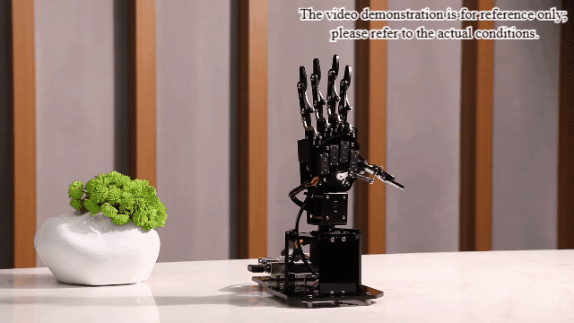

### 4.6.4 Program Brief Analysis

The source code of the program is saved in: [/home/pi/uhandpi/functions/face_detection.py](https://store.hiwonder.com.cn/docs/uHandPi/5/source_code/face_detection.zip)

:::{Note}
Before modifying the program, make sure to back up the original factory settings. Do not make changes directly in the source code file to avoid incorrect modifications that could cause the robot to malfunction and become irreparable!
:::

<p id="6_import_parameter_module"></p>

* **Importing Parameter Modules**

| **Module Import**                 | **Purpose**                                                  |
| --------------------------------- | ------------------------------------------------------------ |
| import sys                        | Imports the Python sys module, which provides access to system-specific parameters and functions. |
| import cv2                        | Imports the OpenCV library, which is used for image processing and computer vision tasks. |
| import time                       | Imports the Python time module, which provides functions for handling time-related tasks, such as delays. |
| import HiwonderSDK.Misc as Misc   | Imports the Misc module from the Hiwonder SDK for handling recognized rectangular data. |
| import threading                  | Provides support for running tasks in multiple threads concurrently |
| import yaml_handle                | Contains functions or tools for handling YAML format files   |
| from ArmIK.Transform import *     | Imports functions for robotic arm posture transformations    |
| from ArmIK.ArmMoveIK import *     | Provides functions for inverse kinematics solving and control for robotic arm movement |
| import HiwonderSDK.Board as Board | Imports the Board module from the Hiwonder SDK, which is used to control sensors and execute related actions |

* **Function Logic**

Capture image data from the camera, then process the image by converting its color space. Next, use the MediaPipe library's face detector to perform face detection.
When a face is detected, the robotic hand will perform a "**wave**" gesture. If no face is detected, the robotic hand will move left and right to search for a face.

* **Program Logic and Code Analysis**

(1)  Initialization

① Importing Libraries

At this initialization step, necessary libraries are imported to facilitate future function calls within the program.

{lineno-start=4}

```python
import sys
import cv2
import time
import signal
import threading
import mediapipe as mp
from calibration.camera import Camera 
```

② Setting Initial State

Set the initial state, which includes the initialization of the facial recognition module and the hardware initialization of the expansion board.

{lineno-start=21}

```python
mp_face_detection = mp.solutions.face_detection
mp_drawing = mp.solutions.drawing_utils
face_detection = mp_face_detection.FaceDetection() #阈值(threshold)

target_detected = False
servo_6 = 1500
dx = 20

# 初始位置(initial position)
def init_move():
    agc.runAction('15_5_12345')


__isRunning = False
```

(2)  Image Processing

① Color Space Conversion

The BGR image is converted to an RGB image.

{lineno-start=123}

```python
    img = cv2.cvtColor(img, cv2.COLOR_BGR2RGB)
```

The `cvtColor()` function is used to convert the color space of an image. Taking the code `gray = cv2.cvtColor(frame_resize, cv2.COLOR_BGR2GRAY)` as an example, the parameters within the parentheses are as follows:

First Parameter: `frame_resize` is the input image.

Second Parameter: `cv2.COLOR_BGR2RGB` specifies the conversion type, in this case, converting from BGR to grayscale.

②  Invoke Face Detector

After completing the above image processing, input the image into the face detector for further processing.

{lineno-start=112}

```python
    results = face_detection.process(img)
    img.flags.writeable = True
    
    if __isRunning:
        if results.detections:
            for detection in results.detections:
                scores = list(detection.score)   
                if scores and scores[0] > 0.8:
                    mp_drawing.draw_detection(img, detection)
                    target_detected = True
```

(3) Face Tracking

After completing image processing, if a face is detected, the robotic hand will perform a "**waving**" action. If no face is tracked, the robotic hand will rotate left and right to search for a face. The control of the robotic hand is achieved by calling the `board.pwm_servo_set_position()` function.

{lineno-start=68}

```python
    while True:
        if __isRunning:
            if target_detected :
                time.sleep(1)   
                data_1 = [2100, 950, 950, 950, 950]     #设置舵机运行角度(set servo running angle)
                data_2 = [950, 2100, 2100, 2100, 2100]

                board.pwm_servo_set_position(0.4, [[1, data_1[0]], [2, data_1[1]], [3, data_1[2]],
                                 [4, data_1[3]], [5, data_1[4]]]) 
                time.sleep(0.4)
                board.pwm_servo_set_position(0.4, [[1, data_2[0]], [2, data_2[1]], [3, data_2[2]],
                                 [4, data_2[3]], [5, data_2[4]]])
                time.sleep(0.4)
                board.pwm_servo_set_position(0.4, [[1, data_1[0]], [2, data_1[1]], [3, data_1[2]],
                                 [4, data_1[3]], [5, data_1[4]]]) 
                time.sleep(0.4)
                board.pwm_servo_set_position(0.4, [[1, data_2[0]], [2, data_2[1]], [3, data_2[2]],
                                 [4, data_2[3]], [5, data_2[4]]])
                time.sleep(0.4)
                target_detected  = False
            else:
                servo_6 += dx
                if servo_6 >= 2500:
                    dx = -10
                    servo_6 = 2500
                if servo_6 <= 500:
                    dx = 10
                    servo_6 = 500
                board.pwm_servo_set_position(0.05, [[6, servo_6]])             
                time.sleep(0.05)
                
        else:
            servo_6 = 1500
            time.sleep(0.01)
```

Servo Control Using `board.pwm_servo_set_position`:  

This function is used to control the servo motor. The parameters in the parentheses are as follows:  

First Parameter: `0.05` specifies the duration of the action, measured in seconds.  

Second Parameter: `[[6, servo_6]]` indicates that servo 6 will rotate by `servo_6` pulse width units.  

## 4.7 Scissors-Rock-Paper

### 4.7.1 Program Logic

Rock-paper-scissors is a common game, and the most important function of a bio-robot is to interact with us. In this section, we'll implement this game using visual recognition.

In this lesson, we will use MediaPipe's hand detection model to display the key points of the hand and the lines connecting these key points on the feedback screen.

First, import the hand detection model and then capture the real-time video from the camera.
Then, performing operations such as flipping and changing color spaces on the image greatly reduces the need for data augmentation in the hand landmark model.

In addition, in our pipeline, we can also generate crops based on the hand landmarks recognized in the previous frame. We only call hand detection to reposition the hand when the landmark model no longer recognizes the presence of a hand.

Finally, detect the key points of the hands in the captured image and draw lines to connect them, then call the corresponding action group to complete the interaction.

### 4.7.2 Operation Steps

:::{Note}
Instructions must be entered with strict attention to case sensitivity and spacing.
:::

(1) Power on the robot and use VNC Viewer to connect to the remote desktop.

(2) Clickat upper left corner, or press "**Ctrl+Alt+T**" to open LX terminal.

(3) Enter the following command and press Enter into the directory where the game programs are stored.

```shell
cd uhandpi/functions
```

(4) Enter the below command and press Enter to start the game.

```shell
python3 rock_paper_scissors.py
```

(5) If want to quit this game, press "**Ctrl+C**" after the game program completes loading. If the game cannot be quit, please try again.

### 4.7.3 Program Outcome

When the camera detects a gesture, uHandPi will make a recognition judgment and provide feedback by displaying a corresponding gesture. For example, when the camera detects a "**scissors**" gesture, uHandPi will display a "**rock**" gesture in response.

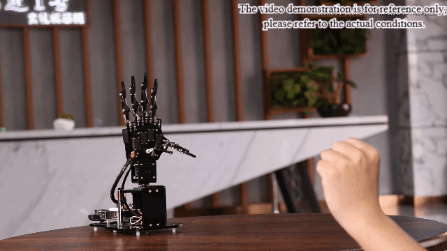

### 4.7.4 Programming Analysis

The source code of this program is locate in ： [/home/pi/uhandpi/functions/rock_paper_scissors.py](https://store.hiwonder.com.cn/docs/uHandPi/5/source_code/rock_paper_scissors.zip)

:::{Note}
Before modifying the program, it's crucial to create a backup of the original factory program. Avoid modifying parameters in the wrong way, which may cause the robot to malfunction and become irreparable！
:::

<p id="7_import_parameter_module"></p>

* **Import parameter module**

| **Import module**                                            | **Function**                                                 |
| ------------------------------------------------------------ | ------------------------------------------------------------ |
| import sys                                                   | The Python "**sys**" module has been imported for accessing system-related functions and variables. |
| import cv2                                                   | The OpenCV library has been imported for image processing and computer vision-related functionalities. |
| import time                                                  | The Python "**time**" module has been imported for time-related functionalities, such as delay operations. |
| import threading                                             | Provides an environment for running multiple threads concurrently |
| import mediapipe as mp                                       | The mediapipe library has been   imported to recognize gesture. |
| from common.action_group_controller import ActionGroupController | Import action group execution library                        |
| from common.ros_robot_controller_sdk import Board            | Import board library to control sensor                       |
| from common.transform import vector_2d_angle                 | Import a function to calculate the angle between two-dimensional vectors, which is used to calculate the angle between fingers. |

* **Function logic**

Capture image information through the camera, then process the image, specifically by performing color space conversion. Then call face detection machine of the MediaPipe library to detect gesture.
Based on the recognized gestures, calculate the degree of bending of each finger to determine the specific gesture. The robotic hand makes different gestures based on the recognized gesture results, thus achieving the interactive effect of "**rock-paper-scissors**" between humans and machines.

* **Program logic and related code analysis**

**(1) Initialization**

① Import function library

In this initialization step, the first task is to import the required libraries for subsequent program calls. For details on the imports, refer to "[**4.7.4 Programming Analysis -> Import parameter module**](#7_import_parameter_module)".

{lineno-start=4}

```python
import sys
import cv2
import time
import math
import signal
import threading
import numpy as np
import mediapipe as mp
from calibration.camera import Camera 
from common.transform import vector_2d_angle

```

② Set initial state

Set initial state, including the initial position of servo, MediaPipe toolkit example for hand detection, etc.

{lineno-start=24}

```python
gesture = None
mp_drawing = mp.solutions.drawing_utils
hand_detector = mp.solutions.hands.Hands(
            static_image_mode=False,
            max_num_hands=1,
            min_tracking_confidence=0.05,
            min_detection_confidence=0.6
        )


# 初始位置(initial position)
def init_move():
    agc.runAction('15_5_12345')
```

The specific meanings of the example parameters for the `hand_detector` are as follows:

The first parameter, `static_image_mode,` is the processing mode for input images. The default value is "**False**", indicating that the input image is treated as a video stream. After detecting the first image, only subsequent images are tracked for landmarks. Detection is performed again only if tracking fails. This detection mode helps reduce computational load and latency. When the value is "**True**", the program detects all input images. This mode is suitable for detecting batches of static, unrelated images.

The second parameter, `max_num_hands,` is the maximum number of hands that can be detected, i.e., the maximum number of hands that can be recognized simultaneously.
The third parameter, `min_tracking_confidence,` is the minimum confidence value for the coordinate tracking model, with a range of 0 to 1. This parameter is not effective when the `static_image_mode` parameter is set to`True`.

The fourth parameter, `min_detection_confidence,` is the minimum confidence value for the hand detection model, with a range of 0 to 1. If the probability of hand detection is higher than this value, it is considered a successful detection.

**(2) Image processing**

①  Image pre-processing

Resizing and Gaussian blur processing of the image.

{lineno-start=168}

```python
    frame_resize = cv2.resize(img_copy, size, interpolation=cv2.INTER_NEAREST)
    frame_gb = cv2.GaussianBlur(frame_resize, (3, 3), 3)
```

`cv2.resize(img_copy, size, interpolation=cv2.INTER_NEAREST)` is an operation to resize the image.

The first parameter `img_copy` is the image to be resized.

The second parameter `size` is the target size.

The third parameter `interpolation` is the interpolation method, which is used to determine the pixel interpolation algorithm used for resizing.

`cv2.GaussianBlur(frame_resize, (3, 3), 3)` applies Gaussian blur to the image.

The first parameter `frame_resize` is the image to be blurred.

The second parameter `(3, 3)` is the size of the Gaussian kernel, indicating that the width and height of the kernel are both 3.

The third parameter `3` is the standard deviation of the Gaussian kernel, used to control the degree of blur.

② Color space conversion

Convert the BGR image to LAB image.

{lineno-start=171}

```python
    frame_rgb = cv2.cvtColor(frame_gb, cv2.COLOR_BGR2RGB)
```

③ Adjust gesture detection machine

After completing the above image processing, input the image into the gesture detector for further processing.

{lineno-start=70}

```python
def get_hand_landmarks(img, landmarks):
    """
    将landmarks从medipipe的归一化输出转为像素坐标(convert landmarks from normalized output of Mediapipe to pixel coordinates)
    :param img: 像素坐标对应的图片(the image corresponding to pixel coordinates)
    :param landmarks: 归一化的关键点(normalized keypoints)
    :return:
    """
    h, w, _ = img.shape
    landmarks = [(lm.x * w, lm.y * h) for lm in landmarks]
    return np.array(landmarks)
```

(3) Gesture recognition

After the image processing is completed, the robotic hand will perform different gestures based on the recognized gesture results. The execution of the action group by the robotic hand is achieved through calling agc.runAction().

{lineno-start=131}

```python
def move():
    global __isRunning, gesture
    global _stop
    
    while True:
        if __isRunning:
            if gesture == 'scissors' :  # 检测到剪刀,运行握拳动作组(scissor gesture is detected, run the fist action group)
                agc.runAction('0_0_0')
                                            
            elif gesture == 'rock' :  # 检测到石头,运行张开动作组(rock gesture is detected, run the opening action group)
                agc.runAction('15_5_12345')

            elif gesture == 'paper' :  # 检测到张开,运行剪刀动作组(opening gesture is detected, run scissor action group)
                agc.runAction('6_2_23')

            else :
                pass
            #_stop = True
        else:
            if _stop:
                init_move()  # 回到初始位置(return the initial position)
                #_stop = False
                time.sleep(1.5)               
            time.sleep(0.01)
```

## 4.8 Gesture Recognition

### 4.8.1 Program Description

In this lesson, the MediaPipe hand detection model is used to display key points of the hand and the connections between them on the feedback screen.

First, import the hand detection model, then capture the real-time image from the camera.

Then, performing operations such as flipping the image and converting color spaces greatly reduces the need for data augmentation in the hand landmark model.

In addition, in our pipeline, we can also generate crops based on the hand landmarks recognized in the previous frame. Hand detection is only invoked to reposition the hand when the landmark model no longer detects the presence of a hand.

Finally, detect the key points of the hands in the captured image and draw lines to connect them, then call the corresponding action group to complete the interaction.

### 4.8.2 Start and Close the Game

:::{Note}
Instructions must be entered with strict attention to case sensitivity and spacing.
:::

(1) Boot up uHandPi, and then login Raspberry Pi desktop remotely through VNC.

(2) Clickat upper left corner, or press **"Ctrl+Alt+T "** to open LX terminal.

(3) Enter the following command and press Enter into the directory where the game programs are stored.

```shell
cd uhandpi/functions
```

(4) Enter the command below and press Enter to start the game.

```shell
python3 gesture_recognition.py
```

(5) If want to quit this game, press "**Ctrl+C**" after the game program completes loading. If the game cannot be quit, please try again.

### 4.8.3 Program Outcome

:::{Note}
Maintaining an internet connection at all times is necessary to ensure the functionality remains unaffected.
:::

Place your hand within the camera's field of view. When the camera recognizes a gesture, uHandPi will mimic the corresponding action.

The following table lists gestures with added feedback actions:

| No. | Gesture | Figure |
|:--:|:--:|:--:|
| 1 | One |  |
| 2 | Two | 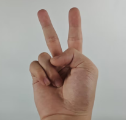 |
| 3 | Three |  |
| 4 | Four |  |
| **5** | Five |  |
| 6 | Six | 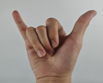 |
| 7 | Fist | 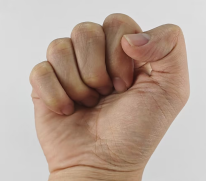 |
| 8 | OK | 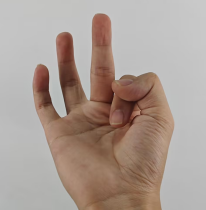 |
| 9 | Gun | 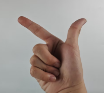 |
| 10 | Rock | 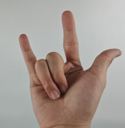 |
| 11 | hand_heart | 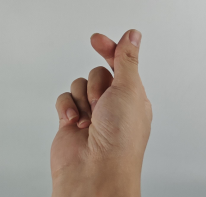 |

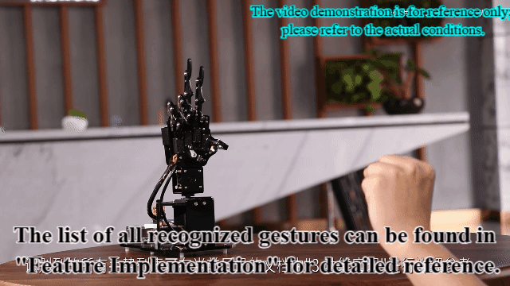

### 4.8.4 Program Analysis

The source code of this program is located in: [/home/pi/uhandpi/functions/gesture_recognition.py](https://store.hiwonder.com.cn/docs/uHandPi/5/source_code/gesture_recognition.zip)

:::{Note}
Before modifying the program, it's crucial to create a backup of the original factory program. Avoid modifying parameters in the wrong way, which may cause the robot to malfunction and become irreparable!!!
:::

<p id="8_import_parameter_module"></p>

* **Import parameter module**

| **Import module**                                            | **Function**                                                 |
| ------------------------------------------------------------ | ------------------------------------------------------------ |
| import sys                                                   | The Python "**sys**" module has been imported for accessing system-related functions and variables. |
| import cv2                                                   | The OpenCV library has been imported for image processing and computer vision-related functionalities. |
| import time                                                  | The Python "**time**" module has been imported for time-related functionalities, such as delay operations. |
| import threading                                             | Provides an environment for running multiple threads concurrently |
| import mediapipe as mp                                       | The mediapipe library has been imported for gesture recognition |
| from common.action_group_controller import ActionGroupController | Import action group execution library                        |
| from common.ros_robot_controller_sdk import Board            | The board library is imported to control sensor.             |
| from common.transform import vector_2d_angle                 | Import a function to calculate the angle between two 2D vectors for calculating the angle between fingers. |

* **Function logic** 

Capture image information through the camera, then process the image, specifically by performing color space conversion. Then call face detection machine of the MediaPipe library to detect gesture.

Based on the recognized gestures, calculate the bending degree of each finger to determine the specific gesture. The robotic hand will then perform different gestures according to the recognized gesture results, thereby achieving a "**rock-paper-scissors**" human-machine interaction effect.

* **Program logic and related code analysis**

**(1) Initialization**

① Import function library

In this initialization step, the first task is to import the required libraries for subsequent program calls. For details on the imports, refer to "[**4.8.4 Function Extension -> Import parameter module**](#8_import_parameter_module)".

{lineno-start=4}

```python
import sys
import cv2
import time
import math
import signal
import threading
import numpy as np
import mediapipe as mp
from calibration.camera import Camera 
from common.transform import vector_2d_angle
```

② Set initial state

Set initial state, including the initial position of servo, MediaPipe toolkit example for hand detection, etc.

{lineno-start=16}

```python
# 手势识别(gesture recognition)
board = None
agc =None

if sys.version_info.major == 2:
    print('Please run this program with python3!')
    sys.exit(0)

gesture = None
mp_drawing = mp.solutions.drawing_utils
hand_detector = mp.solutions.hands.Hands(
            static_image_mode=False,
            max_num_hands=1,
            min_tracking_confidence=0.05,
            min_detection_confidence=0.6
        )
```

The specific meanings of the example parameters for the `hand_detector` are as follows:

The first parameter, `static_image_mode,` is the processing mode for input images.

The default value is "**False**", indicating that the input image is treated as a video stream. After detecting the first image, only subsequent images are tracked for landmarks. Detection is performed again only if tracking fails. This detection mode helps reduce computational load and latency.
When the value is "**True**", the program detects all input images. This mode is suitable for detecting batches of static, unrelated images.

The second parameter `max_num_hands` is the maximum detectable quantity, which means the maximum number of hands that can be recognized at the same time.

The third parameter, `min_tracking_confidence,` is the minimum confidence value for the coordinate tracking model, with a range of 0 to 1. This parameter is not effective when the "**static_image_mode**" parameter is set to "**True**".

The fourth parameter, `min_detection_confidence,` is the minimum confidence value for the hand detection model, with a range of 0 to 1. If the probability of hand detection is higher than this value, it is considered a successful detection.

(2) Image processing

① Image pre-processing

Resizing and Gaussian blur processing of the image.

{lineno-start=217}

```python
    frame_resize = cv2.resize(img_copy, size, interpolation=cv2.INTER_NEAREST)
    frame_gb = cv2.GaussianBlur(frame_resize, (3, 3), 3)
```

`cv2.resize(img_copy, size, interpolation=cv2.INTER_NEAREST)` is an operation to resize the image.

The first parameter `img_copy` is the image to be resized.

The second parameter `size` is the target size.

The third parameter `interpolation` is the interpolation method, which is used to determine the pixel interpolation algorithm used for resizing.

`cv2.GaussianBlur(frame_resize, (3, 3), 3)` applies Gaussian blur to the image.

The first parameter `frame_resize` is the image to be blurred.

The second parameter `(3, 3)` is the size of the Gaussian kernel, indicating that the width and height of the kernel are both 3.

The third parameter `3` is the standard deviation of the Gaussian kernel, used to control the degree of blur.

② Color space conversion

Convert the BGR image to LAB image.

{lineno-start=220}

```python
    frame_rgb = cv2.cvtColor(frame_gb, cv2.COLOR_BGR2RGB)
```

③ Adjust gesture detection machine

After completing the above image processing, input the image into the gesture detector for further processing.

{lineno-start=222}

```python
    gesture = "none" 
    results = hand_detector.process(frame_rgb)
    result_image = frame_rgb.copy()
    if results is not None and results.multi_hand_landmarks:
        
        for hand_landmarks in results.multi_hand_landmarks:
            mp_drawing.draw_landmarks(
                result_image,
                hand_landmarks,
                mp.solutions.hands.HAND_CONNECTIONS)
            landmarks = get_hand_landmarks(img_copy, hand_landmarks.landmark)
            angle_list = (hand_angle(landmarks))
            gesture = (h_gesture(angle_list))
            cv2.putText(result_image, gesture, (10, img.shape[0] - 10), cv2.FONT_HERSHEY_SIMPLEX, 1, (255, 255, 0), 2)
```

④ Gesture recognition

After the image processing is completed, the robotic hand will perform different gestures based on the recognized gesture results. The execution of the action group by the robotic hand is achieved through calling agc.runAction().

{lineno-start=155}

```python
# 机器人移动逻辑处理(robot movement logic processing)
def move():
    global __isRunning, gesture
    global _stop
    while True:
        if __isRunning:            
            if gesture == 'fist' :     #根据识别结果调用对应的动作组(call the corresponding action group based on recognition result)
                agc.runAction('0_0_0')
                                            
            elif gesture == 'gun' :  
                agc.runAction('21_gun')

            elif gesture == 'rock' :  
                agc.runAction('24_rock')

            elif gesture == 'ok' :  
                agc.runAction('23_ok')
                                            
            elif gesture == 'hand_heart' :  
                agc.runAction('22_hand_heart')

            elif gesture == 'one' :  
                agc.runAction('2_1_2')

            elif gesture == 'two' :  
                agc.runAction('6_2_23')
                                            
            elif gesture == 'three' :  
                agc.runAction('11_3_234')

            elif gesture == 'four' :  
                agc.runAction('14_4_2345')
                                    
            elif gesture == 'five' :  
                agc.runAction('15_5_12345')

            elif gesture == 'six' :  
                agc.runAction('5_2_15')
```
