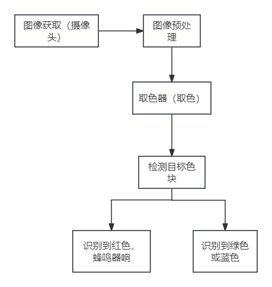
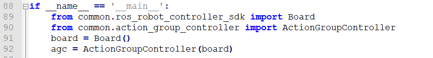
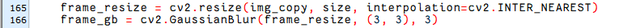
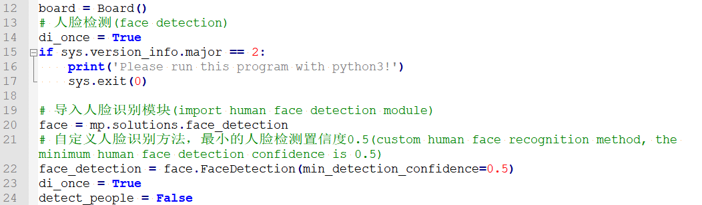
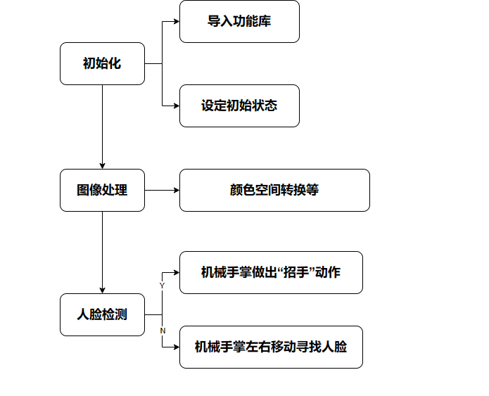
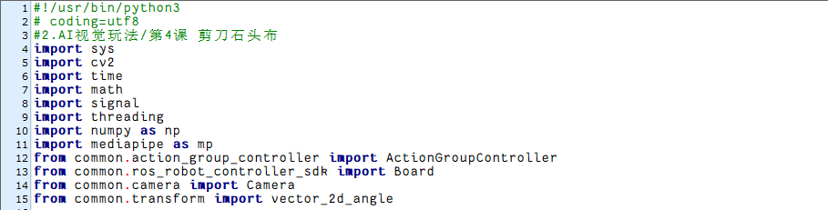
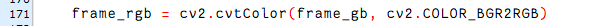

# AI视觉玩法课程

## 1. 单个颜色识别

本节通过摄像头来识别颜色,识别到红色小球时，蜂鸣器发出滴滴报警声，并在回传画面中圈出，打印 "Color：red"。

### 1.1 实现原理

颜色识别的实现分为颜色识别和识别后的执行反馈两部分。

首先颜色识别部分，先进行高斯滤波（对图像中进行减噪），通过Lab颜色空间来对物品的颜色进行转换(关于Lab颜色空间的这个部分可以前往教程资料中 "**第7章 OpenCV基础课程**"进行详细学习)。

接着通过颜色阈值对圆圈中的物体颜色进行识别，再对图像部分进行掩膜（掩膜是用选定的图像、图形或物体，对处理的图像进行全局或者局部遮挡）。

然后经过对物品图片开闭运算处理后，最后将轮廓最大的物体用圆圈圈出。

开运算：先对图像腐蚀后膨胀。作用：用来消除小的物体，平滑形状边界，并且不改变其面积。可以去除小颗粒噪声，断开物体之间的粘连。

闭运算：先对图像膨胀后腐蚀。作用：用来填充物体内的小空洞，连接邻近的物体，连接断开的轮廓线，平滑其边界的同时不改变面积。

在识别后对蜂鸣器进行设置，使小车根据不同颜色来做出对应的反馈。比如识别红色，蜂鸣器响一声。

关于详细对应的反馈效果，可参考本文档[1.3 实现效果](#anchor_1_3)效果。

### 1.2 玩法开启及关闭步骤

:::{Note}
指令输入需严格区分大小写及空格，关键字可以使用"Tab"键进行补齐。
:::

1. 将设备开机，并参照课程资料的"**[远程工具安装及连接\1. 远程桌面工具安装与连接]()**"内容，通过VNC远程连接工具连接。


2. 点击系统桌面左上角的图标，或按下快捷键"**Ctrl+Alt+T**"打开LX终端。

3. 输入指令，按下回车，则可定位到存放玩法程序的目录。

```commandline
cd uhandpi/function_demo
```

4. 输入指令，然后按下回车键，玩法启动。

```commandline
python3 individual_colors.py
```

5. 如需关闭此玩法，只需要在LX终端界面中按下"Ctrl+c"。若关闭失败，可多次按下。

<p id="anchor_1_3"></p>

### 1.3 实现效果

玩法开启后，通过摄像头来识别颜色,识别到红色小球时，蜂鸣器发出滴滴报警声，并在回传画面中圈出，打印 "Color：red"

:::{Note}
- **识别过程中，请尽量保证在光线充足环境下进行识别，避免因光线问题导致识别不准确。**
- **识别过程中，摄像头视觉范围之内的背景中，不要出现与要识别颜色相近或相同的物体，避免误识别。**
:::

### 1.4 功能延伸

<p id="anchor_1_4_1"></p>

- #### 1.4.1 更换默认识别颜色

颜色识别程序内置了三种颜色：红色、绿色以及蓝色，其中默认识别到红色，蜂鸣器发出滴滴响声，并在回传画面中圈出，打印 "Color：red"。

**这里我们将识别颜色更换为绿色为例，具体修改步骤如下所示：**

1.  输入指令切换到源码路径下的指令，按下回车。

```commandline
cd uhandpi/function_demo
```

2. 然后再输入指令打开程序文件的指令，按下回车。

```commandline
sudo vim individual_colors.py
```

3. 按下键盘上的"**i**"键，进入到编辑模式。


4. 找到下图红框代码。


5. 将绿色的RGB值写入其中"’green’: (0, 255, 0),"。


6. 将识别颜色更改为绿色，找到下图所示代码，将red替换为green。


7. 将回传窗口颜色中显示的圆圈以及文字更改为绿色。


8. 保存修改的内容。按下"**Esc**"键，然后依次输入"**:wq**"（注意wq前为冒号：），回车即可保存并退出。

9.  输入开启颜色识别玩法的指令，按下回车。

```commandline
python3 individual_colors.py
```

- ####  1.4.2 增加新的识别颜色

除了内置三种识别的颜色，我们还可以设置其它可识别的颜色，**比如我们以紫色作为新增的识别颜色为例**，**具体的修改步骤如下：**

1.  双击系统桌面LAB图标，然后弹出的提示框内直接选择"**Execute**"即可。


2. 在弹出的界面中点击"Connect"按钮。


3. 点击"**Add**"，然后为新增颜色命名（这里以"**purple**"为例），再点击"**OK**"。


4. 然后点击颜色选框的下拉按钮，选择"**purple**"。


5. 将摄像头对准紫色物体，拖动L、A、B应的滑杆，直到左侧画面里要识别的颜色区域变为白色，其他区域变成黑色。


6. 最后，再点击"**Save**"，保存一下调节好的颜色阈值。


7. 修改完成后，我们可以检查一下修改的值是否成功被写入进去，输入进入到程序代码的目录。

```commandline
cd uhandpi/config
```

8.  输入打开程序文件的指令，按下回车。

```commandline
sudo vim lab_config.yaml
```

9.  打开颜色阈值程序文件后，即可查看紫色阈值参数。


10. 再按照"**[更换默认识别颜色](#anchor_1_4_1)**"可将默认颜色修改为紫色

11. 如果需要添加其他颜色作为可识别颜色，可参考前面步骤进行操作。

### 1.5 程序分析

该程序的源代码位于： **/home/pi/uhandpi/function_demo/individual_colors.py**

根据实现的效果，梳理程序的过程逻辑，如下图所示：



- #### 1.5.1 导入功能库


1)  导入opencv、时间、数学、线程相关的库。我们如果想要调用功能库里的函数，就可以使用"功能库名+函数名（参数，参数...）"如：

```commandline
time.sleep(0.01)
```

就是调用"**time**"库中的"**sleep**"函数，sleep()的作用是延时。

在python中有一些已经内置的库，我们直接导入调用就可以，比如"**time**"、"**cv2**"、"**math**"等。我们也可以自己写一个库，比如上面的"**yaml_handle**"文件读取库。

- #### 1.5.2 主函数分析

python程序中"**\_\_name\_\_ == ’\_\_main\_\_:’**"就是程序的主函数。首先调用函数init()进行初始化配置。本程序中初始化包括读取颜色阈值文件。一般还有端口、外设、定时中断等配置，这些都要在初始化内容中完成。



**读取摄像头图像**


**进入图像处理**

读取到图像时，调用run()函数进行图像处理。


1)  函数img.copy()的作用是将"**img**"的内容复制给"**frame**"。

2)  函数run()进行图像处理。


3. 对图片大小进行缩放，方便处理。


第一个参数"**img_copy**"是输入图像。

第二个参数"**size**"是输出图像的大小。大小可以自己设定。

第三个参数"**interpolation=cv2.INTER_NEAREST**"是插值方式。INTER_NEAREST：最邻近插值。INTER_LINEAR：双线性插值，如果最后一个参数你不指定，将默认使用这种方法。INTER_CUBIC：4x4像素邻域内的双立方插值。INTER_LANCZOS4：8x8像素邻域内的Lanczos插值。

4. 高斯滤波

图像中总是会混入噪声，影响图像的质量，让特征不明显。根据不同的噪声种类选择对应的滤波方法，常见的有：高斯滤波、中值滤波、均值滤波等。

高斯滤波是一种线性平滑滤波，适用于消除高斯噪声，广泛应用于图像处理的减噪过程。


第一个参数"**frame_resize**"是输入图像。

第二个参数"**(3, 3)**"是高斯内核大小。

第三个参数"**3**"是X方向上的高斯核标准偏差。

5. 将图像转换到LAB空间，其中函数cv2.cvtColor()是颜色空间转换函数。


第一个参数"**frame_gb**"是输入图像。

第二个参数"**cv2.COLOR_BGR2LAB**"是转换格式。"**cv2.COLOR_BGR2LAB**"是将BGR格式转换到LAB格式。如果要转换到RGB就可以使用"**cv2.COLOR_BGR2RGB**"。

6. 将图像转换成二值图像，只有0和1，图像变得简单并且数据量减小，更容易处理。

采用cv2库中的inRange()函数对图像进行二值化处理。


第一个参数"**frame_lab**"是输入图像；

第二个参数"**(lab_data\['red'\]\['min'\]\[0\], lab_data\['red'\]\['min'\]\[1\], lab_data\['red'\]\['min'\]\[2\]),**"是颜色阈值下限；

第三个参数"**(lab_data\['red'\]\['max'\]\[0\], lab_data\['red'\]\['max'\]\[1\], lab_data\['red'\]\['max'\]\[2\])**"是颜色阈值上限；

7. 为了降低干扰，令图像更平滑，需要对图像进行开运算和闭运算，开运算是先腐蚀再膨胀，闭运算是先膨胀再腐蚀。函数cv2.MORPH_RECT是形态学函数。


在腐蚀操作中，第一个参数"**frame_mask**"是输入的二值图像。

在膨胀操作中，第一个参数"eroded"是腐蚀操作后的结果图像。

第二个参数"**cv2.getStructuringElement(cv2.MORPH_RECT, (3, 3))**"用于指定形态学变换时使用的结构元素（结构元素定义了变换的邻域形状和大小）。

其中"cv2.MORPH_RECT"指定了结构元素的形状，这里是矩形。

"(3, 3)"是一个元组，指定了结构元素的大小。

在此例程中，结构元素是一个3x3的矩形，即它有3行3列。

8. 获取最大面积轮廓

完成上述的图像处理后，需要获取识别目标的轮廓，此处涉及cv2库中的findContours()函数。


第一个参数"**dilated**"是输入图像，即之前经过膨胀操作后的图像；

第二个参数"**cv2.RETR_EXTERNAL**"是轮廓检索模式， 表示只检索最外层的轮廓，忽略轮廓内部的任何嵌套轮廓；

第三个参数"**cv2.CHAIN_APPROX_NONE)\[-2\]**"是轮廓近似方法，表示存储轮廓的每一个点，即轮廓的精确表示。

在获得的轮廓中寻找面积最大的轮廓，而为了避免干扰，需要设定一个最小值，仅当面积大于该值时，目标轮廓才有效。


通过判断语句得到图像中面积最大的颜色。


**显示回传画面**


函数cv2.resize()的作用是把处理好的图像缩放到合适的大小。

函数cv2.imshow()的作用是在窗口显示图像，"**’frame’**"是窗口名称、"**frame_resize**"是显示内容。后面一定要有cv2.waitKey()，否则无法显示。

函数cv2.waitKey()的作用是等待按键输入，参数"**1**"是延迟时间。

## 2. 颜色分类

### 2.1 玩法简要说明

人类的眼睛可以很轻松的区分世界上不同的颜色，对于机器人而言，怎样可以识别物体颜色呢？我们可以给uHandPi加上摄像头视觉模块。通过视觉识别让uHandPi识别不同的颜色。

首先颜色识别部分，通过Lab颜色空间来对物品的颜色进行转换(关于Lab颜色空间的这个部分可以前往 "**OpenCV视觉基础课程**"进行详细学习)。

接着通过颜色阈值对圆圈中的物体颜色进行识别，再对图像部分进行掩膜（掩膜是用选定的图像、图形或物体，对处理的图像进行全局或者局部遮挡）。

然后经过对物品图片开闭运算处理后，最后将轮廓最大的物体用圆圈圈出。

开运算：先对图像腐蚀后膨胀。作用：用来消除小的物体，平滑形状边界，并且不改变其面积。可以去除小颗粒噪声，断开物体之间的粘连。

闭运算：先对图像膨胀后腐蚀。作用：用来填充物体内的小空洞，连接邻近的物体，连接断开的轮廓线，平滑其边界的同时不改变面积。

在识别后对云台、RGB彩灯进行设置，使手掌根据不同颜色来做出对应的反馈。比如识别红色，RGB彩灯亮红色，将小球放到手掌中心，手掌抓住小球，云台转动到左边将然后张开手掌。

### 2.2 玩法开启及关闭步骤

:::{Note}
指令的输入需严格区分大小写及空格。
:::

1)  启动机械手掌，并通过VNC远程连接树莓派桌面。

2)  单击桌面左上角的的图标，或使用快捷键"**Ctrl+Alt+T**"，打开LX终端。

3)  输入进入玩法程序所在目录的指令，按下回车。

```commandline
cd uhandpi/functions
```

4)  输入启动玩法的指令，按下回车。

```commandline
python3 color_classification.py
```

5)  如需关闭此玩法，只需等待玩法程序加载完毕后，按下"**Ctrl+C**"即可，如果关闭失败，可多次按下。

### 2.3 功能实现

:::{Note}
可将配件包的小球取出，搭配使用。
:::

当摄像头识别到红色小球，回传画面内会将其圈出。将小球放置于uHandPi的掌心前方，uHandPi会抓取小球，然后云台会转动，再张开手掌。当识别小球为红色时，云台向右转动。当识别小球为蓝色时，云台向左转动。


### 2.4 功能延伸

- #### 2.4.1 调节颜色阈值

在玩法体验的过程中，如识别物体颜色效果不佳，则需调节颜色阈值。**本节以调节红色为例，其他颜色设置方法皆可参考此方法，操作步骤如下**：

1)  双击系统桌面图标，在弹出的界面中点击"**Execute**"。


2)  进入界面后，点击"**Connect**"连接摄像头。


3)  连接成功后，在界面右下角的颜色选项栏中选择"**red**"。


4)  若在弹出的界面中未出现回传画面，说明摄像头未连接成功，需检查一下摄像头连接线是否连接好。

下图界面右侧是实时回传画面，左侧是需要被采集的颜色。将摄像头对准红色小球，然后拖动下方的六个滑杆，使得左侧画面中红色小球的区域全部变为白色，其它区域为黑色。接着点击"**Save**"按钮保存数据。


- #### 2.4.2 更换默认识别颜色

颜色识别程序内置了三种颜色：红色、绿色以及蓝色，其中默认识别到红色和蓝色 ，机器人便执行对应的动作。

**这里我们将识别颜色更换为绿色为例，具体修改步骤如下所示：**

1)  输入指令，回车，切换至源码程序路径下。

```commandline
cd uhandpi/functions
```

2. 然后再输入指令，回车，即可打开程序文件。

```commandline
sudo vim color_classification.py
```

3. 在打开的程序中找到下图框出的代码。


4. 按下键盘上的"i"键，进入到编辑模式。


5. 将"detect_color == 'red'"中的"red"换成"green"，如下图所示：


6)  接下来，保存我们修改的内容。按下"Esc"键，然后依次输入":wq"（注意wq前为冒号：），回车即可保存并退出。

7)  再次输入指令，回车，即可开启识别绿色，云台向右转动的玩法。

```commandline
python3 color_classification.py
```

### 2.5 程序简要分析

该程序的源代码位于： **/home/pi/uhandpi/functions/color_classification.py**


:::{Note}
在程序修改前务必将原有出厂程序进行备份，再进行修改，禁止直接在源代码文件中进行修改，避免以错误的方式修改参数之后导致机器人异常且无法修复！！！
:::

<p id="anchor_2_5_1"></p>

- #### 2.5.1 导入参数模块

| **导入模块** | **作用** |
|:--:|:--:|
| import sys | 导入了Python的sys模块，用于访问系统相关的功能和变量 |
| import cv2 | 导入了OpenCV库，用于图像处理和计算机视觉相关的功能 |
| import time | 导入了Python的time模块，用于时间相关的功能，例如延时操作 |
| import threading | 提供多线程运行的环境 |
| import yaml_handle | 包含一些与处理YAML格式文件相关的功能或工具 |
| from common.action_group_controller import ActionGroupController | 导入执行动作组库 |
| from common.ros_robot_controller_sdk import Board | 导入了board库，可以控制传感器，用于执行控制的操作 |

- #### 2.5.2 功能逻辑

根据实现效果，梳理该玩法的实现逻辑如下图所示：


通过摄像头获取图像信息，再进行图像处理，即对图像进行二值化处理，为了降低干扰，令图像更平滑，对图像进行腐蚀和膨胀处理，然后获取目标最大面积轮廓，判断色块颜色，并且做出相应的反馈。

- #### 2.5.3 程序逻辑及对应的代码分析

从程序文件梳理得到程序逻辑流程图如下图所示。


从上图得到，程序的逻辑流程主要为图像处理与颜色识别，以下的文档内容将依照上述程序逻辑流程图进行编写。

- #### 2.5.4 初始化

**导入功能库**

在初始化的这一步，首先就需要将功能库导入进来，方便后续程序的调用，关于导入进来的内容。可以前往[导入参数模块](#anchor_2_5_1)进行查看。


**设定初始状态**

初始完成之后，就需要设置好初始状态。这里就包括了舵机的初始位置、颜色的阈值等。


- #### 2.5.5 图像处理

**图像预处理**

对图像进行尺寸调整与高斯模糊处理



cv2.resize(img_copy, size, interpolation=cv2.INTER_NEAREST) 是对图像进行尺寸调整的操作。

第一个参数"**img_copy**"是要调整尺寸的图像；

第二个参数"**size**"是目标尺寸；

第三个参数"**interpolation**"是插值方法，用于确定调整尺寸时使用的像素插值算法。

cv2.GaussianBlur(frame_resize, (3, 3), 3) 是对图像应用高斯模糊

第一个参数"**frame_resize**"是要进行模糊处理的图像；

第二个参数"**(3, 3)**"高斯核的大小，表示核的宽度和高度都为 3；

第三个参数"**3**"是高斯核的标准差，用于控制模糊程度。较大的值会产生更强的模糊效果。

**颜色空间转换**

将BGR图像转换为LAB图像


**二值化处理**

采用cv2库中的inRange()函数对图像进行二值化处理。


第一个参数"**frame_lab**"是输入图像；

第二个参数"**lab_data\[i\]\['min'\]\[0\]**"是阈值下限；

第三个参数"**lab_data\[i\]\['max'\]\[0\]**"是阈值上限；

**开运算与闭运算**


cv2.morphologyEx(frame_mask, cv2.MORPH_OPEN, np.ones((3, 3), np.uint8)) 是对二值图像进行开运算的操作。

第一个参数"**frame_mask**"是要进行形态学运算的二值图像；

第二个参数"**cv2.MORPH_OPEN**"是指定进行开运算操作；

第三个参数"**np.ones((3, 3), np.uint8)**"是形态学运算的结构元素，用于定义运算的形状和大小。在这里，使用了一个大小为 3x3 的全为 1 的矩阵作为结构元素。

闭运算函数同理。

**获取最大面积轮廓**

完成上述的图像处理后，需要获取识别目标的轮廓，此处涉及cv2库中的findContours()函数。


以代码"**contours = cv2.findContours(closed, cv2.RETR_EXTERNAL, cv2.CHAIN_APPROX_NONE)\[-2\]**"为例：

第一个参数"**dilated**"是输入图像；

第二个参数"**cv2.RETR_EXTERNAL**"是轮廓的检索模式；

第三个参数"**cv2.CHAIN_APPROX_NONE)\[-2\]**"是轮廓的近似方法。

在获得的轮廓中寻找面积最大的轮廓，而为了避免干扰，需要设定一个最小值，仅当面积大于该值时，目标轮廓才有效。


**判断颜色最大的色块**


**多次判断**

多次判断取平均值，确定识别到的颜色


- #### 2.5.6 颜色识别

**打开RGB灯与蜂鸣器**


set_rgb(detect_color)：调用了一个函数 set_rgb()，将扩展板上的彩灯设置为与检测到的颜色相同。根据输入的颜色参数设置扩展板上的 RGB 灯光。

board.set_buzzer(1900, 0.1, 0.9, 1)：调用了一个函数 set_buzzer()，将蜂鸣器设置为响铃持续 0.1 秒。用于控制蜂鸣器的音响效果和持续时间。

可以根据检测到的颜色来控制扩展板上的彩灯，并通过蜂鸣器发出的声音反馈。

- #### 2.5.7 执行动作组


根据识别结果，使用 agc.runAction函数进行动作组调用。

## 3. 颜色位置识别

### 3.1 实验原理

本节课可以通过摄像头定位色块的位置，然后在终端打印出来。实现过程分为颜色识别和定位目标坐标两部分。

首先颜色识别部分，先进行高斯滤波（对图像中进行减噪），通过Lab颜色空间来对物品的颜色进行转换(关于Lab颜色空间的这个部分可以前往"**[OpenCV视觉基础课程]()**"进行详细学习)。

接着通过颜色阈值对圆圈中的物体颜色进行识别，再对图像部分进行掩膜（掩膜是用选定的图像、图形或物体，对处理的图像进行全局或者局部遮挡）。

然后经过对物品图片开闭运算处理后，最后将轮廓最大的物体用圆圈圈出。

开运算：先对图像腐蚀后膨胀。作用：用来消除小的物体，平滑形状边界，并且不改变其面积。可以去除小颗粒噪声，断开物体之间的粘连。

闭运算：先对图像膨胀后腐蚀。作用：用来填充物体内的小空洞，连接邻近的物体，连接断开的轮廓线，平滑其边界的同时不改变面积。

定位目标坐标部分，根据圈中物体的最小外接圆，得到它的圆心坐标，即为目标颜色的位置。

### 3.2 玩法开启及关闭步骤

:::{Note}
指令的输入需严格区分大小写，另外可按键盘"**Tab**"键进行关键词补齐。
:::

1. 将设备开机，并参照课程资料的"**[远程工具安装及连接\1. 远程桌面工具安装与连接]()**"内容，通过VNC远程连接工具连接。


2. 输入玩法程序目录所在的指令，按下回车。

```commandline
cd uhandpi/function_demo
```

3. 输入玩法执行指令，并按下回车,玩法启动。

```commandline
python3 Target_location_identification.py
```

4. 如需关闭此玩法，只需要在LX终端界面中按下"**Ctrl+C**"。若关闭失败，可多次按下。

### 3.3 功能实现

回传画面中圈出红色物品，并在终端打印物中心坐标的X、Y的值。


### 3.4 代码分析

该程序的源代码位于：**/home/pi/uhandpi/function_demo/Target_location_identification.py**

根据实现效果，梳理该玩法的实现逻辑如下图所示：


- #### 3.4.1 导入功能库


导入opencv、时间、数学、线程。我们如果想要调用功能库里的函数，就可以使用"**功能库名+函数名（参数，参数...）**"如：


就是调用"**time**"库中的"**sleep**"函数，sleep()的作用是延时。

在python中有一些已经内置的库，我们直接导入调用就可以，比如"**time**"、"**cv2**"、"**math**"等。我们也可以自己写一个库，比如"**common.yaml_handle**"文件读取库。

- ####  3.4.2 实例化函数库

我们有些函数库的名称太长，并且不容易记忆，为了方便调用函数，我们经常会对函数库进行实例化，如：


进行实例化后，在使用board库中的函数，就可以像这样"**board.函数名(参数,参数...)**"直接调用了，非常方便。


- #### 3.4.3 主函数分析

python程序中"**\_\_name\_\_ == ’\_\_main\_\_:’**"就是程序的主函数。首先调用函数init()进行初始化配置。本程序中初始化包括：机械臂回到初始位置、读取颜色阈值文件。一般还有端口、外设、定时中断等配置，这些都要在初始化内容中完成。


**读取摄像头图像**


**入图像处理**

读取到图像时，"**img**"的值不为空。


函数img.copy()的作用是将"**img**"的内容复制给"**frame**"。

函数run()进行图像处理。详细内容请看下文**图像处理**。

**窗口显示图像**


<span id="_5.4 图像处理" class="anchor"></span>函数cv2.resize()的作用是把处理好的图像缩放的合适大小。

函数cv2.imshow()的作用是在窗口显示图像，"**’frame’**"是窗口名称、"**frame_resize**"是显示内容。后面一定要有cv2.waitKey()，否则无法显示。

函数cv2.waitKey()的作用是等待按键输入，参数"1"是延迟时间。

- #### 图像处理


**图像缩放处理**

对图片大小缩放，方便处理。


第一个参数"**img_copy**"是输入图像。

第二个参数"**size**"是输出图像的大小。

**高斯滤波**

图像中总是会混入噪声，影响图像的质量，让特征不明显。根据不同的噪声种类选择对应的滤波方法，常见的有：高斯滤波、中值滤波、均值滤波等。

高斯滤波是一种线性平滑滤波，适用于消除高斯噪声，广泛应用于图像处理的减噪过程。


第一个参数"**frame_resize**"是输入图像。

第二个参数"**(3, 3)**"是高斯内核大小。

第三个参数"**3**"是X方向上的高斯核标准偏差。

**转换颜色空间**

将图像转换到LAB空间，其中函数cv2.cvtColor()是颜色空间转换函数。


第一个参数"**frame_gb**"是输入图像。

第二个参数"**cv2.COLOR_BGR2LAB**"是转换格式。"**cv2.COLOR_BGR2LAB**"是将BGR格式转换到LAB格式。如果要转换到RGB就可以使用"**cv2.COLOR_BGR2RGB**"。

**二值化处理**

将图像转换成二值图像，只有0和1，图像变得简单并且数据量减小，更容易处理。

采用cv2库中的inRange()函数对图像进行二值化处理。


第一个参数"**frame_lab**"是输入图像；

第二个参数"**(lab_data\[i\]\['min'\]\[0\],lab_data\[i\]\['min'\]\[1\],lab_data\[i\]\['min'\]\[2\])**"是颜色阈值下限；

第三个参数"**(lab_data\[i\]\['max'\]\[0\],lab_data\[i\]\['max'\]\[1\],lab_data\[i\]\['max'\]\[2\])**"是颜色阈值上限；

**开运算和闭运算**

为了降低干扰，令图像更平滑，需要对图像进行开运算和闭运算，开运算是先腐蚀再膨胀，闭运算是先膨胀再腐蚀。函数cv2.morphologyEx()是形态学函数。


在腐蚀操作中，第一个参数"**frame_mask**"是输入的二值图像。

在膨胀操作中，第一个参数"eroded"是腐蚀操作后的结果图像。

第二个参数"**cv2.getStructuringElement(cv2.MORPH_RECT, (3, 3))**"用于指定形态学变换时使用的结构元素（结构元素定义了变换的邻域形状和大小）。

其中"cv2.MORPH_RECT"指定了结构元素的形状，这里是矩形。

"(3, 3)"是一个元组，指定了结构元素的大小。

在此例程中，结构元素是一个3x3的矩形，即它有3行3列。

**获取最大面积轮廓**

完成上述的图像处理后，需要获取识别目标的轮廓，此处涉及cv2库中的findContours()函数。


第一个参数"**dilated**"是输入图像，即之前经过膨胀操作后的图像；

第二个参数"**cv2.RETR_EXTERNAL**"是轮廓检索模式， 表示只检索最外层的轮廓，忽略轮廓内部的任何嵌套轮廓；

第三个参数"**cv2.CHAIN_APPROX_NONE)\[-2\]**"是轮廓近似方法，表示存储轮廓的每一个点，即轮廓的精确表示。

在获得的轮廓中寻找面积最大的轮廓，而为了避免干扰，需要设定一个最小值，仅当面积大于该值时，目标轮廓才有效。


**获取位置信息**

采用cv2库中的cv2.minEnclosingCircle()函数获取目标轮廓的最小外接圆，并得到最小外接圆的圆心坐标和半径。

前面将图像下进行了缩放，这里使用Misc.map()把中心坐标和半径映射到实际大小。


最后在终端和画面显示中心坐标。


## 4. 颜色追踪

### 4.1 玩法简要说明

上节实验我们学会了如何利用uHandPi实现简单颜色识别的功能，这节我们将进一步学习与颜色识别相关的玩法"颜色跟踪"。

本节实验的原理同上一节类似，还是通过Lab颜色空间来对物品的颜色进行转换(关于Lab颜色空间的这个部分可以前往 "**[OpenCV视觉基础课程]()**"进行详细学习)。

接着通过颜色阈值对圆圈中的物体颜色进行识别，再对图像部分进行掩膜（掩膜是用选定的图像、图形或物体，对处理的图像进行全局或者局部遮挡）。

然后经过对物品图片开闭运算处理后，最后将轮廓最大的物体用圆圈圈出。

开运算：先对图像腐蚀后膨胀。作用：用来消除小的物体，平滑形状边界，并且不改变其面积。可以去除小颗粒噪声，断开物体之间的粘连。

闭运算：先对图像膨胀后腐蚀。作用：用来填充物体内的小空洞，连接邻近的物体，连接断开的轮廓线，平滑其边界的同时不改变面积。

最后根据PID算法通过画面中的中心坐标与追踪目标的位置做比对，从而控制云台舵机进行转动来实现追踪。

PID算法是应用最为广泛的一种自动控制器。在过程控制中，按误差的比例（P）、积分（I）和微分（D）进行控制。它具有原理简单，易于实现，适用面广，控制参数相互独立，参数的选定比较简单等优点。

### 4.2 玩法开启及关闭步骤

:::{Note}
指令的输入需严格区分大小写及空格。
:::

1)  启动机械手掌，并通过VNC远程连接树莓派桌面。

2)  单击桌面左上角的的图标，或使用快捷键"**Ctrl+Alt+T**"，打开LX终端。

3)  输入进入玩法程序所在目录的指令"**cd uhandpi/functions**"，按下回车。

```commandline
cd uhandpi/functions
```

4)  输入启动玩法的指令"**python3 color_tracking.py**"，按下回车。

```commandline
python3 color_tracking.py
```

5)  如需关闭此玩法，只需等待玩法程序加载完毕后，按下"**Ctrl+C**"即可，如果关闭失败，可多次按下。

### 4.3 功能实现

:::{Note}
实验中默认目标颜色为红色，可以通过修改程序，将其更改为其他颜色。修改程序方法可参考"[更换默认识别颜色](#anchor_4_4_2)"
:::

当摄像头识别到指定颜色的物体，回传画面内会将其圈出，且uHandPi云台会随之进行转动。


### 4.4 功能延伸

- #### 4.4.1 调节颜色阈值

在玩法体验的过程中，如识别物体颜色效果不佳，则需调节颜色阈值。**本节以调节红色为例，其他颜色设置方法皆可参考此方法，操作步骤如下**：

1)  双击系统桌面图标，在弹出的界面中点击"**Execute**"。


2)  进入界面后，点击"**Connect**"连接摄像头。


3)  连接成功后，在界面右下角的颜色选项栏中选择"**red**"。


4)  若在弹出的界面中未出现回传画面，说明摄像头未连接成功，需检查一下摄像头连接线是否连接好。

下图界面右侧是实时回传画面，左侧是需要被采集的颜色。将摄像头对准红色小球，然后拖动下方的六个滑杆，使得左侧画面中红色小球的区域全部变为白色，其它区域为黑色。接着点击"**Save**"按钮保存数据。


<p id="anchor_4_4_2"></p>

- #### 4.4.2 更换默认识别颜色

颜色识别程序内置了三种颜色：红色、绿色以及蓝色，其中默认识别到红色，回传画面内会将其圈出，且uHandPi云台会随之进行转动。

**这里我们将识别颜色更换为绿色为例，具体修改步骤如下所示：**

1)  输入指令，回车，切换至源码程序路径下。

```commandline
cd uhandpi/functions
```

2. 然后再输入指令，回车，即可打开程序文件。

```commandline
sudo vim color_tracking.py
```

3. 在打开的程序中找到下图框出的代码。


4. 按下键盘上的"i"键，进入到编辑模式。


5. 将"**target_color = ('red',)**"中的"**red**"换成"**green**"，如下图所示：


6)  接下来，保存我们修改的内容。按下"**Esc**"键，然后依次输入"**:wq**"（注意wq前为冒号：），回车即可保存并退出。


7)  再次输入指令，回车，即可开启玩法。

```commandline
python3 color_tracking.py
```

### 4.5 程序简要分析

该程序的源代码位于： **/home/pi/uhandpi/functions/color_tracking.py**


颜色跟踪实验主要用到cv2库中的resize()、GaussianBlur()函数。其中：

resize()函数用于对图像进行缩放处理。括号内的第一个参数是输入图像；第二个参数是输出图像尺寸；第三个参数是插入方式。

GaussianBlur()函数用于对图像进行高斯滤波处理。以代码"**frame_GaussianBlur = cv2.GaussianBlur(frame_resize, (3, 3), 0)**"为例，括号内的参数含义如下：

第一个参数"**frame_resize**"是输入图像；

第二个参数"**(3, 3)**"是高斯内核大小；

第三个参数"**0**"是在高斯滤波中其平均值附近允许的方差大。该值越大，平均值周围允许的方差越大；数值越小，平均值周围允许的方差越小。

:::{Note}
在程序修改前务必将原有出厂程序进行备份，再进行修改，禁止直接在源代码文件中进行修改，避免以错误的方式修改参数之后导致机器人异常且无法修复！！！**
:::

<p id="cnahcor_4_5_1"></p>

- #### 4.5.1 导入参数模块

| **导入模块** | **作用** |
|:--:|:--:|
| import sys | 导入了Python的sys模块，用于访问系统相关的功能和变量 |
| import cv2 | 导入了OpenCV库，用于图像处理和计算机视觉相关的功能 |
| import time | 导入了Python的time模块，用于时间相关的功能，例如延时操作 |
| from common import misc | 导入了Misc模块，用于处理识别得到的矩形数据 |
| from common.pid import PID | 导入PID控制库 |
| import threading | 提供多线程运行的环境 |
| import common.yaml_handle | 包含一些与处理YAML格式文件相关的功能或工具 |
| from common.action_group_controller import ActionGroupController | 导入动作组执行库 |
| from common.ros_robot_controller_sdk import Board | 导入了board库，可以控制传感器，用于执行控制的操作 |

- #### 4.5.2 功能逻辑

根据实现效果，梳理该玩法的实现逻辑如下图所示：


通过摄像头获取图像信息，再进行图像处理，即对图像进行二值化处理。同时为了降低干扰，令图像更平滑，对图像进行腐蚀和膨胀处理。

接着获取目标最大面积轮廓和最小外接圆，得到色块追踪区域，接着根据PID算法让机械手掌转向色块位置。

- #### 4.5.3 程序逻辑及对应的代码分析

从程序文件梳理得到程序逻辑流程图如下图所示。


从上图得到，程序的逻辑流程主要为图像处理与颜色追踪，以下的文档内容将依照上述程序逻辑流程图进行编写。

**导入功能库**

在初始化的这一步，首先就需要将功能库导入进来，方便后续程序的调用，关于导入进来的内容。可以前往[导入参数模块](#cnahcor_4_5_1)进行查看。


**设定初始状态**

初始完成之后，就需要设置好初始状态。这里就包括了设置要追踪目标的颜色、舵机的初始位置、电机的状态等。


**图像预处理**

对图像进行尺寸调整与高斯模糊处理


cv2.resize(img_copy, size, interpolation=cv2.INTER_NEAREST) 是对图像进行尺寸调整的操作。

第一个参数"**img_copy**"是要调整尺寸的图像；

第二个参数"**size**"是目标尺寸；

第三个参数"**interpolation**"是插值方法，用于确定调整尺寸时使用的像素插值算法。

cv2.GaussianBlur(frame_resize, (3, 3), 3) 是对图像应用高斯模糊

第一个参数"**frame_resize**"是要进行模糊处理的图像；

第二个参数"**(3, 3)**"高斯核的大小，表示核的宽度和高度都为 3；

第三个参数"**3**"是高斯核的标准差，用于控制模糊程度。较大的值会产生更强的模糊效果。

**颜色空间转换**

将BGR图像转换为LAB图像


**二值化处理**

采用cv2库中的inRange()函数对图像进行二值化处理。


第一个参数"**frame_lab**"是输入图像；

第二个参数"**lab_data\[i\]\['min'\]\[0\]**"是阈值下限；

第三个参数"**lab_data\[i\]\['max'\]\[0\]**"是阈值上限；

**开运算与闭运算**


cv2.morphologyEx(frame_mask, cv2.MORPH_OPEN, np.ones((3, 3), np.uint8)) 是对二值图像进行开运算的操作。

第一个参数"**frame_mask**"是要进行形态学运算的二值图像；

第二个参数"**cv2.MORPH_OPEN**"是指定进行开运算操作；

第三个参数"**np.ones((3, 3), np.uint8)**"是形态学运算的结构元素，用于定义运算的形状和大小。在这里，使用了一个大小为 3x3 的全为 1 的矩阵作为结构元素。

闭运算函数同理。

**获取位置信息**

完成上述的图像处理后，需要获取识别目标的轮廓，此处涉及cv2库中的findContours()函数。


以代码"contours = cv2.findContours(dilated, cv2.RETR_EXTERNAL, cv2.CHAIN_APPROX_NONE)\[-2\]"为例：

第一个参数"**dilated**"是输入图像；

第二个参数"**cv2.RETR_EXTERNAL**"是轮廓的检索模式；

第三个参数"**cv2.CHAIN_APPROX_NONE)\[-2\]**"是轮廓的近似方法。

在获得的轮廓中寻找面积最大的轮廓，而为了避免干扰，需要设定一个最小值，仅当面积大于该值时，目标轮廓才有效。再通过minEnclosingCircle()函数获取最小的外接圆。


**目标追踪**

图像处理完成后，如果开启的是机械臂追踪的玩法，则是通过调用board.pwm_servo_set_position()来实现的。


使用 board.pwm_servo_set_position函数进行舵机控制，括号内的参数含义如下：

第一个参数："**0.02**"为动作持续时间，单位是秒。

第二个参数"**\[\[6, servo_6\]\]**"为6号舵机转动servo_6个脉宽。

## 5. 人脸检测

### 5.1 玩法简要说明

识别到人脸后，蜂鸣器发声滴滴报警，并在回传画面中圈出人脸。

人工智能中最为一个广泛的应用当属图像识别，而图像识别中的人脸识别是最火热的应用，常常应用于门锁和手机人脸解锁等场景。

本节我们训练好的人脸模型，首先进行缩放画面检测人脸。然后将识别到的人脸坐标转换为未缩放前的坐标，进而判断是否为最大的人脸，并将识别到的人脸框出，蜂鸣器发出滴滴声。

### 5.2 玩法开启及关闭

:::{Note}
指令的输入需严格区分大小写及空格。
:::

1)  将机器人开机，然后通过VNC远程连接树莓派桌面。关于VNC的安装及连接，可参考"**[远程工具安装及连接\1. 远程桌面工具安装与连接]()**"。

2)  在树莓派的桌面单击左上角的图标，或按住快捷键Ctrl+Alt+T，打开LX终端。

3)  输入指令，按下回车键则可定位到存放了玩法程序的目录。

```commandline
cd uhandpi/function_demo
```

4. 输入指令，然后按下回车键将玩法启动。

```commandline
python3 face_demo.py
```

5. 如需关闭此玩法，只需要在LX终端界面中按下"**Ctrl+C**"。如果关闭失败，可多次按下。

### 5.3 实现效果

:::{Note}
本玩法请尽量避免在强光照射下进行，如太阳光、近距离白炽灯照射等，强光会影响人脸识别的效果，因此建议本玩法在室内进行，并且人脸距离摄像头范围以50cm-1m内为佳。
:::

玩法开启后，摄像头云台将进行左右转动。当识别到人脸后，云台会停止转动，此时机器人将执行招手动作。

### 5.4 程序简要分析

该程序的源代码位于： **/home/pi/uhandpi/function_demo/face_demo.py**


<p id="anchor_5_4_1"></p>

- #### 5.4.1 导入参数模块

| **导入模块** | **作用** |
|:--:|:--:|
| import sys | 导入了Python的sys模块，用于访问系统相关的功能和变量 |
| import cv2 | 导入了OpenCV库，用于图像处理和计算机视觉相关的功能 |
| import time | 导入了Python的time模块，用于时间相关的功能，例如延时操作 |
| import numpy as np | numpy模块，为数组运算提供大量的数学函数库 |
| import threading | 提供多线程运行的环境 |
| import mediapipe as mp | 集成的机器学习视觉算法的工具库(包含人脸检测、人脸关键点、手势识别、头像分割和姿态识别等各种模型) |
| Import yaml_handle | 包含一些与处理YAML格式文件相关的功能或工具 |
| from common.ros_robot_controller_sdk import Board | 导入了board库，可以控制传感器，用于执行控制的操作 |

- #### 5.4.2 功能逻辑

根据实现效果，梳理该玩法的实现逻辑如下图所示：


通过摄像头获取图像信息，再进行图像处理，即对图像进行颜色空间转化，方便进行人脸检测。

接着使用mediapipe的人脸模型库对图像进行人脸检测，获取人脸检测结果并调用动作组进行反馈。

- #### 5.4.3 程序逻辑及对应的代码分析

从程序文件梳理得到程序逻辑流程图如下图所示。


从上图得到，程序的逻辑流程主要为图像处理与人脸识别，以下的文档内容将依照上述程序逻辑流程图进行编写。

**导入功能库**

在初始化的这一步，首先就需要将功能库导入进来，方便后续程序的调用，关于导入进来的内容。可以前往[导入参数模块](#anchor_5_4_1)进行查看。


**设定初始状态**

设置初始状态，这里就包括了人脸识别模块的初始化，以及扩展板硬件的初始化。



**颜色空间转换**

将BGR图像转换为RGB图像


**使用mediapipe人脸模型识别**

进行人脸检测，并在检测到的人脸位置绘制矩形框。


**人脸识别**

如果识别到人脸，则驱动蜂鸣器发出响声。


## 6. 人脸识别

### 6.1 玩法简要说明

MediaPipe是Google开发的一个跨平台的机器学习框架，用于实时处理多媒体数据，包括图像和视频。它提供了许多预训练的模型和库，其中之一就是人脸检测模型。

首先，导入MediaPipe的人脸检测模型，获取摄像头的实时画面。

随后，通过OpenCV对图像进行转换颜色空间等处理(关于Lab颜色空间的这个部分可以前往 "**[OpenCV视觉基础课程]()**"进行详细学习)。通过对比人脸检测模型的最小置信度，用以判断人脸是否检测成功。当判定到人脸后，会对人脸面部集合进行检测，其中每个面部都表示为检测原始消息，该消息包含一个边界框和6个关键点（右眼、左眼、鼻尖、嘴中心、右耳区域和左耳区域）。

最后把人脸框起来，同时标记出人脸6个关键点。

### 6.2 玩法开启及关闭步骤

:::{Note}
指令的输入需严格区分大小写及空格。
:::

1)  启动机械手掌，并通过VNC远程连接树莓派桌面。

2)  单击桌面左上角的的图标，或使用快捷键"**Ctrl+Alt+T**"，打开LX终端。

3)  输入进入玩法程序所在目录的指令，按下回车。

```commandline
cd uhandpi/functions
```

4)  输入启动玩法的指令，按下回车。

```commandline
python3 face_detection.py
```

5)  如需关闭此玩法，只需等待玩法程序加载完毕后，按下"**Ctrl+C**"即可，如果关闭失败，可多次按下。

### 6.3 功能实现

在检测过程中，uHandPi会进行左右转动。当摄像头识别到人脸，uHandPi会停止转动，执行"**招手**"动作，且回传画面内会将人脸框出。


### 6.4 程序简要分析

该程序的源代码位于： **/home/pi/uhandpi/functions/face_detection.py**


:::{Note}
在程序修改前务必将原有出厂程序进行备份，再进行修改，禁止直接在源代码文件中进行修改，避免以错误的方式修改参数之后导致机器人异常且无法修复！！！
:::

<p id="anchor_6_4_1"></p>

- #### 6.4.1 导入参数模块

| **导入模块** | **作用** |
|:--:|:--:|
| import sys | 导入了Python的sys模块，用于访问系统相关的功能和变量 |
| import cv2 | 导入了OpenCV库，用于图像处理和计算机视觉相关的功能 |
| import time | 导入了Python的time模块，用于时间相关的功能，例如延时操作 |
| import mediapipe as mp | 导入mediapipe框架，用于处理人脸信息 |
| import threading | 提供多线程运行的环境 |
| import numpy as np | 导入numpy库，支持大量的维度数组与矩阵运算，以及数学函数库 |
| from common.action_group_controller import ActionGroupController | 导入动作组执行库 |
| from common.ros_robot_controller_sdk import Board | 导入了board库，可以控制传感器，用于执行控制的操作 |

- #### 6.4.2 功能逻辑

根据实现效果，梳理该玩法的实现逻辑如下图所示：


通过摄像头获取图像信息，再进行图像处理，即对图像进行颜色空间转化。接着调用MediaPipe库的人脸检测器进行人脸检测。

检测到人脸，机械手掌会执行"**招手**"动作，如果检测不到人脸，机械手掌会左右移动寻找人脸。

- #### 6.4.3 程序逻辑及对应的代码分析

从程序文件梳理得到程序逻辑流程图如下图所示。



从上图得到，程序的逻辑流程主要为图像处理与人脸检测，以下的文档内容将依照上述程序逻辑流程图进行编写。

**导入功能库**

在初始化的这一步，首先就需要将功能库导入进来，方便后续程序的调用，关于导入进来的内容。可以前往[导入参数模块](#anchor_6_4_1)进行查看。


**设定初始状态**

初始完成之后，就需要设置好初始状态。这里就包括了设置要舵机的初始位置、人脸检测器等。


**颜色空间转换**

将BGR图像转换为LAB图像


cvtColor()函数用于转换颜色空间。以代码"**gray = cv2.cvtColor(frame_resize, cv2.COLOR_BGR2GRAY)**"为例，括号内的参数含义如下：

第一个参数"**frame_resize**"是输入图像；

第二个参数"**cv2.COLOR_BGR2GRAY**"是转换类型，此处是BGR和灰度图的转换。

**调用人脸检测器**

完成上述的图像处理后，将图像放入人脸检测器进行处理。


**人脸追踪**

图像处理完成后，检测到人脸，机械手掌执行"**招手**"动作，如果追踪不到人脸，机械手掌左右转动寻找人脸。控制机械手掌通过调用board.pwm_servo_set_position()来实现的。


使用 board.pwm_servo_set_position函数进行舵机控制，括号内的参数含义如下：

第一个参数："**0.02**"为动作持续时间，单位是秒。

第二个参数"**\[\[6, servo_6\]\]**"为6号舵机转动servo_6个脉宽。

## 7. 剪刀石头布

### 7.1 简要说明

剪刀石头布是一种常见的猜拳游戏，仿生机器人最重要的功能就是跟我们互动，本节我们通过视觉识别来实现这一玩法。

本节课通过MediaPipe的手部检测模型，在回传画面显示出手的关键点以及关键点的连线。MediaPipe Hands是一款高保真的手和手指检测模型。它采用机器学习(ML)从单个帧中推断出手部的21个3D标志。

首先导入手掌检测模型后，获取摄像头的实时画面。

随后，对图像进行翻转、转换颜色空间等处理，大大减少了手部界标模型对数据增强的需要。

此外，在我们的管线中，还可以基于在前一帧中识别的手标志来生成作物，只有当标志模型不再能够识别手的存在时，才调用手掌检测来重新定位手。

最后，检测检测画面中的手部关键点并用线条连接绘制，并且调用对应动作组完成互动。

### 7.2 玩法开启及关闭步骤

:::{Note}
指令的输入需严格区分大小写及空格。
:::

1)  启动机械手掌，并通过VNC远程连接树莓派桌面。

2)  单击桌面左上角的的图标，或使用快捷键"**Ctrl+Alt+T**"，打开LX终端。

3)  输入进入玩法程序所在目录的指令"**cd uhandpi/functions**"，按下回车。

```commandline
cd uhandpi/functions
```

4)  输入启动玩法的指令，按下回车。

```commandline
python3 rock_paper_scissors.py
```

5)  如需关闭此玩法，只需等待玩法程序加载完毕后，按下"**Ctrl+C**"即可，如果关闭失败，可多次按下。

### 7.3 功能实现

当摄像头识别到手势，uHandPi会进行识别判断，并反馈压制手势。例如，当摄像头识别到"剪刀"手势，uHandPi会反馈"拳头"手势。


### 7.4 程序简要分析

该程序的源代码位于： **/home/pi/uhandpi/functions/rock_paper_scissors.py**


:::{Note}
在程序修改前务必将原有出厂程序进行备份，再进行修改，禁止直接在源代码文件中进行修改，避免以错误的方式修改参数之后导致机器人异常且无法修复！！！
:::

<p id="anchor_7_4_1"></p>

- #### 7.4.1 导入参数模块

| **导入模块** | **作用** |
|:--:|:--:|
| import sys | 导入了Python的sys模块，用于访问系统相关的功能和变量 |
| import cv2 | 导入了OpenCV库，用于图像处理和计算机视觉相关的功能 |
| import time | 导入了Python的time模块，用于时间相关的功能，例如延时操作 |
| import threading | 提供多线程运行的环境 |
| import mediapipe as mp | 导入mediapipe 库，用于手势识别 |
| from common.action_group_controller import ActionGroupController | 导入动作组执行库 |
| from common.ros_robot_controller_sdk import Board | 导入了board库，可以控制传感器，用于执行控制的操作 |
| from common.transform import vector_2d_angle | 导入计算二维向量夹角的函数，用于计算手指之间的夹角 |

- #### 7.4.2 功能逻辑

根据实现效果，梳理该玩法的实现逻辑如下图所示：


通过摄像头获取图像信息，再进行图像处理，即对图像进行缩放和高斯处理。然后接着调用MediaPipe库的手势检测器进行手势检测。

根据识别到的手势，计算出各手指的弯曲程度来判断具体手势，机械手掌根据识别到的手势结果做出不同的手势，从而实现"剪刀石头布"的人机交互效果。

- #### 7.4.3 程序逻辑及对应的代码分析

从程序文件梳理得到程序逻辑流程图如下图所示。


从上图得到，程序的逻辑流程主要为图像处理与手势识别，以下的文档内容将依照上述程序逻辑流程图进行编写。

**导入功能库**

在初始化的这一步，首先就需要将功能库导入进来，方便后续程序的调用，关于导入进来的内容。可以前往[导入参数模块](#anchor_7_4_1)进行查看。



**设定初始状态**

初始完成之后，就需要设置好初始状态。这里就包括了设置要舵机的初始位置、MediaPipe工具包中的手部识别示例等。


其中hand_detector的示例参数的含义具体如下：

1)  第一个参数"static_image_mode"是输入图像的处理模式。默认值为"False"，表示将输入图像视为视频流，即检测完第一张图像后，仅对随后的图像进行地标跟踪。直至追踪失败，才会再次对图像进行检测。这种检测模式有助于减少计算量与延迟。当值为"True"，程序会对所有输入图像都进行检测，这种模式适用于检测批量静态的、互不关联的图像。

2)  第二个参数"max_num_hands"是可检测数量的最大值，即最多可同时识别多少只手。

3)  第三个参数"min_tracking_confidence"是坐标跟踪模型的最小置信值，取值范围是0-1。当参数"static_image_mode"取值"True"，此参数不生效。

4)  第四个参数"min_detection_confidence"是手部检测模型的最小置信值，取值范围是0-1，若手部检测概率高于该值，则视为检测成功。

- #### 7.4.4 图像处理

**图像预处理**

对图像进行尺寸调整与高斯模糊处理


cv2.resize(img_copy, size, interpolation=cv2.INTER_NEAREST) 是对图像进行尺寸调整的操作。

第一个参数"**img_copy**"是要调整尺寸的图像；

第二个参数"**size**"是目标尺寸；

第三个参数"**interpolation**"是插值方法，用于确定调整尺寸时使用的像素插值算法。

cv2.GaussianBlur(frame_resize, (3, 3), 3) 是对图像应用高斯模糊

第一个参数"**frame_resize**"是要进行模糊处理的图像；

第二个参数"**(3, 3)**"高斯核的大小，表示核的宽度和高度都为 3；

第三个参数"**3**"是高斯核的标准差，用于控制模糊程度。较大的值会产生更强的模糊效果。

**颜色空间转换**

将BGR图像转换为LAB图像



**调用手势检测器**

完成上述的图像处理后，将图像放入手势检测器进行处理。


**手势识别**

图像处理完成后，机械手掌则根据识别到的手势结果做出不同的手势，机械手掌执行动作组是通过调用agc.runAction()来实现的。


## 8. 手势识别

### 8.1 简要说明

本节课通过MediaPipe的手部检测模型，在回传画面显示出手的关键点以及关键点的连线。MediaPipe Hands是一款高保真的手和手指检测模型。它采用机器学习(Machine Learning,ML)从单个帧中推断出手部的21个3D标志。

首先导入手掌检测模型后，获取摄像头的实时画面。

随后，对图像进行翻转、转换颜色空间等处理，大大减少了手部界标模型对数据增强的需要。

此外，在我们的管线中，还可以基于在前一帧中识别的手标志来生成作物，只有当标志模型不再能够识别手的存在时，才调用手掌检测来重新定位手。

最后，检测检测画面中的手部关键点并用线条连接绘制，并且调用对应动作组完成互动。

### 8.2 玩法开启及关闭步骤

:::{Note}
指令的输入需严格区分大小写及空格。
:::

1)  启动机械手掌，并通过VNC远程连接树莓派桌面。

2)  单击桌面左上角的的图标，或使用快捷键"**Ctrl+Alt+T**"，打开LX终端。

3)  输入进入玩法程序所在目录的指令，按下回车。

```commandline
cd uhandpi/functions
```

4)  输入启动玩法的指令，按下回车。

```commandline
python3 gesture_recognition.py
```

5)  如需关闭此玩法，只需等待玩法程序加载完毕后，按下"**Ctrl+C**"即可，如果关闭失败，可多次按下。

### 8.3 功能实现

:::{Note}
需要时刻保持网络连接，否则会影响功能实现。
:::

将手置于摄像头的视野范围内，当摄像头识别到手势，uHandPi会模仿做出相应动作。


下表所列是添加了反馈动作的手势：

| **序号** | **手势名称** | **示例图** |
|:--:|:--:|:--:|
| 1 | One |  |
| 2 | Two |  |
| 3 | Three |  |
| 4 | Four |  |
| **5** | Five |  |
| 6 | Six |  |
| **7** | Fist |  |
| 8 | OK |  |
| 9 | Gun |  |
| 10 | Rock |  |
| 11 | hand_heart |  |

### 8.4 程序简要分析

该程序的源代码位于： **/home/pi/uhandpi/functions/gesture_recognition.py**


:::{Note}
在程序修改前务必将原有出厂程序进行备份，再进行修改，禁止直接在源代码文件中进行修改，避免以错误的方式修改参数之后导致机器人异常且无法修复！！！
:::

<p id="anchor_8_4_1"></p>

- #### 8.4.1 导入参数模块

| **导入模块** | **作用** |
|:--:|:--:|
| import sys | 导入了Python的sys模块，用于访问系统相关的功能和变量 |
| import cv2 | 导入了OpenCV库，用于图像处理和计算机视觉相关的功能 |
| import time | 导入了Python的time模块，用于时间相关的功能，例如延时操作 |
| import threading | 提供多线程运行的环境 |
| import mediapipe as mp | 导入mediapipe 库，用于手势识别 |
| from common.action_group_controller import ActionGroupController | 导入动作组执行库 |
| from common.ros_robot_controller_sdk import Board | 导入了board库，可以控制传感器，用于执行控制的操作 |
| from common.transform import vector_2d_angle | 导入计算二维向量夹角的函数，用于计算手指之间的夹角 |

- #### 8.4.2 功能逻辑

根据实现效果，梳理该玩法的实现逻辑如下图所示：


通过摄像头获取图像信息，再进行图像处理，即对图像进行缩放和高斯处理。然后接着调用MediaPipe库的手势检测器进行手势检测。

根据识别到的手势，计算出各手指的弯曲程度来判断具体手势，机械手掌根据识别到的手势结果做出不同的手势，从而实现"剪刀石头布"的人机交互效果。

- #### 8.4.3 程序逻辑及对应的代码分析

从程序文件梳理得到程序逻辑流程图如下图所示。


从上图得到，程序的逻辑流程主要为图像处理与手势识别，以下的文档内容将依照上述程序逻辑流程图进行编写。

**导入功能库**

在初始化的这一步，首先就需要将功能库导入进来，方便后续程序的调用，关于导入进来的内容。可以前往[导入参数模块](#anchor_8_4_1)进行查看。


**设定初始状态**

初始完成之后，就需要设置好初始状态。这里就包括了设置要舵机的初始位置、MediaPipe工具包中的手部识别示例等。


其中hand_detector的示例参数的含义具体如下：

1.  第一个参数"**static_image_mode**"是输入图像的处理模式。默认值为"**False**"，表示将输入图像视为视频流，即检测完第一张图像后，仅对随后的图像进行地标跟踪。直至追踪失败，才会再次对图像进行检测。这种检测模式有助于减少计算量与延迟。

当值为"**True**"，程序会对所有输入图像都进行检测，这种模式适用于检测批量静态的、互不关联的图像。

2.  第二个参数"**max_num_hands**"是可检测数量的最大值，即最多可同时识别多少只手。

3.  第三个参数"**min_tracking_confidence**"是坐标跟踪模型的最小置信值，取值范围是0-1。当参数"**static_image_mode**"取值"**True**"，此参数不生效。

4.  第四个参数"**min_detection_confidence**"是手部检测模型的最小置信值，取值范围是0-1，若手部检测概率高于该值，则视为检测成功。


**图像预处理**

对图像进行尺寸调整与高斯模糊处理


cv2.resize(img_copy, size, interpolation=cv2.INTER_NEAREST) 是对图像进行尺寸调整的操作。

第一个参数"**img_copy**"是要调整尺寸的图像；

第二个参数"**size**"是目标尺寸；

第三个参数"**interpolation**"是插值方法，用于确定调整尺寸时使用的像素插值算法。

cv2.GaussianBlur(frame_resize, (3, 3), 3) 是对图像应用高斯模糊

第一个参数"**frame_resize**"是要进行模糊处理的图像；

第二个参数"**(3, 3)**"高斯核的大小，表示核的宽度和高度都为 3；

第三个参数"**3**"是高斯核的标准差，用于控制模糊程度。较大的值会产生更强的模糊效果。

**颜色空间转换**

将BGR图像转换为LAB图像


**调用手势检测器**

完成上述的图像处理后，将图像放入手势检测器进行处理。


**手势识别**

图像处理完成后，机械手掌则根据识别到的手势结果做出不同的手势，机械手掌执行动作组是通过调用agc.runAction()来实现的。


