# 6.PC Action Editing Course

## 1. PC Software Introduction

### 1.1 **Turn on PC Software**

**1.1.1 Turn on with desktop icon (recommended for beginners)**

(1) Double-click the uhandpi icon on the desktop.

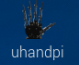

(2) Click “Execute” in the prompt interface to open PC.


**1.1.2 Turn on with command line**

(1) Click the icon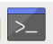on the left upper corner to open the command line terminal.

(2) Then input the following command line in the terminal window to open PC.

```commandline
python3 /home/pi/uhandpi_software/uhandpi_control/main.py
```

### 1.2 Layout for the PC

The interface is as pictured:


The main interface of PC is divided into the following areas below:

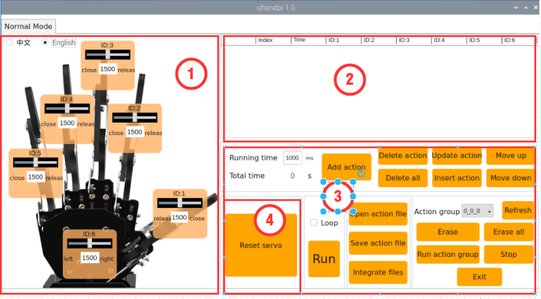

**(1) servo control area**

The servo control area displays icons representing controllable servos, and you can adjust the position of the servo by adjusting the corresponding slider values.

| Icon | Function |
|----|----|
|  | Servo ID number, here takes 1 as example. |
| 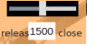 | To adjust the angle position of servo, the minimum value is 0, the maximal value is 2500. |
|  | To adjust servo deviation, the minimum value is -150, the maximal value is 150. |

**(2) action details list**

The Action Details List displays the execution time for each action in the current action group, as well as the servo values for each servo within each action.

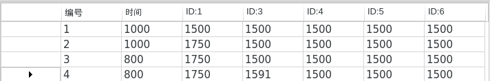

| Icon | Function |
|----|----|
| 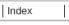 | Action number |
| 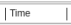 | Action running time, that is the time required to execute this action |
| 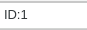 | The rotational value corresponding to the ID servo can be adjusted directly by double-clicking the value below. |

**(3) action group setting area**

<table class="docutils-nobg" border="1">
<colgroup>
<col  />
<col  />
</colgroup>
<tbody>
<tr>
<td>Icon</td>
<td>Function</td>
</tr>
<tr>
<td>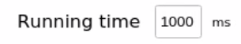</td>
<td>The time required to execute a single action, which can be modified by clicking on it.</td>
</tr>
<tr>
<td>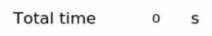</td>
<td>The total duration required for the action group to run.</td>
</tr>
<tr>
<td>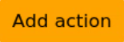</td>
<td>Add the servo values of the current servo control area as an action to the last row of the action details list.</td>
</tr>
<tr>
<td>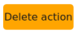</td>
<td>The selected action in the action details list will be deleted.</td>
</tr>
<tr>
<td></td>
<td>All the actions in the action details list will be deleted.</td>
</tr>
<tr>
<td></td>
<td><p>Replace the selected value in the action details list.</p>
<p>（Replace the servo value with the current servo value from the servo control area, and replace the action execution time with the time set within the "Action Time".）</p></td>
</tr>
<tr>
<td></td>
<td><p>Insert a new action above the selected action.</p>
<p>（The action time is the time set in "Action Time (ms)", and the angle value is the servo value from the servo control area.）</p></td>
</tr>
<tr>
<td></td>
<td>Swap the selected action with the one above it.</td>
</tr>
<tr>
<td></td>
<td>Swap the selected action with the one below it.</td>
</tr>
<tr>
<td>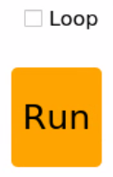</td>
<td><p>Clicking this button will execute the action once in the action details list.</p>
<p>（If "Loop" is checked, the robot will repeat the action.）</p></td>
</tr>
<tr>
<td></td>
<td><p>Clicking it allows you to select the action group to load its data into the action details list.</p>
<p>（The action group file path is "<strong>uhandpi-&gt;action_groups</strong>"）</p></td>
</tr>
<tr>
<td></td>
<td><p>Save the actions in the action details list to a specified location.</p>
<p>（The action group file path is："<strong>uhandpi-&gt;action_groups</strong>"）</p></td>
</tr>
<tr>
<td></td>
<td>After opening an action group, clicking the "Concatenate Action Files" button, then opening another action group file, allows you to concatenate the two action group files into a new one.</td>
</tr>
<tr>
<td>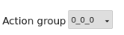</td>
<td>The saved action groups can be displayed in the host computer interface.</td>
</tr>
<tr>
<td></td>
<td>Press this key, the selection bar of the action group will be refreshed</td>
</tr>
<tr>
<td></td>
<td>Delete current action group file</td>
</tr>
<tr>
<td></td>
<td>(be careful) Delete all the action group files</td>
</tr>
<tr>
<td></td>
<td>Execute the action group (selected number) once.</td>
</tr>
<tr>
<td></td>
<td>Stop the running action group</td>
</tr>
<tr>
<td></td>
<td>Exit current PC interface</td>
</tr>
</tbody>
</table>

**(4) deviation setting area (this area is for learning)**

| Icon | Function |
|----|----|
|  | Clicking it will automatically read the saved deviations. |
|  | Clicking it will save the deviations adjusted through the host computer to the robot. |
|  | Clicking it will restore all servos in the servo control area to the 1500 position. |

## 2. Call Action Group

The robotic hand comes with built-in action groups stored in the following path at the time of manufacturing: **/home/pi/uhandpi/action_groups**

We can use the host computer software to view and call its built-in actions. The specific steps are as follows:

### 2.1 Operation Steps

(1) Power on the robot and use VNC Viewer to connect to the remote desktop.

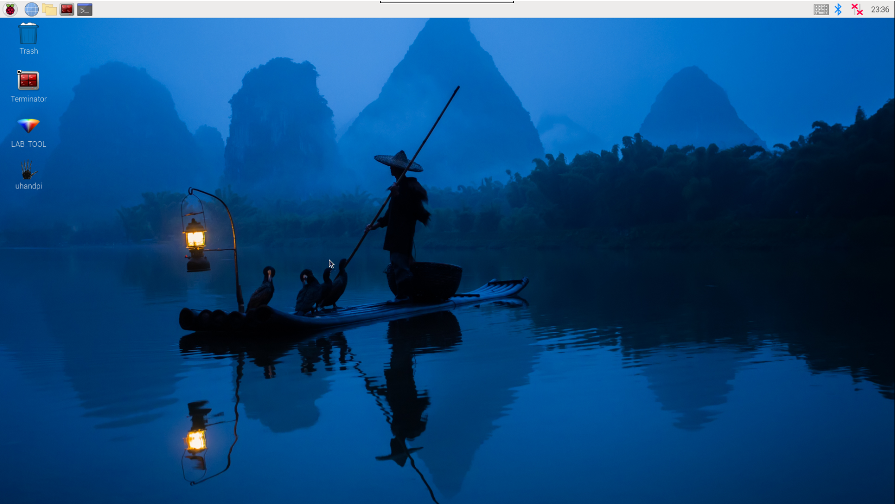

(2) Double click the uhandpi icon on the desktop.


(3) Click “Execute” on the pop-up interface to open PC.

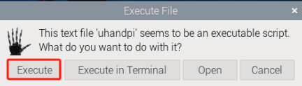

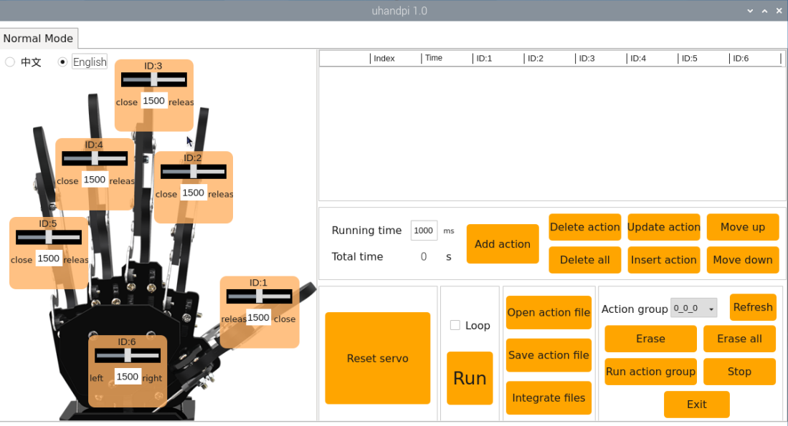

(4) Next, click “Open Action File” key to select the action group required to be executed. And click “Open” again.

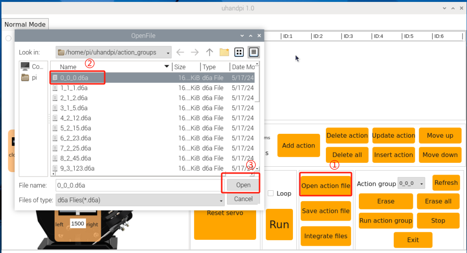

(5) At this point, the action details list will display the action group's file path and servo values for each action. The following image shows only a partial screenshot of the actions.

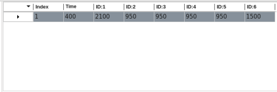

(6) Click the "Run" button to execute all actions currently listed in the action details. If you want to repeat the current action group, you can check the "Loop" option.

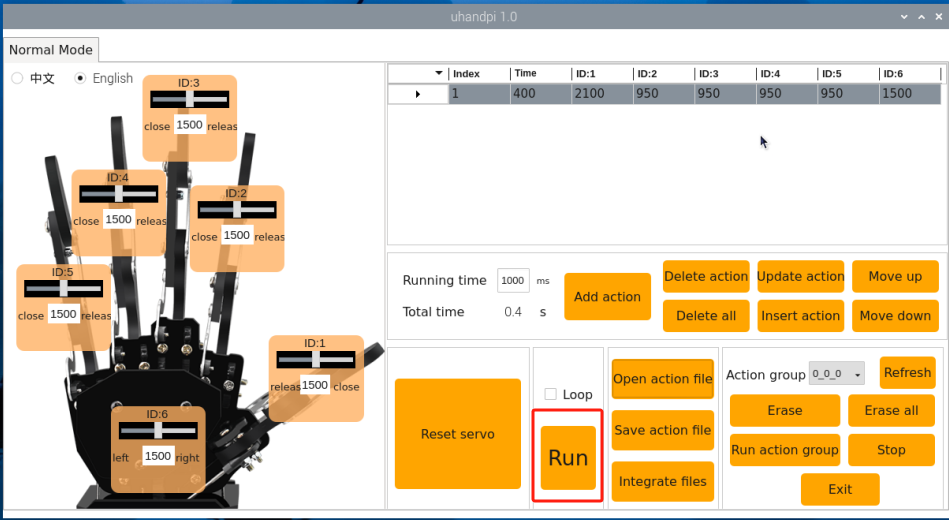

### 2.2 Import External Action Groups

To call external actions through the host computer, you can follow these steps. This section takes importing **“22_hand_heart.d6a”** action group as example. Note: the action group files must end with “.d6a”.

(1) Insert the USB flash drive containing the action files into any USB port on the Raspberry Pi motherboard. Copy the action group files to the system desktop by using copy-paste as pictured:

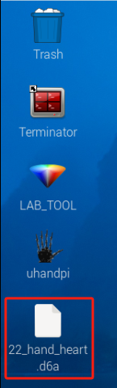

(2) Click icon" "to locate the “/home/pi/uhandpi/action_groups” path. Place the action group under this path as pictured:

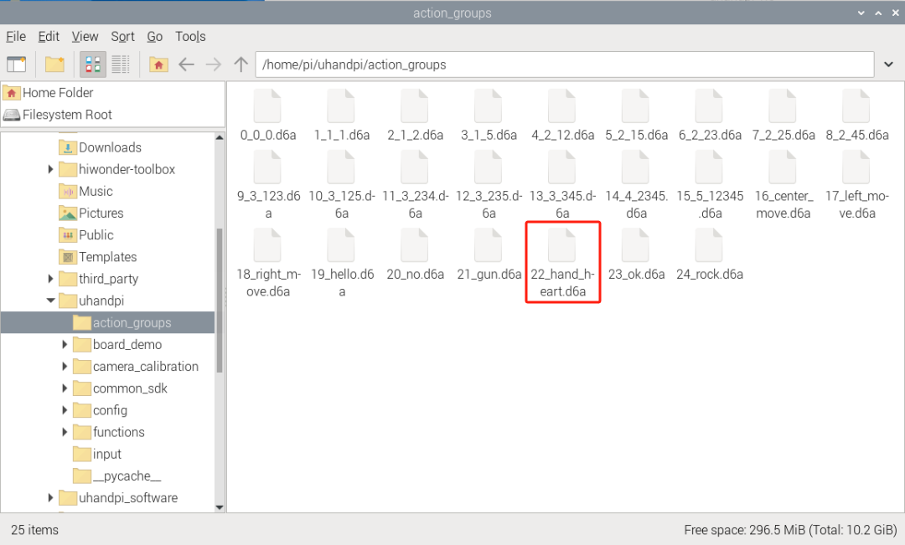

(3) Double click the uhandpi icon on the desktop.


(4) Click “Execute” in the pop-up interface to open PC.


(5) NEXT, click “Open” key to select the action group required to be executed. And click “Open” again.

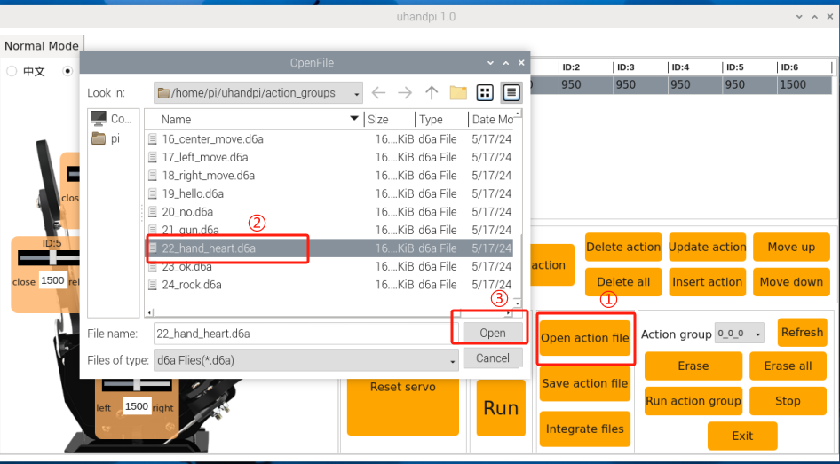

(6) At this time, the action detailed list displays the value of the new imported action group and running time.

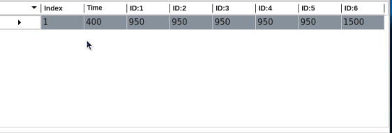

## 3. Action Group Editing Learning

The values set in this document are for reference only, and users can adjust them according to their actual situation.

### 3.1 Program Purpose

Create an action group that implements the action of “closing and opening the hand”.

### 3.2 Operation Steps

**3.2.1 Action designation**

(1) Click “Open Action File” and select “15_5_12345” action group. Then click “Open” to set an initial position to the robot.

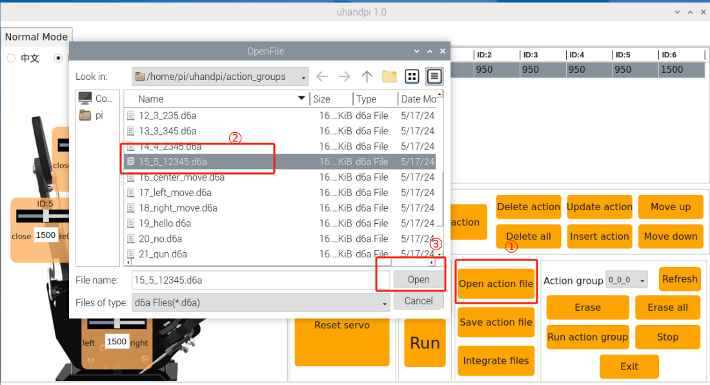

(2) In the action detailed list, click the key next to action 1 to execute it. That synchronize the servo angle information with the servo area on the left.

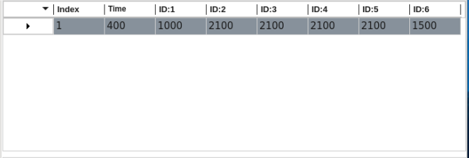

(3) Slide the sliders for servos 1 to 5 to move the fingers of the robotic hand downwards. The specific values are as shown in the following image:

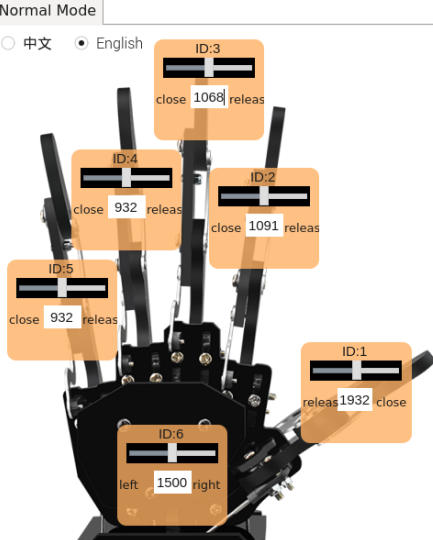

(4) Set the time to 1000ms, then click "Add Action" to obtain the second action.

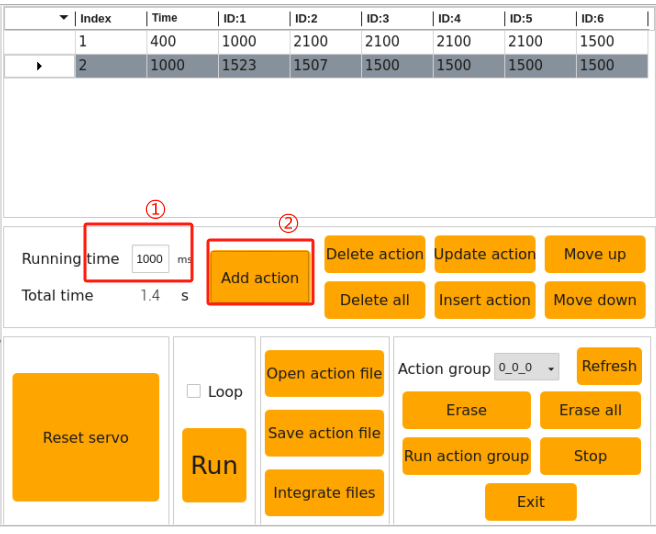

(5) To make the entire set of actions more cohesive and smooth, we add a transition action after setting each action. Based on the previous action, modify the time to 200ms, then click "Add Action" again to obtain the third action.

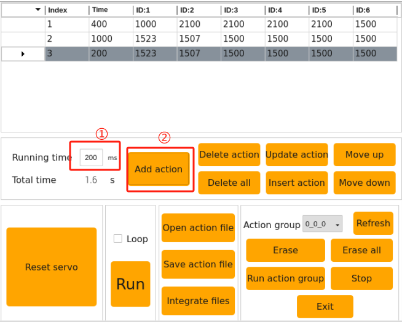

(6) Next, open the robot hand. Slide the sliders 1-5. The specific value is as pictured:

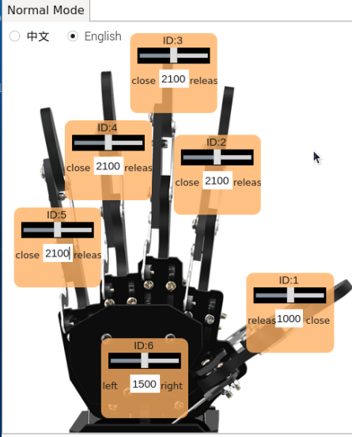

(7) Set the time to 400ms, then click “Add Action” to obtain the fourth action.

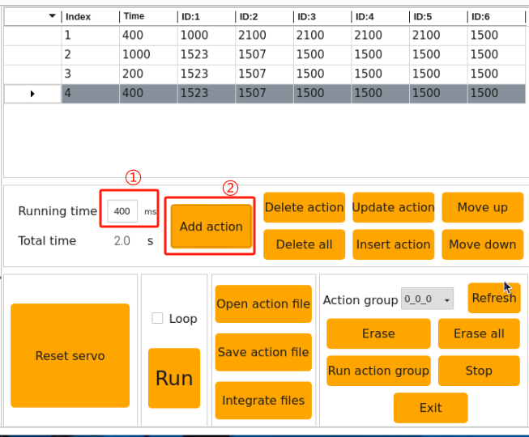

**3.2.2 Action saving**

To facilitate later debugging and management, you can save the actions. Click the "Save Action File" button, here naming it "16_center_move" as an example, then click "Save".

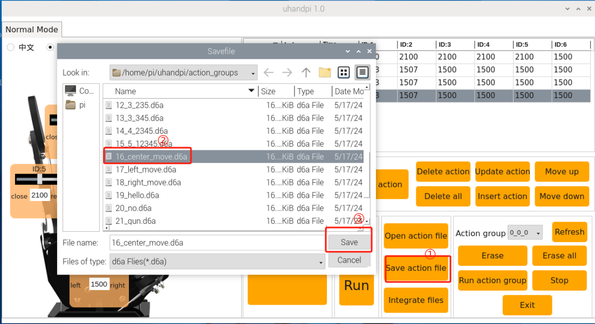

## 4. Integrate Action Group File

:::{Note}
This section explains with the examples of action groups "20_no" and "23_ok". You can view the demonstration video in the directory.
:::

### 4.1 Program Purpose

Learn the function of integrate action to realize the merging between action groups.

### 4.2 Operation Steps

(1) Open PC and click “integrate action files”.

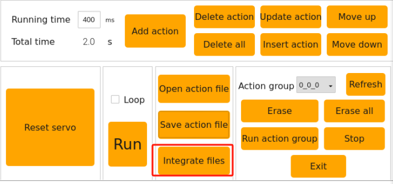

(2) Select 23_ok action group in the popped-up interface, and click “Open”.

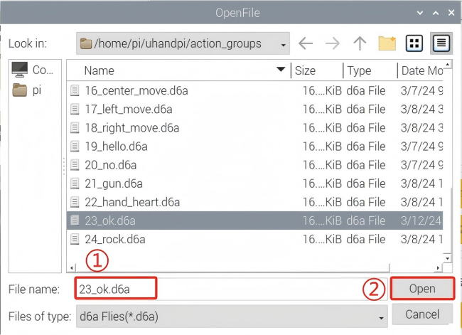

(3) Now you can see the whole action of 23_ok in the action list.

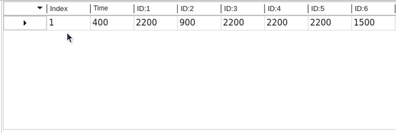

(4) Next, click “integrate action file” again, select “20_no” action group and click “Open”.

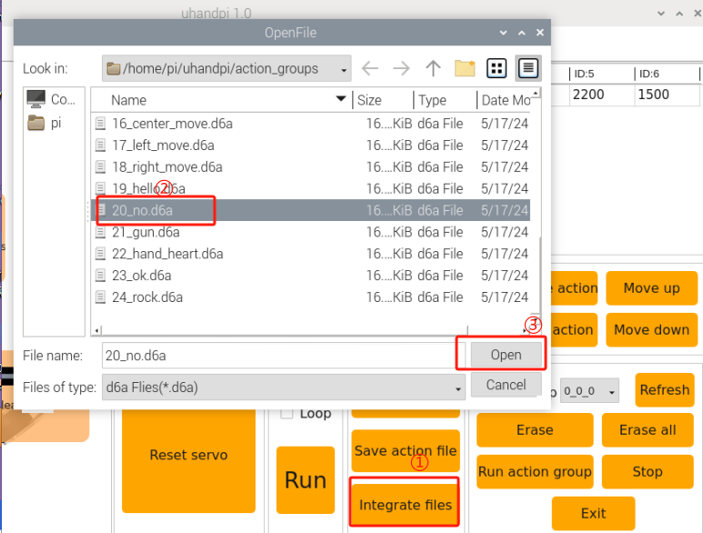

Now, the action details list shows the full set of actions from both the "23_ok" and "20_no" action groups, seamlessly connected from start to finish.

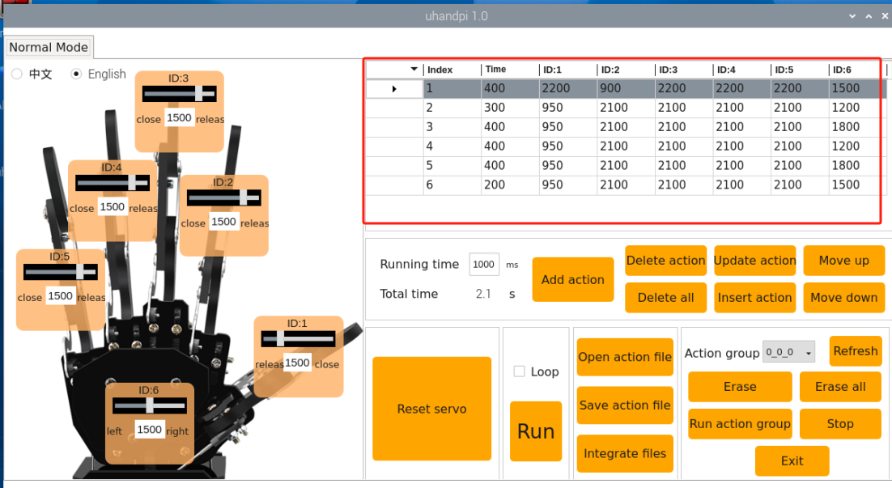

(5) Click “Run” to execute the concatenated new action group online.

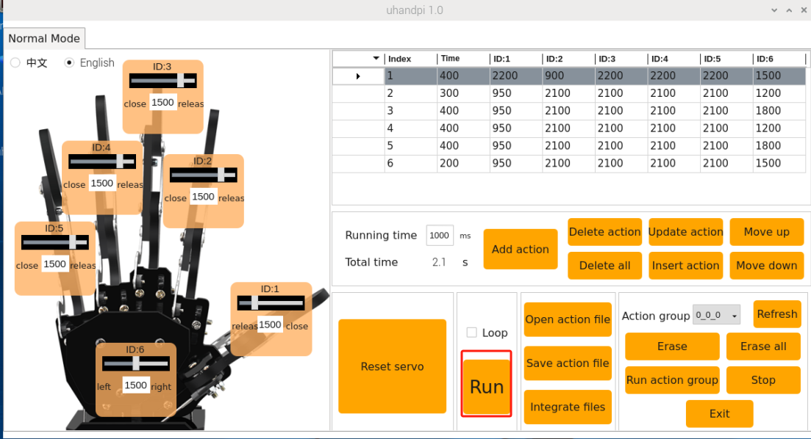

(6) Click “Save Action File” to save the integrated new action group to facilitate the later debugging. Here we name the new action group “hiwonder”.

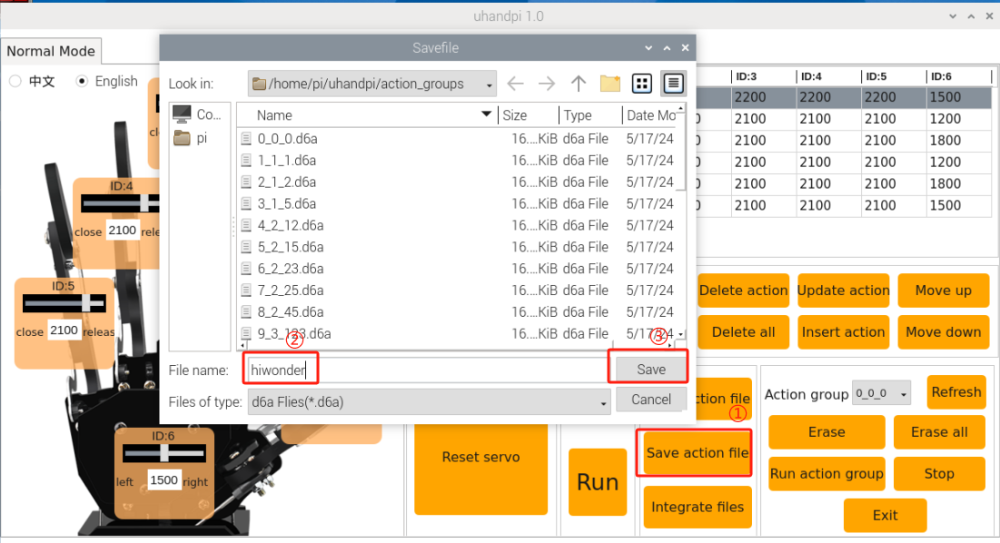
