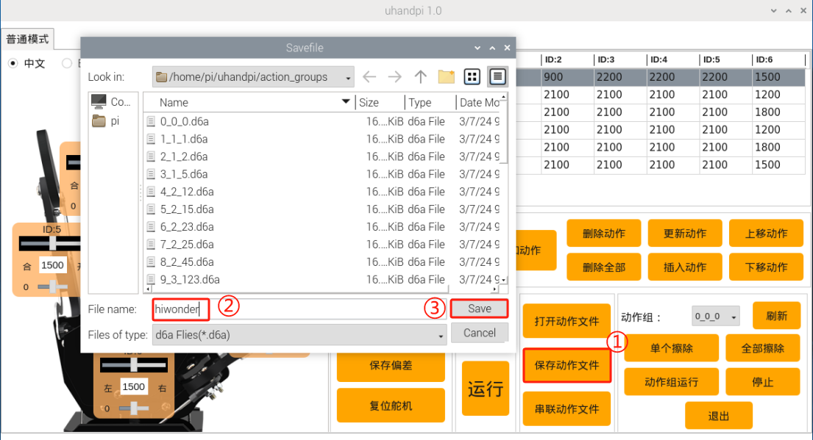

# 上位机动作编辑课程

## 1. 上位机界面介绍

### 1.1 启动上位机

- #### 采用桌面图标启动（初学者推荐）

1.  双击系统桌面上的uhandpi图标。


2.  在弹出的界面中点击"**Execute**"，即可打开上位机。


- #### 采用命令行形式启动

1.  点击桌面左上角的图标，打开命令行终端。

2.  然后在终端窗口输入命令行，打开上位机。

```commandline
python3 /home/pi/uhandpi_software/uhandpi_control/main.py
```

### 1.2 上位机界面分布

上位机界面如下图所示：


上位机在主界面下分为以下区域：


1. **舵机操控区域**

舵机操控区域显示了可以控制的舵机图标，通过调整对应滑杆值即可调整舵机位置。

| 图标 | 功能说明 |
|----|----|
|  | 代表舵机的ID号，这里以1为例。 |
|  | 用于调整舵机的角度位置，最小值为0，最大值为2500。 |
|  | 用于调整舵机偏差，最小值为-150，最大值为150。 |

2. **动作详情列表**

动作详情列表显示了当前动作组每个动作的执行时间，以及每个动作里各个舵机的舵机值。


|  |  |
|----|----|
| 图标 | 功能说明 |
|  | 动作编号。 |
|  | 动作运行的时间，即执行该动作需所用的时间。 |
|  | 该ID舵机对应的转动数值，双击下方数值可直接修改。 |

3. **动作组设置区域**

<table class="docutils-nobg" border="1">
<colgroup>
<col  />
<col  />
</colgroup>
<tbody>
<tr>
<td>图标</td>
<td>功能说明</td>
</tr>
<tr>
<td></td>
<td>运行单个动作所需的时间，点击可进行修改。</td>
</tr>
<tr>
<td></td>
<td>动作组运行所需的总时长。</td>
</tr>
<tr>
<td></td>
<td>将当前舵机操控区域的舵机数值作为一个动作，添加至动作详情列表的最后一行。</td>
</tr>
<tr>
<td></td>
<td>将会删除动作详情列表里选中的动作。</td>
</tr>
<tr>
<td></td>
<td>将会删除动作详情列表里所有动作。</td>
</tr>
<tr>
<td></td>
<td><p>将动作详情列表中选中的数值进行替换。</p>
<p>（舵机数值替换为舵机操控区域的当前舵机值，动作运行时间替换为"动作时间"内设定的时间）</p></td>
</tr>
<tr>
<td></td>
<td><p>在选中的动作上面插入一行动作。</p>
<p>（其中动作的时间为"动作时间(ms)"的时间，角度数值为舵机操控区域的舵机值）</p></td>
</tr>
<tr>
<td></td>
<td>将选中的动作与其上一行进行位置交换。</td>
</tr>
<tr>
<td></td>
<td>将选中的动作与其下一行进行位置交换。</td>
</tr>
<tr>
<td></td>
<td><p>单击该按钮后将会运行一次动作详情列表的动作。</p>
<p>（如果勾选了"循环"，机器人则重复运行动作）</p></td>
</tr>
<tr>
<td></td>
<td><p>单击后选择要打开的动作组即可将动作组数据加载到动作详情列表中。</p>
<p>（动作组文件路径："<strong>uhandpi-&gt;action_groups</strong>"）</p></td>
</tr>
<tr>
<td></td>
<td><p>将此时动作详情列表里的动作保存到指定位置。</p>
<p>（动作组文件路径："<strong>uhandpi-&gt;action_groups</strong>"）</p></td>
</tr>
<tr>
<td></td>
<td>打开一个动作组后，点击串联动作文件按钮，继续打开另一个动作组文件，可将两个动作组文件串联成一个新的动作组。</td>
</tr>
<tr>
<td></td>
<td>可在上位机中显示已保存的动作组。</td>
</tr>
<tr>
<td></td>
<td>按下此按钮，动作组选择栏即可刷新。</td>
</tr>
<tr>
<td></td>
<td>删除当前动作组文件。</td>
</tr>
<tr>
<td></td>
<td>（慎点）删除所有动作组文件。</td>
</tr>
<tr>
<td></td>
<td>执行动作组（选定序号）一次。</td>
</tr>
<tr>
<td></td>
<td>停止正在运行的动作组。</td>
</tr>
<tr>
<td></td>
<td>退出当前上位机操作界面。</td>
</tr>
</tbody>
</table>

4. **偏差设置区域（此区域功能按键了解即可）**

| **图标** | **功能说明** |
|----|----|
|  | 单击后即可自动读取保存的偏差。 |
|  | 单击后即可将通过上位机调整好的偏差保存到机器人中。 |
|  | 单击后即可将舵机操控区域的所有舵机恢复至1500位置。 |

## 2. 动作组调用教学

机械手掌在出厂时内置有动作组，其动作组文件储存在： **/home/pi/uhandpi/action_groups**

我们可通过上位机软件来查看并调用其内置动作。具体操作步骤如下：

### 2.1 操作步骤

1)  将设备开机，并参照课程资料的"**[远程工具安装及连接\1. 远程桌面工具安装与连接](https://docs.hiwonder.com/projects/uHandPi/en/latest/docs/6.remote_tool_installation_and_connection.html#id2)**"内容，通过VNC远程连接工具连接。


2)  双击桌面上uhandpi的图标。


3)  在弹出的界面中点击"**Execute**"，即可打开上位机。


4)  接下来，点击"**打开动作组**"按钮，选择想要执行的动作组，再点击"**Open**"。


5)  此时动作详情列表将显示动作组的各个动作的动作组文件路径和舵机数值（下图仅为部分动作截图）


6)  点击"**运行** "按钮，即可运行当前动作详情列表内的所有动作，若想重复当前动作组，可勾选"**循环** "选项。


### 2.2 导入外部动作组

若想通过上位机调用外部动作，可通过以下步骤实现。本节以导入"**22_hand_heart.d6a**"动作组为例进行说明（动作组文件必须是以".d6a "后缀结尾）。

1. 将带有动作文件的U盘安插至树莓派主板的任意一个USB接口，通过复制粘贴的形式将动作组文件复制到系统桌面，如下图所示：


2. 点击图标" "，找到"**/home/pi/uhandpi/action_groups**"路径，将动作组放到此路径下，如下图所示:


3. 双击桌面上的uhandpi图标。


4)  在弹出的界面中点击"**Execute**"，即可打开上位机。


5)  接下来，点击"**打开动作组**"按钮，选择想要执行的动作组，再点击"**Open**"。


6)  此时，动作详情列表显示了新导入的动作组各舵机的数值和运行时间。


## 3. 动作编辑教学

本节文档所设置的数值仅供参考，用户可根据实际情况进行调整。

### 3.1 实现目标

创建一个实现"**手掌合上张开**"的动作组。

### 3.2 动作实现

- #### 3.2.1 动作设计

1)  点击"**打开动作文件**"，选择"**15_5_12345**"动作组，点击"**Open**"，给机器人设置一个初始姿态。


2)  在动作详情列表中点击1号动作前面的" "按钮，运行1号动作，使左侧的舵机操控区域同步舵机角度信息。


3)  滑动1—5号舵机的滑杆，使机械手掌的各手指向下移，数值具体如下图所示:


4)  时间设为1000ms，点击"**添加动作**"，即可得到第2个动作。


5)  为了使整套动作更加连贯流畅，我们每设置一个动作之后，就添加一个过渡动作。在上一个动作的基础上，将时间修改为200ms，再次点击"**添加动作**"，即可得到第3个动作。


6)  接下来，我们让机械手掌张开。滑动1-5号舵机的滑杆，具体数值如下图所示。


7)  时间设为400ms，点击"**添加动作**"，即可得到4号动作。


- #### 3.2.2 动作保存

为了便于后期的调试和管理，可将动作保存起来。单击"**保存动作文件**"按钮，这里以"**16_center_move**"为例进行命名，单击"**Save**"。


## 4. 串联动作文件

:::{Note}
本节内容以20_no号动作组和23_ok动作组为例进行讲解。
:::

### 4.1 实现目标

学习串联动作文件的功能，实现动作组之间的合并。

### 4.2 动手实现

1)  打开上位机，点击"**串联动作文件**"。


2)  在弹出的界面中选择23_ok动作组，点击"**Open**"。


3)  此时可以在动作详情列表中看到23_ok号动作组的全部动作。


4)  接下来，再次点击"**串联动作文件**"，选择"**20_no**"动作组，点击"**Open**"。


这时动作详情列表里同时出现了23_ok和20_no动作组的全部动作，并且两个动作组首尾连贯起来。


5)  点击"**运行**"，将串联的新的动作组在线运行一遍。


6)  点击"**保存动作文件**"按钮，将新串联的动作组进行保存，以便后期调试。这里我们命名为"**hiwonder**"。


